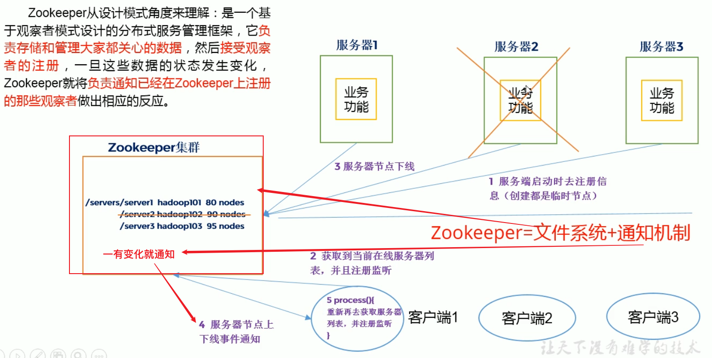
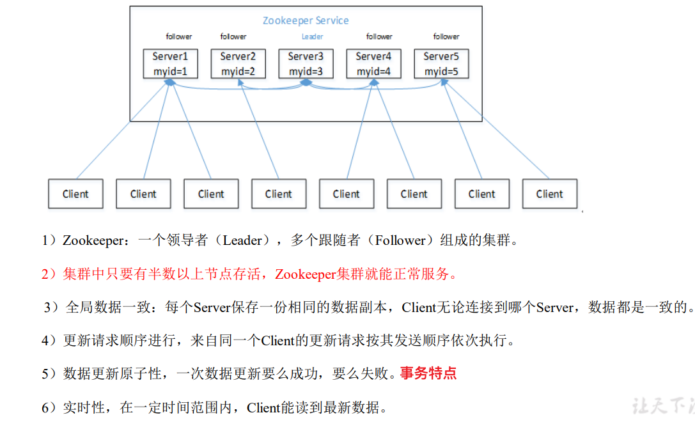
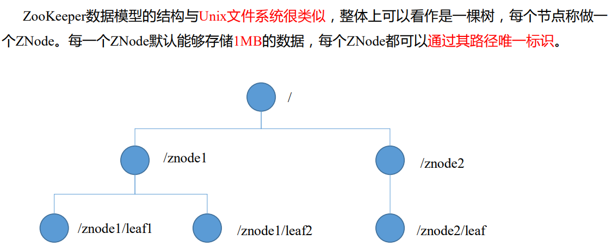
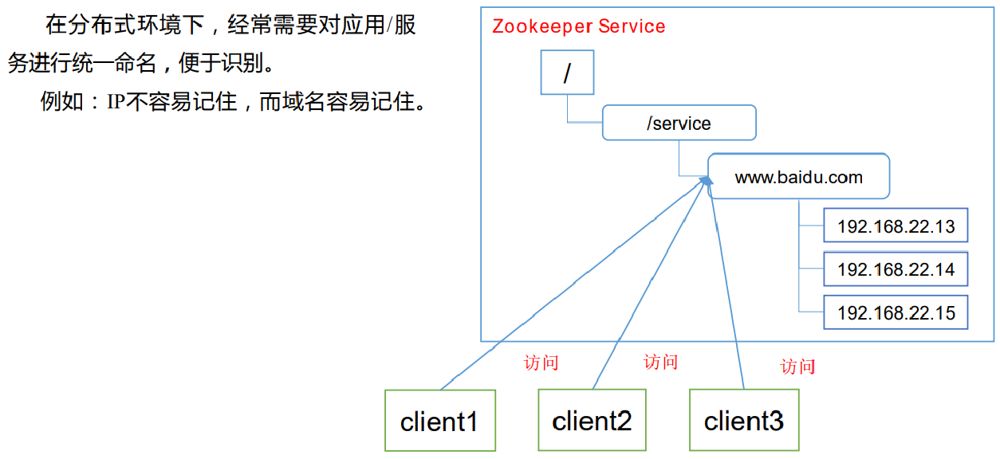
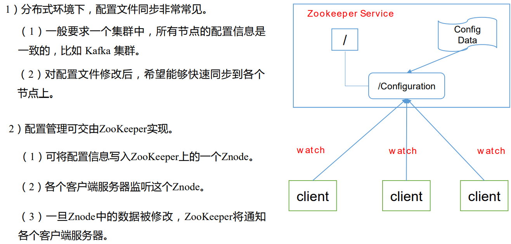
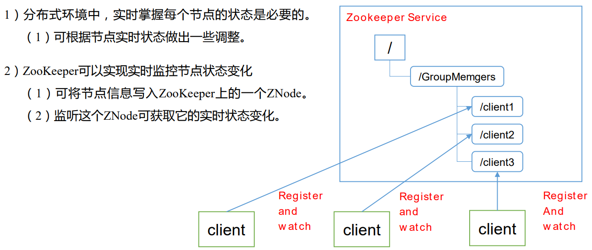
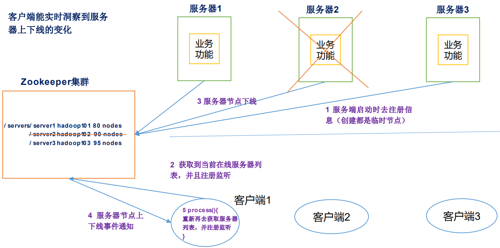
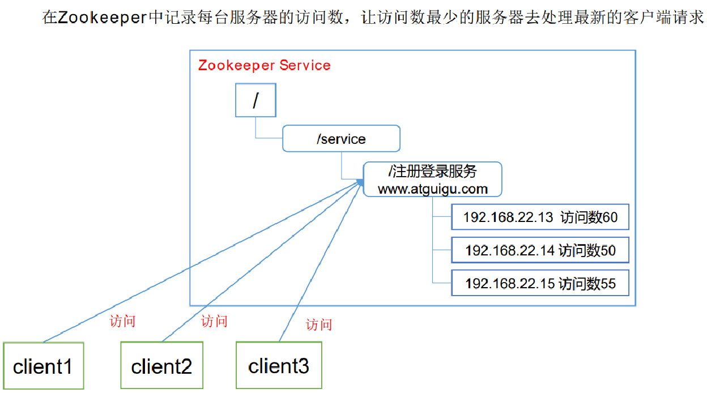

# Zookeeper

+ 相当于润滑剂，协调大数据工作

## 1.zookeeper概述

### 1.1 工作机制

+ 

### 1.2 特点

+ 

### 1.3 数据结构

+ 

### 1.4 应用场景

#### 1.4.1 提供的服务

+ 统一命名服务
+ 统一配置管理
+ 统一集群管理
+ 服务器节点动态上下线
+ 软负载均衡
+ etc.

#### 1.4.2 统一命名服务

+ 

#### 1.4.3 统一配置管理

+ 

#### 1.4.4 统一集群管理

+ 

#### 1.4.5 服务器动态上下线

+ 

#### 1.4.6 软负载均衡

+ 


### 1.5 下载和安装

+ https://zookeeper.apache.org/

#### 1.5.1 本地模式安装部署

> 用于测试

##### 1.安装前准备

+ 安装jdk
+ 将zookeeper安装包拷贝到Linux系统下
+ 解压到指定目录`tar -zxvf zookeeperxxx /opt/module/`

##### 2.修改配置

+ 修改`/opt/module/zookeeperxxx/conf`下`zoo_sample.cfg`为`zoo.cfg`
  + `mv zoo_sample.cfg zoo.cfg`
+ 打开`zoo.cfg`，修改`dataDir`路径：
  + `dataDir=/opt/module/zookeepwexxx/zkData`
  + 很多安装都是把数据放到自己的目录下
+ 创建`zkData`文件夹
  + `mkdir zkData`

##### 3.操作Zookeeper

+ ```bash
  #启动
  bin/zkServer.sh start
  
  #查看进程是否启动
  jps
  
  #查看状态
  bin/zkServer.sh status
  
  #启动客户端
  bin/zkCli.sh
  
  #退出客户端
  quit
  
  #停止zookeeper
  bin/zkServer.sh stop
  ```


#### 1.5.2 配置参数解读

Zookeeper中的配置文件zoo.cfg中参数含义解读如下：

 **1．tickTime =2000：**通信心跳数，Zookeeper 服务器与客户端心跳时间，单位毫秒 

Zookeeper使用的基本时间，服务器之间或客户端与服务器之间维持心跳的时间间隔， 也就是每个tickTime时间就会发送一个心跳，时间单位为毫秒。 它用于心跳机制，并且设置最小的session超时时间为两倍心跳时间。(session的最小超 时时间是2*tickTime)

 **2．initLimit =10：**LF 初始通信时限 

集群中的Follower跟随者服务器与Leader领导者服务器之间初始连接时能容忍的最多心 跳数（tickTime的数量），用它来限定集群中的Zookeeper服务器连接到Leader的时限。 

**3．syncLimit =5：**LF 同步通信时限

 集群中Leader与Follower之间的最大响应时间单位，假如响应超过syncLimit * tickTime，Leader认为Follwer死掉，从服务器列表中删除Follwer。 

**4．dataDir：**数据文件目录+数据持久化路径 

主要用于保存 Zookeeper 中的数据。

 **5．clientPort =2181：**客户端连接端口 

监听客户端连接的端口。