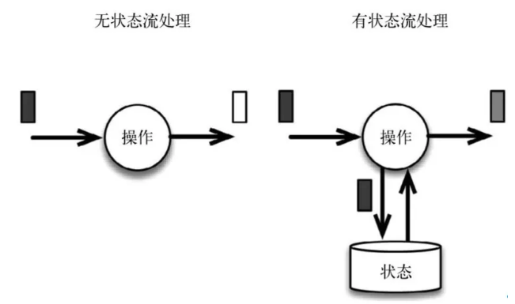
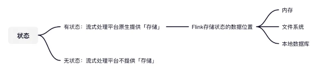
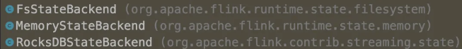
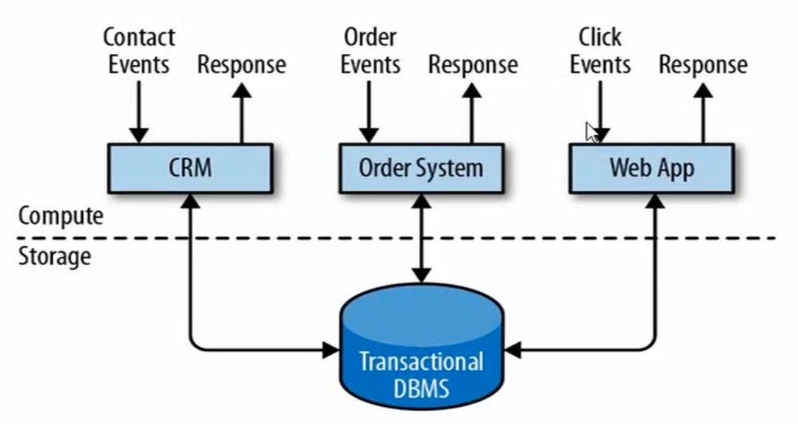
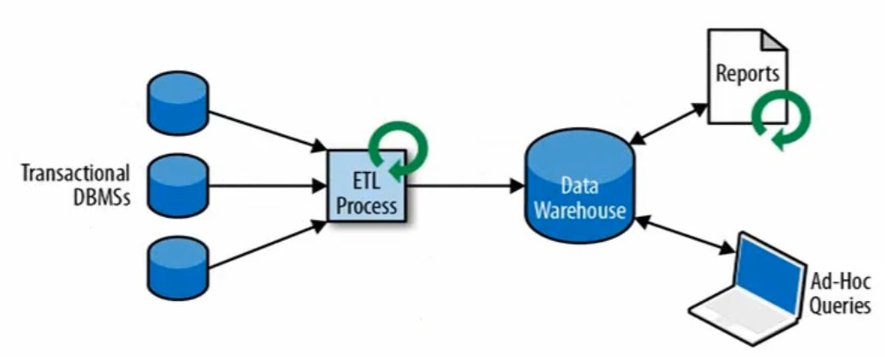
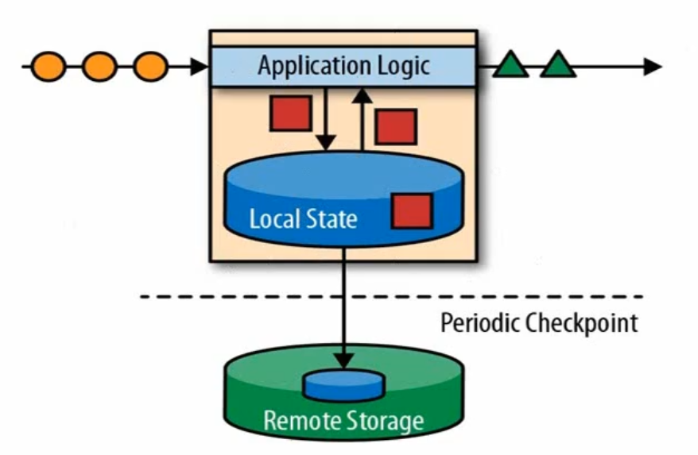
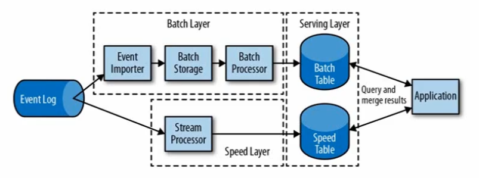
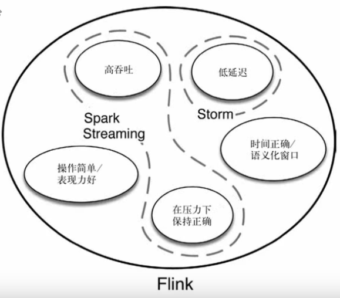
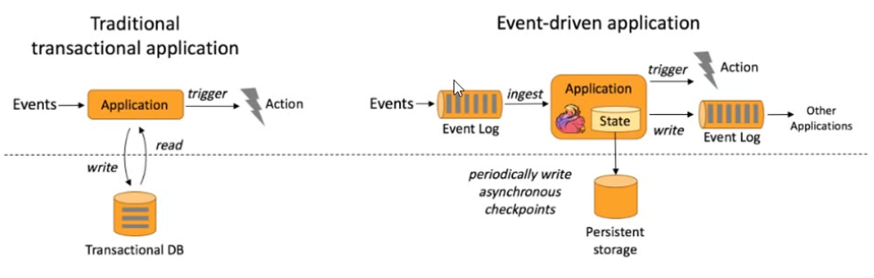
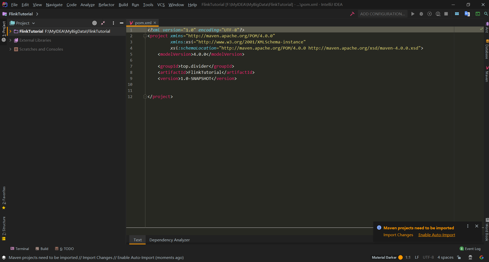

# Flink

> https://flink.apache.org/zh/


## 1.:triangular_flag_on_post: what

### 1.1 奥义

#### 1.1.1 起源

+ 10年，德国柏林几个大学对大数据进行处理，流式计算的研究项目。
+ 14年，源代码捐给了Apache基金会，成为孵化项目
+ 15年1月，短短几个月，成为Apache顶级项目，应用广泛
+ 17年，阿里巴巴接手，投入大量人力物力

#### 1.1.2 了解

`Flink`德语：快速灵巧

> 
>
> logo小故事：
>
> 源于德国柏林，地区多红棕色松鼠，特点是快速灵巧。
>
> 红棕色又与Apache基金会logo一致，就有了美丽的渐变色尾巴。

#### 1.1.3 定义

Apache Flink is a **framework** and **distributed** processing engine for **stateful** computations over **unbounded and bounded data streams**. 

Apache Flink 是一个**框架**和**分布式**处理引擎，用于在**无边界和有边界数据流**上进行**有状态**的计算。

#### 1.1.4 理解

**框架：**

+ 有约束的半成品

**分布式：**

+ 它的存储或者计算交由多台服务器上完成，最后汇总起来达到最终效果。

**无边界和有边界数据流：**

+ 无边界：没有做任何处理的数据
+ 有边界：无边界的基础上加上条件
+ Flink中设置“边界”的操作叫开窗口（`windows`），可简单分为两种类型：
  + 时间窗口（`TimeWindows`）
  + 计数窗口（`CountWindows`）

**有状态：**

+ 无状态：每次的执行都**不依赖**上一次或上N次的执行结果，每次的执行都是**独立**的。

+ 有状态：执行**需要依赖**上一次或上N次的执行结果，某次的执行需要依赖前面事件的处理结果。

  

+ Flink有状态：Flink**本身**就给我们提供了”存储“的功能，而我们每次执行是可以依赖Flink的”存储”的，所以它是**有状态**的。

  

  

**实时计算：**

+ 处理速度毫秒级

+ 计算：对数据进行处理，比如清洗数据（对数据进行规整，取出有用的）

  


### 1.2 应用

> 各行各业

+ 

#### 1.2.1  why

+ 传统的数据结构是基于有限数据集的（
  
  + 缺点：较高延迟，无法实时）
+ 流数据---->更真实地反映我们地生活方式，e.g（
  + 实时聊天
  + 写信（批处理）
  + 叫车，定位，自动驾驶等）
+ 达到了<span style="color:red">**对数据处理的目标：**</span>
  
  + 低延迟
  
  + 高吞吐
  
  + 结果的准确性和良好的容错性（
  
    + 分布式回滚到比较近的位置，不回到最初时刻
  
    + `Flink`的**数据存储**主要在三个地方
  
      + 内存
  
      + 文件系统（HDFS）
  
      + 本地数据库
  
        
  
      + :question:这里只是存储，如果假设`Flink`挂了，可能内存的数据没了，磁盘可能存储了部分的数据，那再重启的时候（比如消息队列会重新拉取），就不怕会丢了或多了数据吗？
  
      + 解决：精确一次性（exactly once）【见4.1】）

#### 1.2.2 哪些

+ 电商和市场营销
  + 市场销售数据统计分析，月底统计->数据量大，无法本季度低直接出数据（
    + 向上：宽限几天
    + 向下：放弃几天的数据
    + 都会增加最后数据的不确定和不准确的机率）
  + 数据报表、广告投放、业务流程
+ 物联网（IOT）
  + 传感器实时数据采集和显示、实时报警、交通运输业
+ 电信业
  + 基站流量调配 e.g（
    + 大型事故时，某地基站出现峰值，则对周边基站的调配）
+ 银行和金融业（
  + 银行家工作时间
    + 以前每天三四点下班，对当天的交易进行核算盘点）
  + 实时结算和通知推送
  + 实时检测异常行为

## 2.:question: 问题->:bulb: 解决->:heavy_check_mark: Flink

>  对数据的处理架构，实现对数据处理的期望和目标(见上文 1.1.5)

### 2.1 传统

**事务处理**

+ 

  [^Compute]: 运算层
  [^Storage]: 存储层

+ 特点：实时性很好（与用户交互，来信息处理一个）

+ 问题：吞吐量低，同时处理大量数据代价高

+ 优化：分析处理

  --------

**分析处理**

+ 

  [^Transactional DBMSs]: 业务数据库
  [^ETL Process]: ETL提取（清洗整合）
  [^Data Warehouse]: 数仓

+ 将数据从`业务数据库` 复制到`数仓`，在进行分析和查询。

+ 特点：（高吞吐）数据源不需要直接联表查询（因在不同的数据库），需要的海量数据提取出来，ETL进行处理、分层放进数仓，然后统一进行查询处理。

+ 缺点：数据过程长，实时性差，延迟高

+ 优化：有状态的流式处理

  -----

**有状态的流式处理**

+ 

  [^Checkpoint ]: 周期性的检查点

+ 问题：事务处理的瓶颈，来一个处理一个，主要因为关系型数据库链表查询比价复杂
  
+ 解决方向：数据放到本地内存中（【有状态】当前做数据处理需要的数据不去关系型数据库查，而是直接存到本地栈中）
  
+ 问题：在内存中不稳定，数据丢失
  
  + 解决：存盘，故障恢复机制（添加checkpoint，针对内存的状态定期的进行保存）
  
+ 特点：低延迟，高吞吐，良好的故障机制

+ 问题：分布式架构下，数据的顺序无法保证，不同分区处理任务可能导致数据乱序。:question:如何保证时间序是对的？

+ 优化：第二代流处理器：lambda架构

  ----

**lambda架构**

+ 

  [^Event Log]: 事件日志
  [^Batch Layer]: 批处理层（保证准确性）
  [^Speed Layer]: 流处理层（保证速度）

+ 用两套系统，同时保证低延迟和结果的准确

+ 过程：speed层快速处理保存到speedTable中（其中可能有错误信息）；故batch层解决这个问题，进行批处理，攒一批然后处理保存到batchTable中（这里面的结果准确），最终对两个表做处理比对整合。

+ 特点：快速得到近似正确的结果，然后过段时间回看得到最准确结果。

+ 问题：实现一个需求需要两个系统，同时需维护两个系统，过程麻烦，成本高

+ 优化：第三代流处理器：Flink

### 2.2 Flink

+ 

  [^Storm]: 第一代流处理器
  [^Spark Streaming]: 从批处理演变过来的处理方式

+ 特点：

  + 事件驱动（Event-driven）

    

  + 基于流的世界观

    + 一切都是流

    + 离线数据：有界流

    + 实时数据：无界流

      

  + 分层API

    + 越顶层越抽象，表达含义越简明，使用越方便

    + 越底层越具体，表达能力越丰富，使用越灵活

      

  + 其他特点

    + 支持事件时间和处理时间语义
    + 精确一次的状态一致性保证
    + 低延迟，每秒处理数百万个时间，毫秒级延迟
    + 与众多常用存储系统的连接
    + 高可用，动态扩展，实现7*24小时全天候运行

+ Flink:vs:Spark Streaming

  >  架构、世界观上

  + 流（Stream）

  

  + 微批（micro-batching）

  

  > 底层数据模型

  + `flink` 基本数据模型是数据流，以及事件（Event）序列。
  + `spark` 采用RDD模型（弹性分布式数据集），spark streaming 的 DStream 实际上也就是一组组小批数据RDD集合。

  > 运行时架构
  + `flink`是标准的流执行模式（没有stage的概念），一个事件在一个节点处理完后可以直接发往下一个节点进行处理。
  + `spark`是批计算，将DAG（Directed Acyclic Graph，有向无环图（用来描述任务之间的先后关系））划分为不同的 stage（调度阶段），一个完成后才可以计算下一个。（
    + 存在问题：如果完成stage1和stage2才能开始stage3，那么，stage1完成了而stage2没有，此时，stage1就会等待（若为无边界数据，源源不断地来，需要等待到何时））

## 3.:key: 使用

### 3.1 创建一个 `Maven` 项目



### 3.2 引入依赖

```xml
<dependencies>
    <dependency>
        <groupId>org.apache.flink</groupId>
        <artifactId>flink-java</artifactId>
        <version>1.10.1</version>
    </dependency>
    <dependency>
        <groupId>org.apache.flink</groupId>
        <!--2.12是scala版本，因为其运行文件中有akka，底层是scala写的-->
        <artifactId>flink-streaming-java_2.12</artifactId>
        <version>1.10.1</version>
    </dependency>
</dependencies>
```

### 3.3 创建离线数据

位置：`src/main/resources/hello.txt`

代码：

+ ```txt
  hello world
  hello flink
  hello spark
  hello scala
  how are you my bro
  fine thank you and you
  ```

### 3.4 批处理筛选字母出现个数

位置：`src/main/java/top/divider/wc/WordCount.java`

代码：

+ ```java
  package top.divider.wc;
  
  import org.apache.flink.api.common.functions.FlatMapFunction;
  import org.apache.flink.api.java.DataSet;
  import org.apache.flink.api.java.ExecutionEnvironment;
  import org.apache.flink.api.java.operators.DataSource;
  import org.apache.flink.api.java.tuple.Tuple2;
  import org.apache.flink.util.Collector;
  
  /**
   * @program: FlinkTutorial
   * @description: 批处理word count
   * @author: Bruce Jin
   * @create: 2020-12-28 19:32
   **/
  
  public class WordCount {
      public static void main(String[] args) throws Exception{
          //创建执行环境
          ExecutionEnvironment env = ExecutionEnvironment.getExecutionEnvironment();
  
          //从文件中读取数据
          String inputPath = "F:\\MyIDEA\\MyBigData\\FlinkTutorial\\src\\main\\resources\\hello.txt";
  
          //得到数据源,本质是DataSet（数据集）
          DataSource<String> inputDataSet = env.readTextFile(inputPath);
  
          //对数据集进行处理,按空格分词展开，转换成（word,1）二元组进行统计
          DataSet<Tuple2<String, Integer>> resultSet = inputDataSet.flatMap(new MyFlatMapper())
              //按照第一个位置地word分组
              .groupBy(0)
              //将第二个位置上的数据求和，1表示第二个位置
              .sum(1);
  
          //打印输出
          resultSet.print();
      }
  
      /**
       * 自定义类，实现FlatMapFunction接口
       */
      public static class MyFlatMapper implements FlatMapFunction<String, Tuple2<String, Integer>>{
  
          @Override
          public void flatMap(String value, Collector<Tuple2<String, Integer>> out) throws Exception {
              //按空格进行分词
              String[] words = value.split(" ");
              //遍历所有word，包成二元组输出
              for (String word : words) {
                  out.collect(new Tuple2<String, Integer>(word,1));
              }
          }
      }
  }
  ```

### 3.5 流处理

位置：`src/main/java/top/divider/wc/StreamWotdCount.java`

代码：

+ ```java
  package top.divider.wc;
  
  import org.apache.flink.api.java.tuple.Tuple2;
  import org.apache.flink.streaming.api.datastream.DataStream;
  import org.apache.flink.streaming.api.datastream.SingleOutputStreamOperator;
  import org.apache.flink.streaming.api.environment.StreamExecutionEnvironment;
  
  /**
   * @program: FlinkTutorial
   * @description: 流处理
   * @author: Bruce Jin
   * @create: 2020-12-28 20:09
   **/
  
  public class StreamWotdCount {
      public static void main(String[] args) throws Exception {
          //创建流处理执行环境
          StreamExecutionEnvironment env = StreamExecutionEnvironment.getExecutionEnvironment();
          //设置并行数
          //env.setParallelism(8);
  
          //从文件中读取数据
          String inputPath = "F:\\MyIDEA\\MyBigData\\FlinkTutorial\\src\\main\\resources\\hello.txt";
  
          //得到数据源,DataStream,对数据进行读取
          DataStream<String> inputDataStream = env.readTextFile(inputPath);
  
          //基于数据流进行转换计算
          SingleOutputStreamOperator<Tuple2<String, Integer>> resultStream = inputDataStream.flatMap(new WordCount.MyFlatMapper())
                  //对数据分组，按照key进行不同划分
                  .keyBy(0)
                  .sum(1);
  
          //输出
          resultStream.print();
  
          //执行任务
          env.execute();
      }
  }
  ```

## 4. :balloon:OtherPoints

### 4.1 精确一次性（exactly once）

众所周知，流的语义性有三种：

+ 精确一次性（exactly once）：有且只有一条，不多不少
+ 至少一次（at least once）：最少会有一条，只多不少
+ 最多一次（at most once）：最多只有一条，可能会没有

Flink的精确一次性指的是：状态**只持久化一次**到**最终**的存储介质中（本地数据库/HDFS...)。

那么怎么实现对数据的存储，多久存储一次呢？

答：`CheckPoint`机制。

所谓的`CheckPoint`其实就是`Flink`会在指定的时间段上保存状态的信息，假设`Flink`挂了可以将**上一次**状态信息再捞出来，重放还没保存的数据来执行计算，最终实现`exactly once`。


## 5. :book:资料来源

三太子敖丙

https://mp.weixin.qq.com/s/xa2iGrmyoXq3FtZeU9GU-w

B站

https://search.bilibili.com/all?keyword=Flink