# Linux

## 1.安装

### 1.1 手动自定义分区

Linux必须**至少有三个**分区

+ /boot分区

  + Linux在启动或引导的时候，需要的文件都在这。

  + 200M左右

    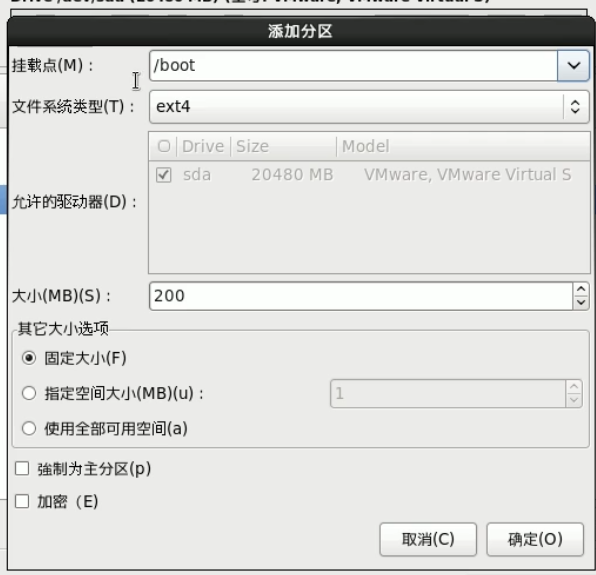

  

+ swap

  + 交换分区（类似windows中的虚拟内存）

  + 2048（和物理内存一样大就可以）

  + 作用：在内存不够用时，临时充当内存，效率比物理内存低，但比硬盘高。

    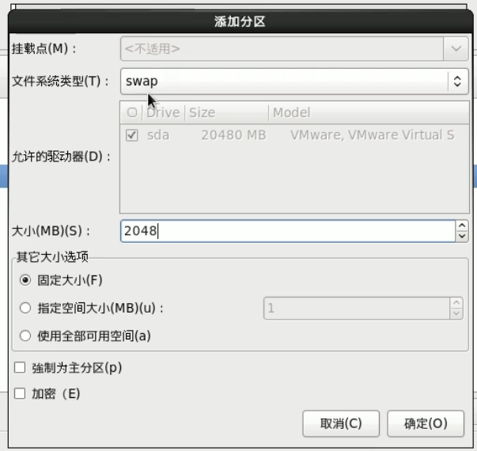

+ /

  + 根分区

  + Linux主要是挂载的方式，根分区包括其他的分区或文件

    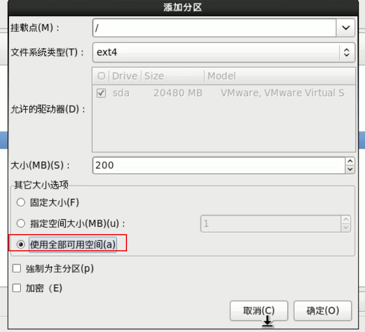

分区效果：

+ 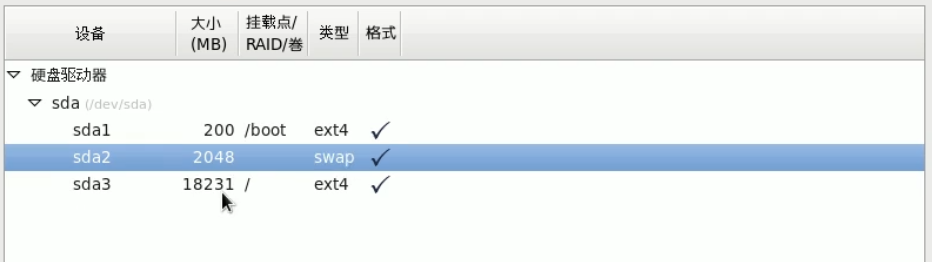

### 1.2 Kdump

崩溃转储机制，可以捕获一些异常信息。

生产环境中需要，日常学习可以不用。

### 1.3.联网问题

net模式

## 2.linux目录结构 :bangbang:

+ 级层式的树状目录结构，最上层是根目录“/”

+ linux中一切皆文件

  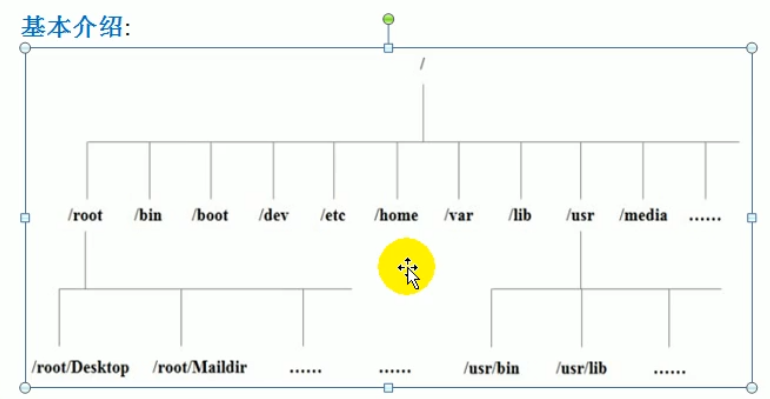


### 2.1 具体的目录结构

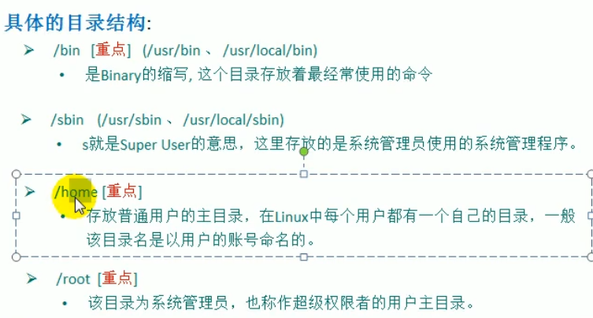

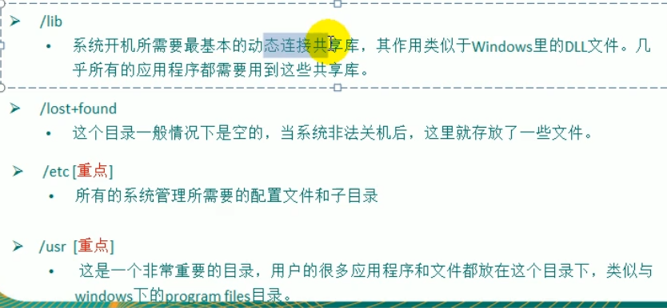

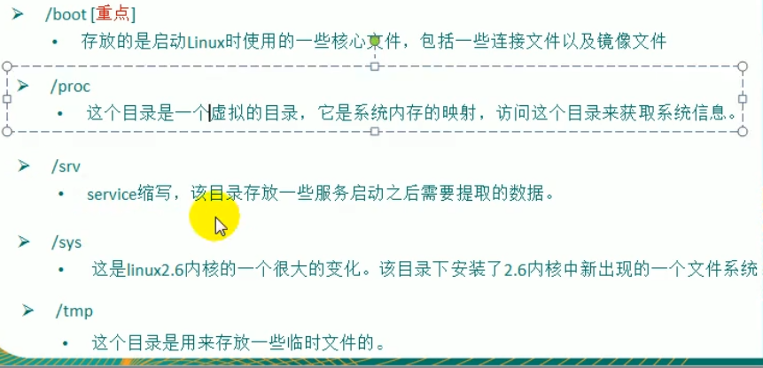

proc和srv和sys轻易不要动

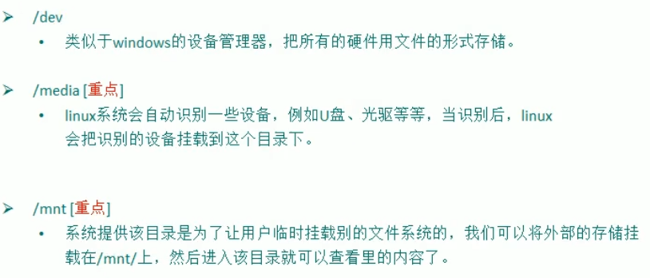

+ 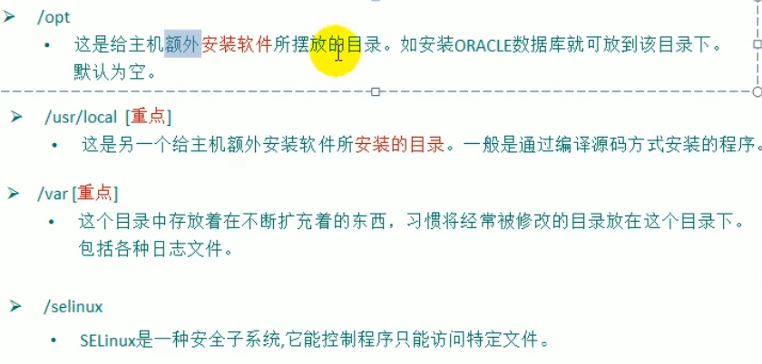

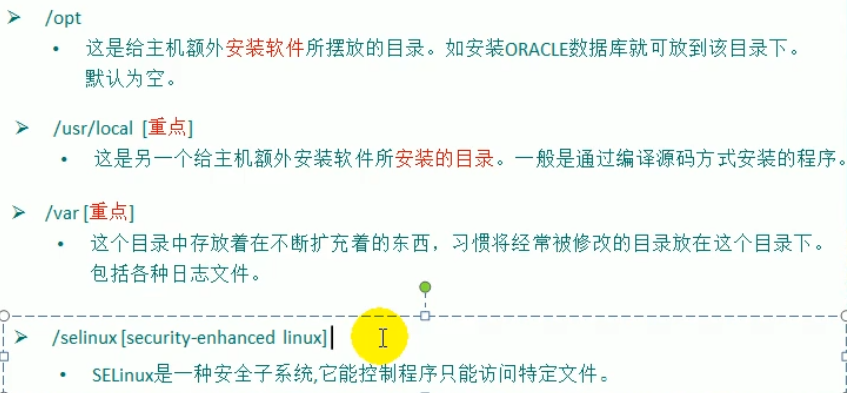

selinux类似于360


**:a:总结：**

+ Linux的目录有且只有一个根目录
+ Linux的各个目录存放的内容是规划好的，不能乱放
+ Linux是以文件的形式管理我们的设备，一切皆文件
+ Linux的各个目录放什么必须有认识
+ Linux目录树，必须记住。

## 3.准备工作

### 3.1远程连接服务

Linux虚拟机需开启sshd服务，该服务会监听22端口。

### 3.2指定静态IP

+ 目录`/etc/sysconfig/network-scripts/`中ens网卡

+ 重启网络centos7以上`systemctl restart network`或centos7以下`service network restart`

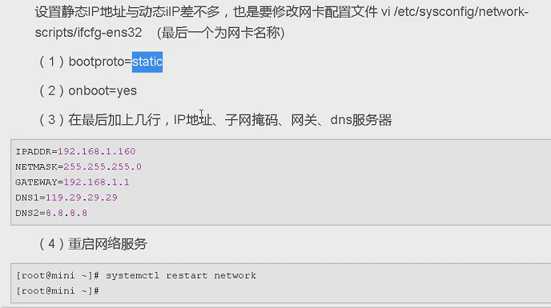

+ `reboot`重启Linux
+ 注意：
  + 第一点：虚拟机的Net模式静态ip由这里设置网段
    + 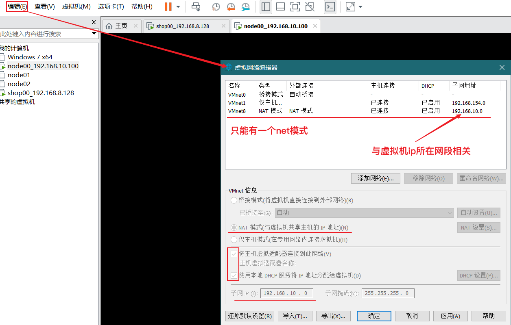
  + 第二点：这里对应v8网段不是本地网络
    + 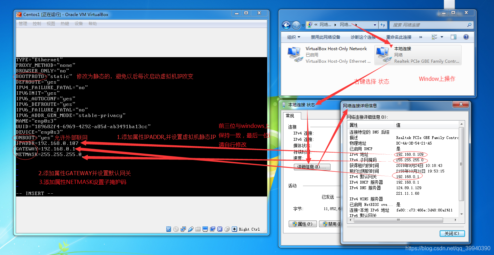

### 3.3 文件传输

xftp必须注意协议使用SFTP，这样端口是22.

解决乱码：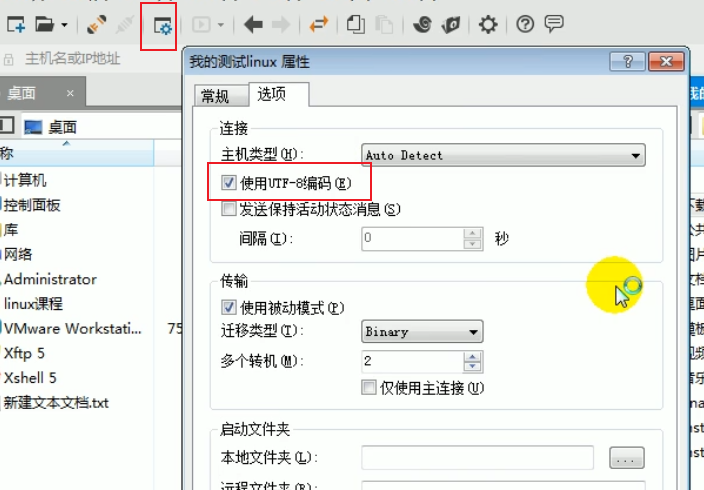


### 3.4 SecureCRT

+ 远程登录Linux软件（同xshell）
+ 大数据开发常用
+ 细节：中文乱码
  + 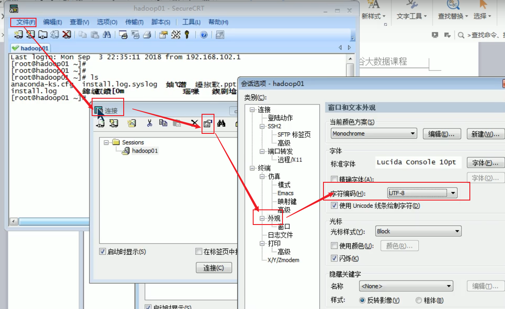


## 4.Linux实操

+ `cd`为change directory,切换目录
+ `^`为定位符号
+ ip:
  + `ip addr`
  + ``ifconfig`
+ 基本概念
  + 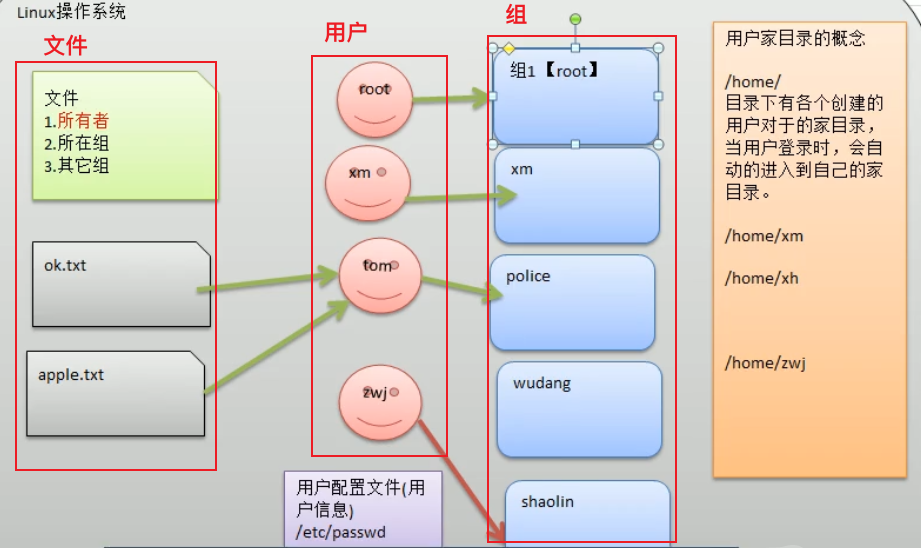
+ 文件类型见权限
+ 查看信息太多可以用管道命令和more结合
  + 例如 `xxxx | more`

### 4.1 vi & vim

#### 4.1.1 三种常见模式

+ 正常模式
+ 插入模式
+ 命令行模式

#### 4.1.2 转换

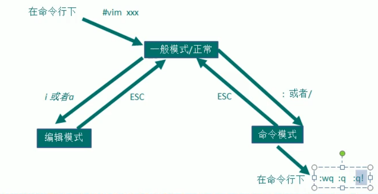

#### 4.1.3 快捷键

正常模式下：

+ 拷贝 `[num]yy`
+ 粘贴 `p`
+ 删除`[num]dd`
+ 最首最末：首`gg`，尾`G`
+ 撤回：`u`
+ 光标到指定位置：
  + 显示行号（命令行下`set nu`）
  + 输入num
  + `shift+g`

命令行模式下：

+ 查找：`/`，`n`下一个，`N`上一个
+ 行号：`set nu`，`set nonu`

### 4.2 开机重启注销

#### 4.2.1 基本

+ `shutdown -h time`几分钟后关机（-r表示重启）

+ `halt`关机

+ `reboot`重启

+ `sync`把内存存储到磁盘上，建议每次关机前都使用

#### 4.2.2用户注销

+ `logout`注销（图形界面下无效）

### 4.3 用户管理

**命令：**

```shell
#添加
useradd [选项] name #添加
useradd -d /home/xxx name #创建新用户并指定home位置（xxx在闯创建前不存在）

#密码
passwd name #指定密码

#删除
userdel name #删除，保留家目录
userdel -r name #删除及家目录

#查询
id name #不存在则返回无此用户

#切换
su - name
exit #返回

#当前是谁
whoami

#用户组============================================================
#类似角色，对有共性的用户统一管理
#添加
groupadd name

#删除
groupdel name

#创建用户分配组（前提有组）
useradd -g 用户组 name

#修改所在组
usermod -g 新用户组 用户名

#相关文件==========================================================
/etc/password #用户信息
/etc/shadow #口令/密码/登录信息
/etc/group # 组信息
```

**概念：**

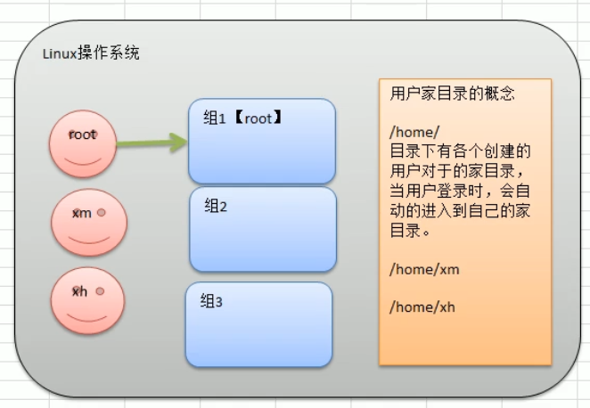

+ 通过用户组管理权限
+ 通过家目录授予用户可编辑的文件
+ 一个用户至少在一个组（默认在同用户名组）
+ 删除用户时，一般保留家目录

**相关文件：**

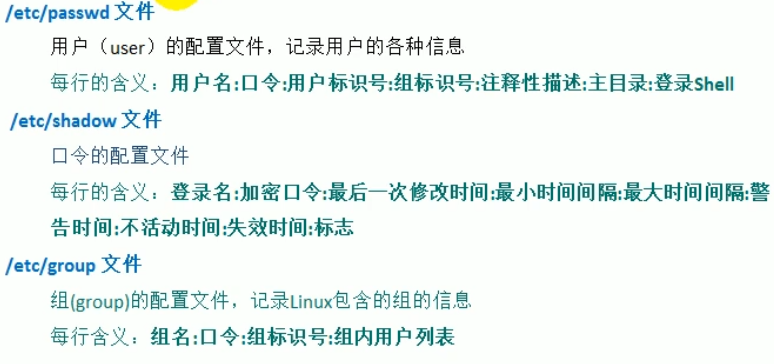

### 4.4 实用指令

#### 4.4.1 指定运行级别

**命令：**

```shell
#配置文件位置
/etc/inittab

#切换到指定运行级别
init 级别 #级别为0至6

#修改为开机直接进入命令行界面
vim /etc/inittab
其中级别改为3

#若被人改为0或6，则先进入单用户模式，再进行修改

#工作实用指令========了解4.7.3之后查看==========================================
#1.统计/home文件夹下文件的个数
ls -l /home | grep "^-" | wc -l
#grep过滤，保留-打头的
#^为定位符号，表示以-打头的（就是文件，见4.5.2权限中文件类型）
#wc表示统计

#2.统计/home文件夹下目录的个数
ls -l /home | grep "^d" | wc -l

#3.统计/home文件夹下文件的个数，包括子文件夹里的
ls -lR /home | grep "^-" | wc -l
#-R递归查询

#4.统计文件夹下的目录的个数，包括子文件夹里的
ls -lR /home | grep "^d" | wc -l

#5.以树状显示目录结构
yum install tree
tree
#yum 安装,指令没有就yum
#tree 后可指定目录
```


**概念：**

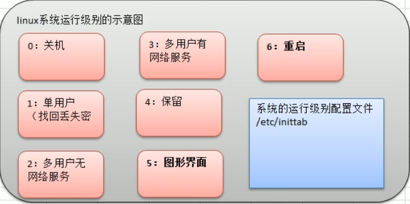

+ 3号用的最多

:bangbang:**面试题：**

**找回root密码？？？**

思路：进入单用户模式，修改root密码（进入单用户模式，不需要root密码）。

前提是`在电脑身边修改，不可远程修改。`

步骤：

+ 开机，在引导时输入 enter键，看到一个界面
  + 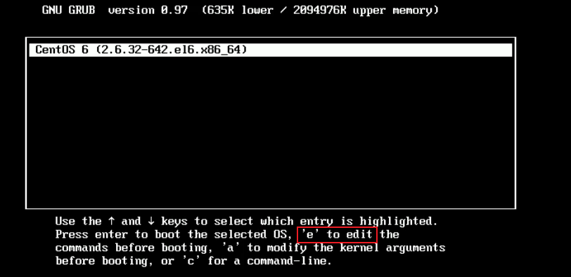
+ 输入`e`，再看到一个新的界面，选中第二行（编辑内核）
  + 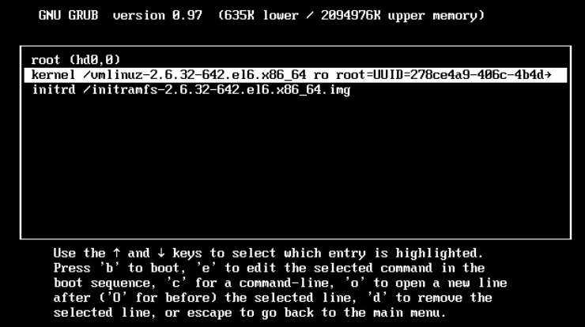
+ 在输入`e`，在这行最后输入 `1`，再enter
  + 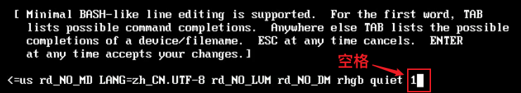
+ 再次输入`b`，则会进入单用户模式
  + 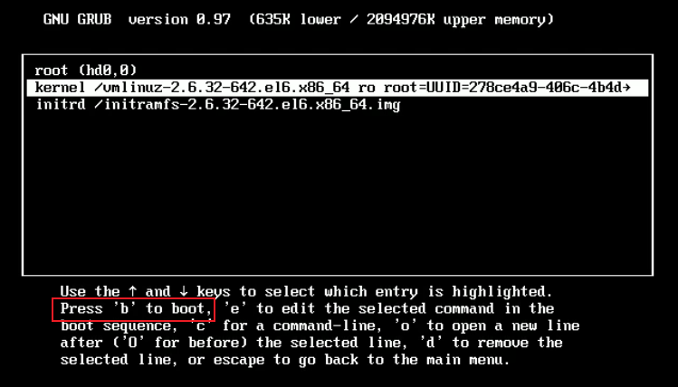
+ `passwd`修改root密码

#### 4.4.2 帮助指令

**命令：**

```shell
#man：帮助信息
man 命令

#help：shell内置命令的帮助信息
help 命令

#百度学习
```

#### 4.4.3 文件目录类

**命令：**

```shell
#pwd：查看当前工作目录的绝对路径
pwd

#ls
ls -a #包含隐藏
ls -l #详细

#cd切换
cd ~ #家目录
cd .. #上级目录

#目录=========================================================
#创建
#mkdir：make directory创建目录
mkdir /home/dog #在home目录下创建dog目录
mkdir -p  /home/animal/tiger #创建多级目录

#删除
rmdir 空目录 #只能删除空目录
rm -rf 目录 #随便删

#文件========================================================
#创建空文件
touch 文件名 # touch hello.txt,可创建多个，空格隔开

#复制
cp 文件 目录 #复制文件到指定目录
cp -r 文件 目录 #递归复制整个文件夹到指定目录
\cp #强制覆盖

#删除
rm -rf 文件/目录

#移动/重命名
mv oldNameFile newNameFile #重命名 mv aa.txt bb.txt
mv /temp/movefile /targetFolder #移动 mv aa.txt /root/

#查看=========================================================
#查看，浏览，只读
cat -n 文件名 | more #行号，more表示分页显示，|管道

#分页查看，全加载读取
more 文件名

#less分屏查看，页读取，所以比more快
less 文件名

#重定向和追加==================================================
#输出重定向
>

#追加
>>
#见概念第3个

#输出=========================================================
#输出内容到控制台
echo 输出内容

#显示文件的开头
head -n num # 默认前10行，num可指定

#显示末尾
tail -n num
tail -f 文件 #实时追踪该文档所有更新，工作中常用

#其他=======================================================
#软链接（类似win快捷方式）
ln -s 源文件或目录 软链接名
cd 软链接名/ #到源文件,但位置没变（pwd）
rm -rf 软链接名 #删除时，软链接后不要带/，否则资源忙

#历史指令（工作常用，可执行）
history #所有
history 10 #最近10个
!历史编号 #!178 执行历史178的指令
```


**概念：**

+ 绝对路径：从根目录开始定位
+ 相对路径：从当前目录到指定目录
+ 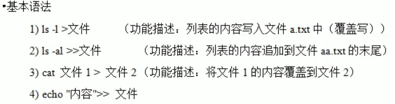
+ `tail -f 文件` 实时追踪该文档所有更新，工作中常用（日志、安全）

#### 4.4.5 时间日期类

**命令：**

```shell
#日期===========================================================
#显示
date  #显示当前时间
date+%Y #显示当前年
date+%m #显示当前月
date+%d #显示当前是哪一天
date "+%Y年%m月%d日 %H:%M:%S" #显示年月日时分秒，+必须，中间连接随意

#设置
date -s 字符串时间 #date -s "2021-01-01 10:10:10"

#以日历方式显示
cal  #显示当前月
cal 2021 #显示2021年，一整年日历
```

#### 4.4.6 搜索查找类

**命令：**

```shell
#find==========================================================
find [搜索范围] [选项]
#按文件名
find /home -name hello.txt
find /home -name *.txt #按名字在home目录中搜索所有文件
#按文件用户
find /opt -user nobody #查找opt目录中属于nobody用户的文件
#按照大小
find / -size +20M #查找根目录/中大于20M的文件，-n是小于，n是等于

#locate========================================================
#快速定位文件路径,因为存在locate数据库.
#使用前，需要先创建库updatedb
updatedb
locate 搜索文件
locate hello.txt

#grep & | ===================================================
#管道命令：将前一个命令处理的结果输出传递给后面的命令处理。
grep [选项] 查找内容 源文件
grep -n  #显示匹配行和行号
grep -i  #忽略大小写
cat hello.txt | grep yes #查看hello.txt文件并查找yes
```

#### 4.4.7 压缩和解压类

**命令：**

```shell
#gzip/gunzip==================================================
gzip 文件 #压缩，*.gz
gunzip gz压缩文件 #解压

#zip/unzip===常用==============================================
zip [选项] xxx.zip 将要压缩的内容 #压缩
unzip [选项] xxx.zip #解压
zip -r #递归压缩，压缩整个目录-----------------------------------
zip -r mypackage.zip /home/
zip -d 目录 文件 #压缩到指定位置---------------------------------
zip -d /opt/tmp/ mypackage.zip

#tar========常用===打包指令=====tar.gz==========================
tar [选项] xxx.tar.gz 打包内容
-z #打包同时压缩
-c #产生.tar打包文件
-v #显示详细信息
-f #指定压缩后的文件名
-x #解压
#压缩时一般
tar -zcvf myhome.tar.gz /home
#解压时一般
tar -zxvf myhome.tar.gz #解压到当前目录
#指定解压到opt(前提目录存在)，必须有-C（大写C，指定解压目录）
tar -zxvf myhome.tar.gz -C /opt/ 
```

### 4.5 组管理和权限管理:bangbang:

#### 4.5.1 组

> 一个用户必须在一个组，不可独立在组外（未指定默认同用户名组下）。
>
> 针对文件：所有者、所在组、其他组、改变用户所在的组

**命令：**

```shell
#所有者==========================================================
#默认属于创建者
#查看
ls -ahl
ll

#修改
chown 用户名 文件名

#组=============================================================
#创建
groupadd 组名

#所在组==========================================================
#默认在创建者组下
#修改
chgrp 组名 文件名

#其他组=========================================================
#除文件的所有者和所在组的用户外，系统的其他用户都是文件的其他组

#改变用户所在组==================================================
#root权限下
usermod -g 组名 用户名

#改变用户登录的初始目录
usermod -d 目录名 用户名
```

#### 4.5.2 权限

> 文件和目录的权限

**命令：**

```bash
#查看
ll

#修改权限=====================================================
chmod

#两种方式
#第一种：+ - = 变更
# u:所有者、g:所在组、o:其他人、a:所有人(u+g+o)
chmod u=rwx,g=rx,o=x 文件目录名
chmod o+w 文件目录名
chmod a-x 文件目录名

#第二种：通过数字变更
# r=4,w=2,x=1,rwx=7
chmod 751 文件目录名 #修改文件权限u=7(rwx),g=5(rx),o=1(x)

#修改所有者===================================================
chown 新所有者 文件名
chown 新所有者:新所在组 文件名
-R #如果是目录，递归改变其中所有文件
chown -R tom:tom /home/abc/

#修改所在组===================================================
chgrp 新组 文件名
-R #对目录递归修改所有文件
```

**概念：**

+ 文件的类型（5种）
  + 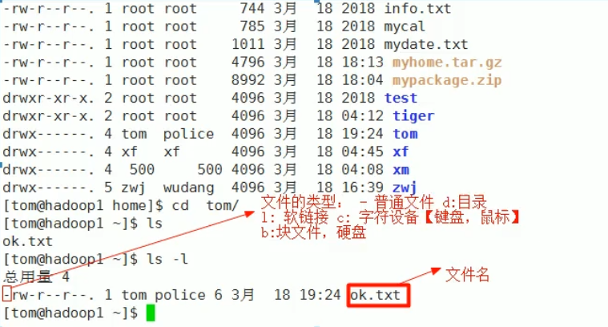
  + `-`普通文件
  + `d`目录
  + `l`软链接文件
  + `c`字符设备（键盘、鼠标）
  + `b`块文件、硬盘
+ 文件最前面的意思
  + `-rw-r--r--`
  + 可分为四部分`-`，`rw-`，`r--`，`r--`
    + 文件类型
    + 文件所有者权限
    + 文件所在组用户权限
    + 文件其他组用户权限
+ Linux中文件显示出来的意思
  + 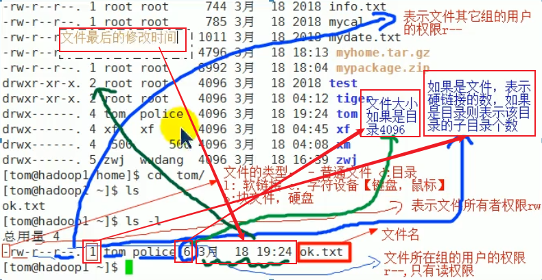
+ 权限（rwx）
  + 文件
    + 
  + 目录
    + 
  + 还可用数字表示
    + r=4,w=2,x=1
    + rwx=4+2+1=7
+ 练习
  + 练习一
    + 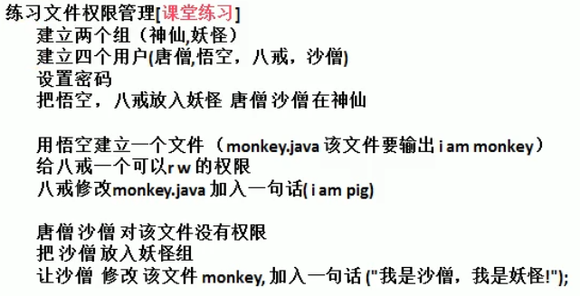
  + 练习二
    + 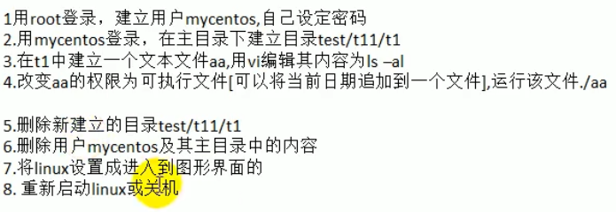

### 4.6 定时任务调度

crond

**命令：**

```bash
#语法
crontab [选项]
-e #编辑crontab定时任务
-l #查询crontab任务，列出当前所有任务调度
-f #删除当前用户所有的crontab任务
crontab -r #终止任务调度
service crond restart #重启任务调度

#实例==============================================================
#第一个：每隔1分钟，将当前的日期信息，追加到/tmp/mydate 文件中-----------
 #1.先编写一个文件，mytask1.sh
 date >> /tmp/mydate
 #2.给mytask1.sh一个可以执行权限
 chmod 744 mytask1.sh
 #3.调度
 crontab -e
 #4.任务
 */1**** /home/mytask1.sh
 #5.出现mydate文件，查看是写入时间
 more mydate
 
#第二个：每隔1分钟，将当前日期和日历都追加到/home/mycal文件中-----------
date >> /home/mycal
cal >> /home/mycal
#第三个：每天凌晨2:00将mysql数据库testdb，备份到文件mydb.bak中----------------
vim /home/mytask3.sh
/usr/local/mysql/bin/mysqldump -u root -proot testdb > /tmp/mydb.bak
chmod 744 /home/mytask3.sh
crontab -e
02*** /home/mytask3.sh
```


**概念：**

+ 任务调度：系统在某个时间执行的特定的命令或程序。

+ 分类

  + 系统工作（重要必须周而复始执行的工作，如病毒扫描等）
  + 个别用户工作（个别用户可能执行某些程序，比如数据库备份等）

+ 原理

  + 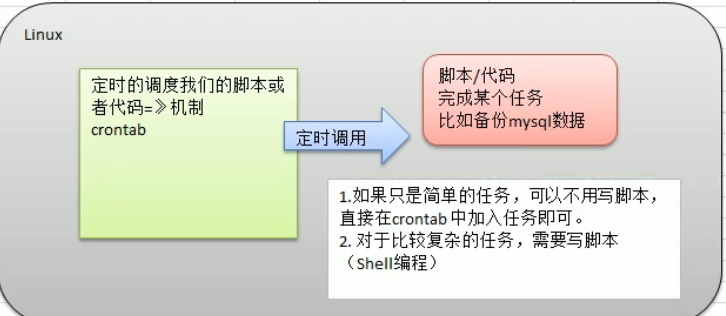
  + 步骤
    + 编写脚本
    + 设置crontab

+ 例子

  + 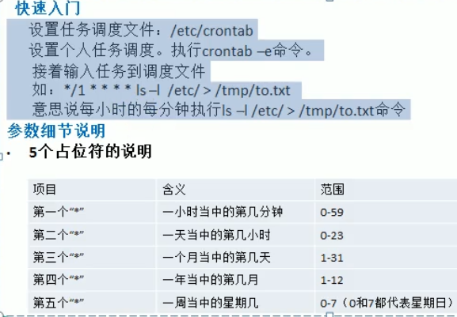
  + 特殊符号
    + 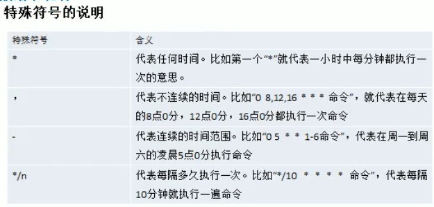
  + 特定时间
    + 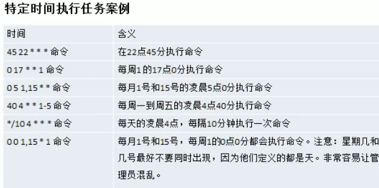

  

### 4.7 磁盘分区&挂载

#### 4.7.1 分区基础

##### 4.7.1.1 方式

【1】mbr分区

+ 特点
  + 最多支持4个主分区
  + 系统只能安装在主分区
  + 扩展分区要占一个主分区
+ 优点
  + 兼容性好（最好，因为最老牌）
+ 缺点
  + 最大支持2TB

【2】gtp分区

+ 特点
  + 支持无限多个主分区（操作系统可能限制，如windows最多128个分区）
  + windows7 64位以后支持gtp
+ 优点
  + 最大支持18EB的大容量（EB=1024PB，PB=1024TB）

##### 4.7.1.2 windows分区

+ 

##### 4.7.1.3 Linux分区

**原理**

+ 概念
  + Linux无论有几个分区，分给哪一个目录使用
  + 它归根结底就**只有一个根目录**，一个**独立且唯一**的**文件结构**
  + Linux中每个分区都是用来组成整个文件系统的一部分

+ 处理
  + Linux采用一种叫**“载入”**的处理方法
  + 它的整个文件系统中包含了一整套的文件和目录，且将一个分区和一个目录联系起来。
  + 这时要载入的一个分区将使它的存储空间在一个目录下获得
+ 示意图
  + 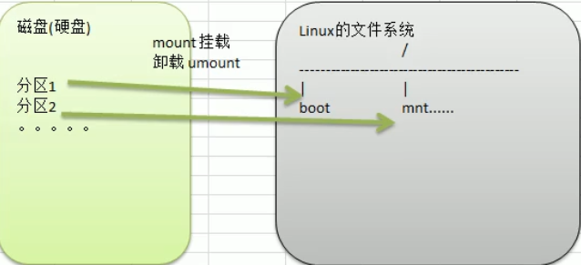

**硬盘说明**

+ Linux硬盘分类
  + IDE硬盘（老）
    + 驱动器标识符“hdx~”
    + `hd`表明分区所在设备类型，是IDE硬盘
    + `x`代表盘号（a基本盘，b基本从属盘，c辅助主盘，d辅助从属盘）
    + `~`代表分区（1~4主分区或扩展分区，5以后为逻辑分区）
  + SCSI硬盘（目前常用）
    + “sdx~”
    + 同上
+ 查看系统分区情况
  + `lsblk -f`
    + 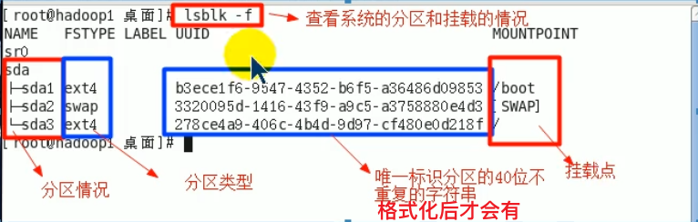
  + `lsblk` 可查看大小
    + 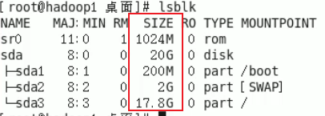


**命令**

```bash
#查看分区挂载情况(老师不离开)
lsblk -f 
lsblk #可查看大小
```

#### 4.7.2 挂载新硬盘

**需求：**给Linux系统增加一个硬盘，并挂载到/home/newdisk/

+ 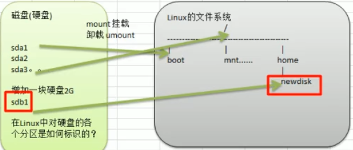

**步骤：**

1. 虚拟机添加硬盘
2. 分区
3. 格式化
4. 挂载
5. 设置可以自动挂载

**操作：**

+ vmware中

  + 虚拟机->设置->硬盘->添加->选硬盘，下一步
    + 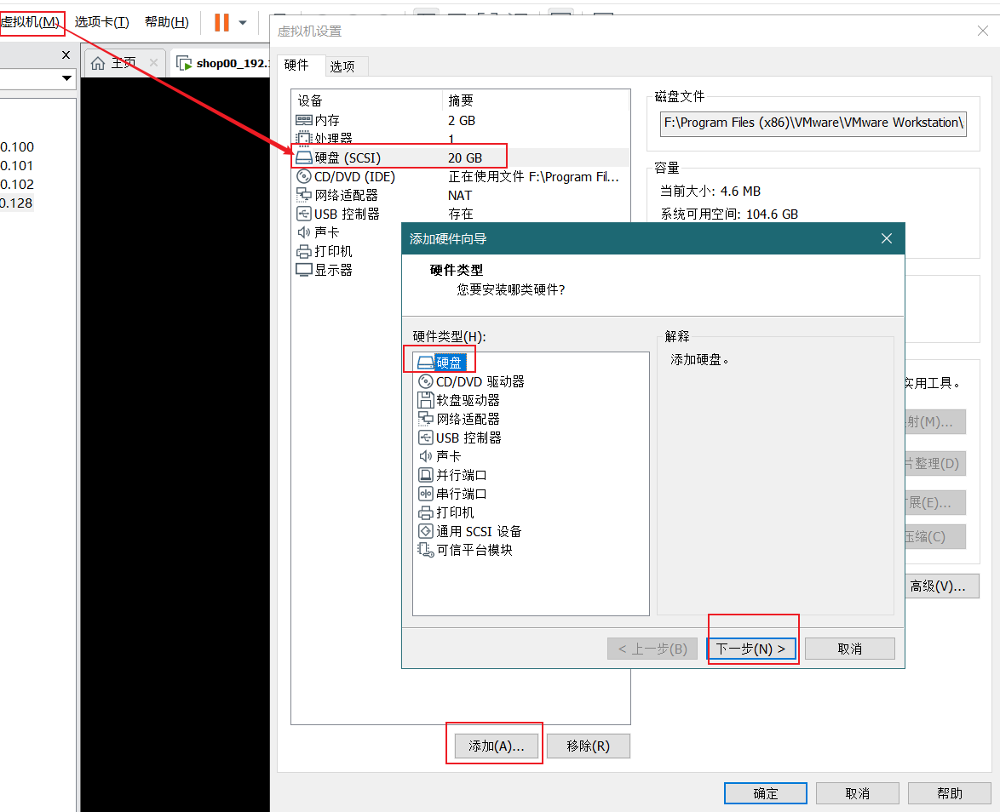
  + 选SCSI(S)
    + 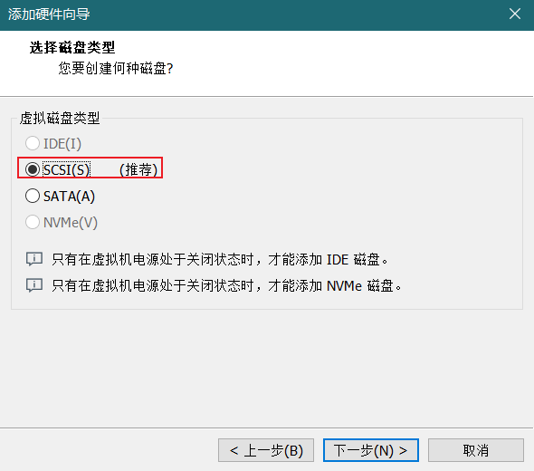
  + 创建新的虚拟磁盘
    + 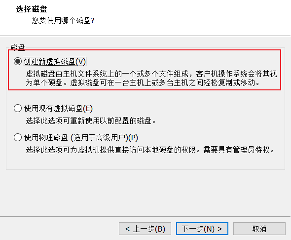
  + 分配所需容量
    + 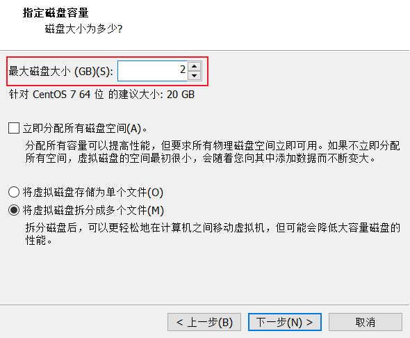
  + 磁盘文件名
    + 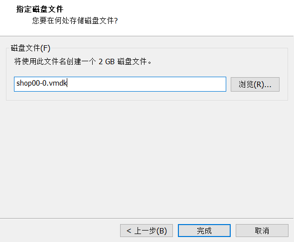

+ 终端

  + ```bash
    lsblk #没有新磁盘信息，需重启
    #重启
    reboot 
    #查看磁盘
    lsblk #看到sdb
    
    #分区================================================
    #对sdb进行分区
    fdisk /dev/sdb
    #Command(m for help)
    m
    #action 中选择n add a new partition
    n
    #是否划一个主分区 p primary partition(1-4)
    p
    #选择分区
    1
    #First ...默认enter
    #Last ... 默认enter
    #写入硬盘并退出 w write table to disk and exit
    w
    
    #格式化================================================
    #命令 -t格式化成ext4格式
    mkfs -t ext4 /dev/sdb1
    
    #挂载=================================================
    #先创建一个目录
    mkdir /home/newdisk
    #挂载
    mount /dew/sdb1 /home/newdisk
    #查看是否成功
    lsblk -f
    
    #问题，这是临时挂载，重启后就不再挂载
    #解决：设置自动挂载（永久挂载）
    #编辑文件(记录分区和挂载点)
    vim /etc/fstab
    #添加挂载信息(见图)
    /dev/sdb      /home/newdisk     ext4     defaults    0 0
    #设置自动挂载生效
    mount -a
    
    reboot
    
    #卸载(前提是不在此分区中，否则会busy，回到home中再卸载)
    umount /dev/sdb1
    ```

  + 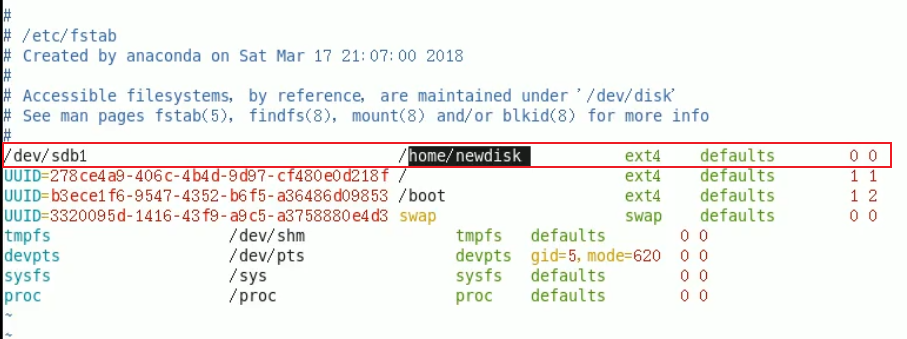

  + 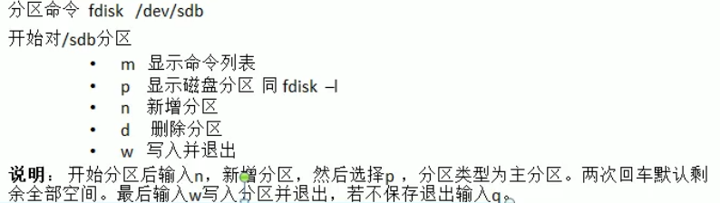

#### 4.7.3 磁盘情况

**命令**

```bash
#查询系统整体磁盘使用情况----------------------------------------------------
df -h
#磁盘不够用要想办法了

#查询指定目录的磁盘占用情况---------------------------------------------------
du -h /目录

-s #指定目录占用大小汇总
-h #带计量单位
-a #含文件
--max-depth=1 #子目录深度
-c #列出明细的同时，增加汇总值

#实例：查询/opt目录磁盘实用情况，深度1
du -ach --max-depth=1 /opt
```

### 4.8 网络配置

#### 4.8.1 原理

+ NAT模式
  + 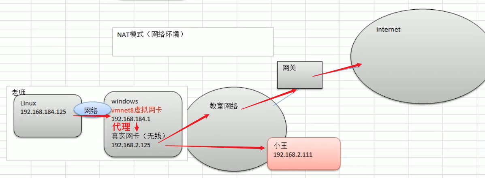
+ 看3.2指定静态ip
+ 查看虚拟网络
  + 
+ 查看网关
  + 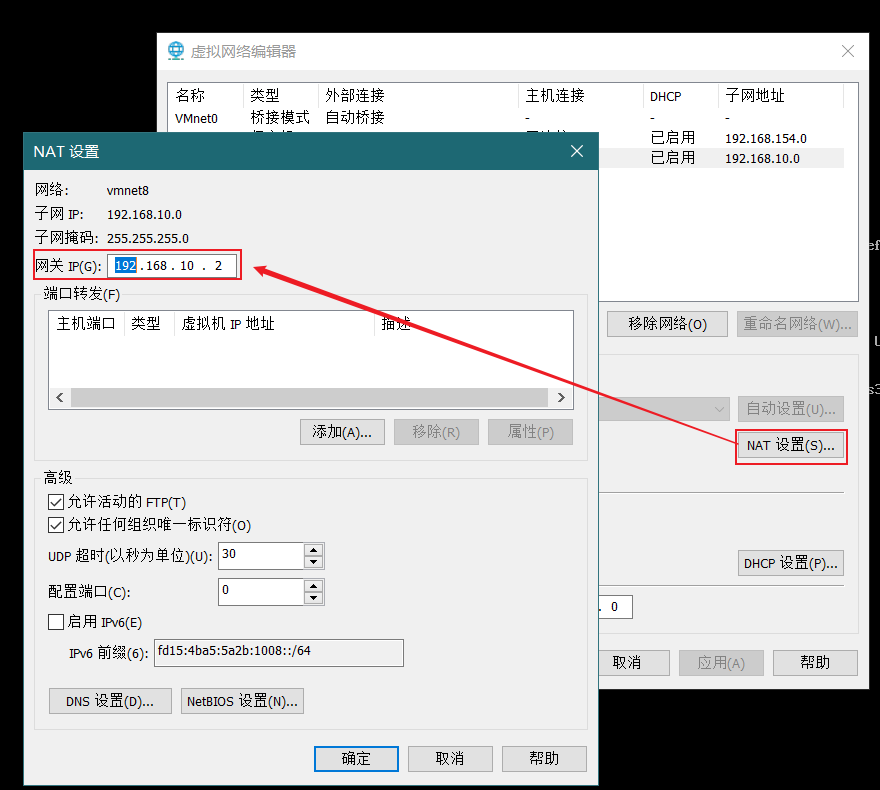
+ 查看windows中VMnet8网络配置（ipconfig指令）
  + 使用ipconfig查看
  + 界面查看
    + 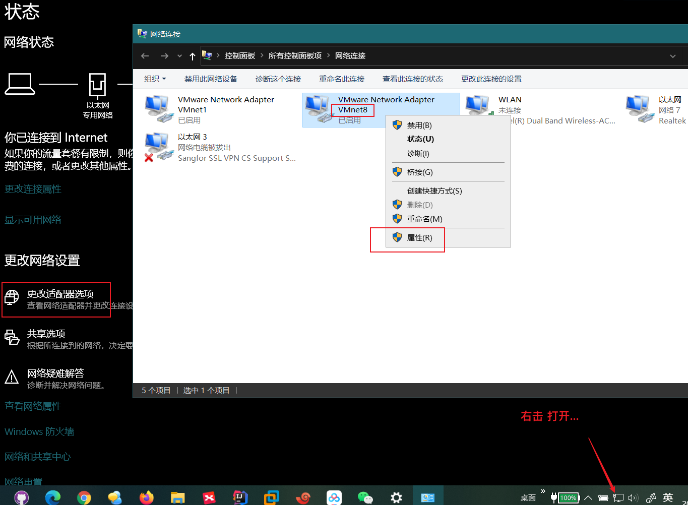
    + 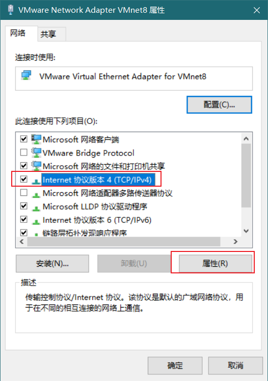
    + 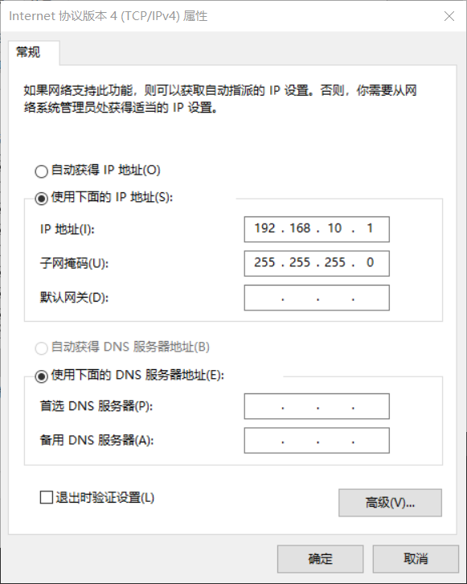
    + 老师的为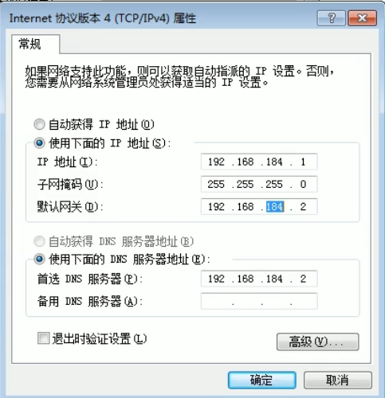
+ 测试：ping www.baidu.com

#### 4.8.2 配置

##### 4.8.2.1 自动获取

+ 图形界面
  + 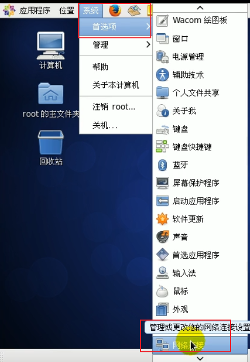
  + 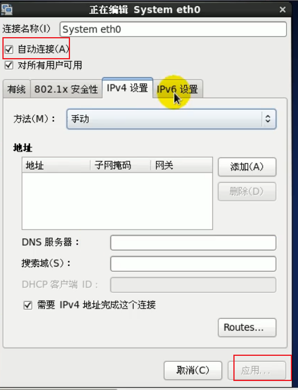
+ 缺点：每次自动获取的ip不一定一样。
  + 不适用于做服务器（服务器ip需固定）

##### 4.8.2.2 指定固定ip

+ 见3.2指定静态ip
+ 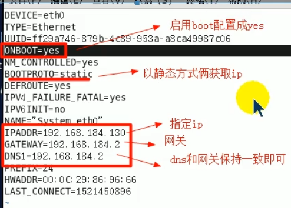
+ DNS为域名解释器

### 4.9 修改主机名

**命令**

```bash
#输出主机名
echo $HOSTNAME

#ping主机名不成功，因为ip和主机名没有映射起来
```

**概念**

+ 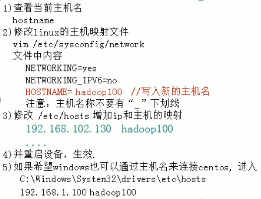
+ ping的原理
  + 因为hosts文件中存在所要ping的地址与网络的映射联系
  + 一般如百度这些是在外网的映射关系中
+ 域名劫持
  + 与hosts文件有关


### 4.10 进程管理:bangbang:

#### 4.10.1 进程的基本介绍

+ 概述
  + Linux中，每个执行的程序（代码）都称为一个进程
  + 每一个进程都分配一个ID号。
  + 每一个进程都会对应一个父进程，这个父进程可以复制多个子进程，如www服务器。
+ 存在方式
  + 每个进程可以以两种方式存在：
    + 前台：用户目前的屏幕上可以进行操作的
    + 后台：实际在操作，但由于屏幕上无法看到的进程
  + 通常使用后台方式执行
  + 一般系统的服务都是以后台进程的方式存在，而且都会常驻在系统中，直到关机才结束。

#### 4.10.2 显示进程的命令

**命令**

```bash
#显示系统执行的进程
ps -a #显示当前终端的所有进程信息
ps -u #以用户的格式显示进程信息
ps -x #显示后台进程运行的参数

ps -ef #查看中显示父进程

#树状形式查看进程
pstree [选项]
-p #显示进程的PID
-u #显示进程的所属用户
```

**概念**

+ ps指令显示的信息
  + 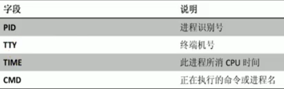
  + 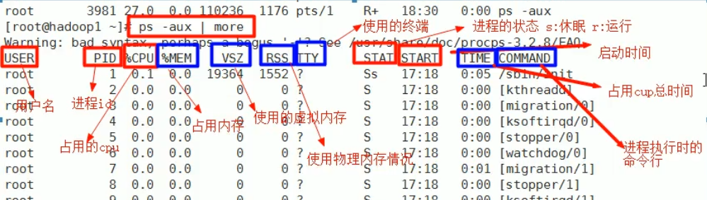
  + 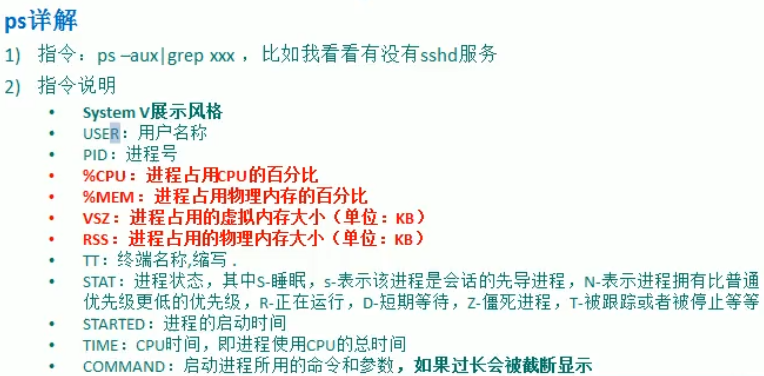
+ 应用实例
  + 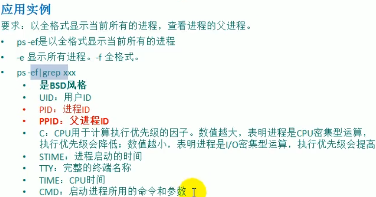

#### 4.10.3 终止进程的命令

**命令**

```bash
#终止进程kill killall 
kill [选项] 进程号 #通过进程号杀死进程
killall 进程名称 #通过进程名称杀死进程，也支持通配符，这在系统因负载过大而变得很慢时很有用

#常用选项
-9 #强迫进程立即停止

#案例=============================================================================
#1.强制踢掉非法用户
ps -aux | grep sshd
kill 用户进程号

#2.终止远程登录服务sshd,在适当时候再次重启sshd服务
ps -aux | grep sshd
kill sshd服务进程号

#3.终止多个gedit编辑器(killall)
killall gedit

#4.强制杀掉一个终端
ps -aux | grep bash #查看终端进程(/bin/bash)
kill -9 终端进程号
```


**概念**

+ 案例1
  + 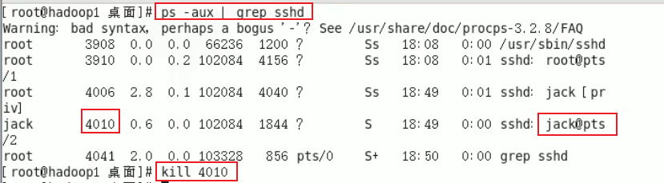


### 4.11 服务管理

#### 4.11.1 基础服务

**命令**

```bash
#service管理指令
service 服务名 start | stop | restart | reload | status
#centos7.0后service不用了，改用systemctl
systemctl

#防火墙iptables
#查看
service iptables status
systemctl status firewalld
#暂时关闭(立马生效)
service iptables stop
systemctl stop firewalld
#永久关闭
chkconfig iptables off
systemctl disable firewalld
#重启
service iptables restart
systemctl enable firewalld

#安装Firewalld（centos7新）
yum install firewalld

#检查Linux的某个端口是否在监听并可访问
telnet ip号 端口号 #telnet 192.168.10.100 22

#service这种关闭是临时的
#永久关闭或服务自启动使用chkconfig======================================
chkconfig --list #查看所有服务
chkconfig --list | grep xxx #查看指定服务
chkconfig 服务名 --list #查看指定服务
chkconfig --level 5 服务名 on/off #给运行级别设置自启动/关闭

#当运行级别为5时，关闭防火墙
chkconfig --level 5 iptables off
#在所有运行级别下，关闭防护墙
chkconfig iptables off

#注意：chkconfig 修改后需reboot生效

#查看服务名============================================================
#方式一
setup
#选系统服务，空格修改
#方式二
cd /etc/init.d/
ll #列出有哪些服务
cd /etc/init.d/服务名称

#服务的运行级别4.4.1
```


**概念**

+ 介绍：
  + 服务（service）本质就是进程，但是是运行在后台的，通常会监听某个端口，等待其他程序的请求，比如（mysql，sshd防火墙等），因此我们又称为**守护进程**:bangbang:
+ 原理图
  + 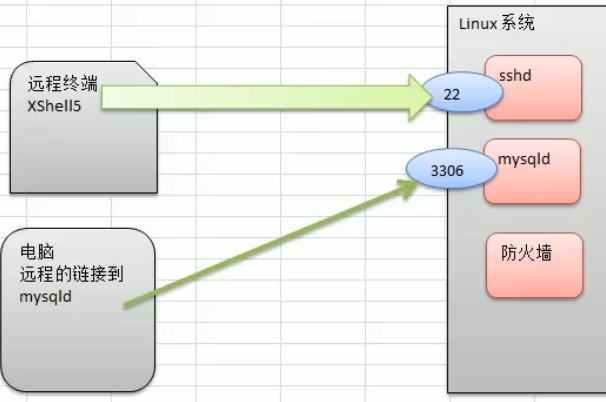
+ 服务运行级别（runlevel）对应4.4.1
  + 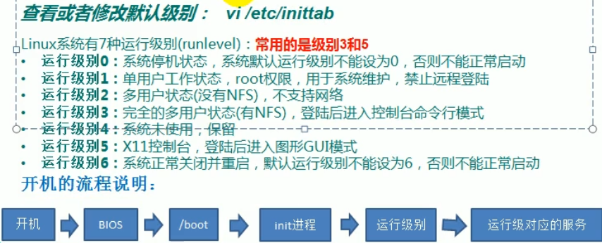
  + 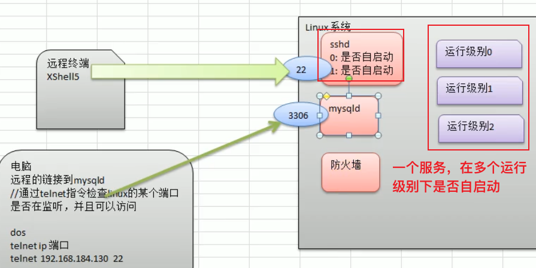

#### 4.11.2 监控服务

##### 4.11.2.1 动态监控进程

**命令**

```bash
#top与ps相似，不同是在执行一段时间可更新正在运行的进程
top [选项]
-d 秒数 #每隔几秒运行top，默认3秒
-i #使用top不显示任何闲置或僵死进程
-p #通过指定监控进程ID来仅仅监控某个进程的状态

#案例====================================================
#监视特定用户
top下输入u然后enter，再输入用户名即可

#杀死某个进程
top下输入k然后enter，再输入进程号

#指定系统更新时间
top -d 10
```

**概念**

+ 类似windows的任务管理器
+ 交互操作
  + `p`以cpu使用率排序，默认就是此项
  + `M`以内存的使用率排序
  + `N`以PID排序
  + `q`退出top
+ 显示参数
  + 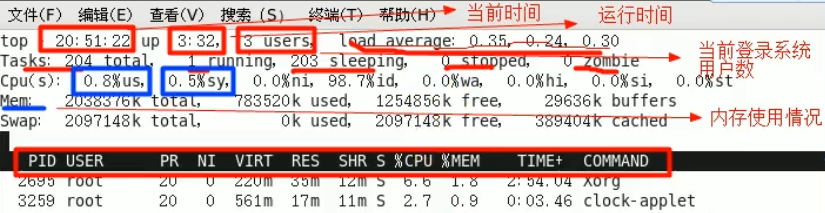

##### 4.11.2.2 监控网络状态

**命令**

```bash
#监控服务
netstat [选项]
-an #按一定顺序排列输出
-p #显示哪个进程在调用

#查看网络服务的状态
netstat -anp | more
```

**概念**

+ 查看
  + 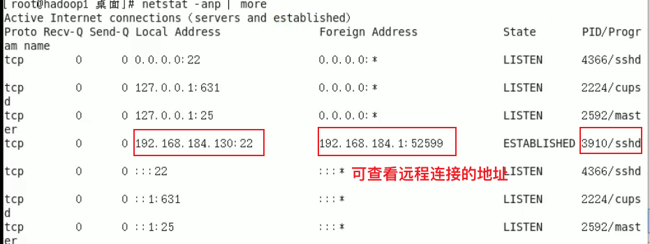

### 4.12 RPM与YUM包管理

#### 4.12.1 RPM

**命令**

```bash
#简单查询==================================================
#查询已安装的rpmlieb
rpm -qa | grep xxx

#查询是否安装火狐
rpm -qa | grep firefox

#其他指令，见概念中截图
-q
-qi
-ql
-qf

#卸载=====================================================
#e 擦除删除的意思
rpm -e RPM包的名称

#细节，出现级联删除
rpm -e foo
#删除一些存在其他包依赖于你要卸载的软件包(这里的例子是foo)会提示
removing these packages would break dependencies:foo is needed by bar-1.0.1
#强制删除可加 --nodeps，但不推荐(有风险)
rpm -e --nodeps foo

#安装=====================================================
rpm -ivh RPM包全路径名称
-i #install 安装
-v #verbose 提示
-h #hash 进度条

#例子：安装firefox
#步骤
#1.找到firefox安装包。
#需要先挂载上我们安装centos的iso文件（在vmware虚拟机设置中，CD/DVD用iso映像文件）
#然后到/media/下中rpm中找firefox。
cd /media/
ls
cd CentOS_xxx
ls
cd Packages
ls -l firefox-xxx #可用Tab键自动填补
#2.复制firefox的rpm文件到/opt/
cp firefox-xxx /opt/
#安装
cd /opt/
rpm -ivh firefox-xxx
```


**概念**

+ RPM介绍
  + 
+ RPM包基本格式
  + 
+ RPM包其他查询指令
  + 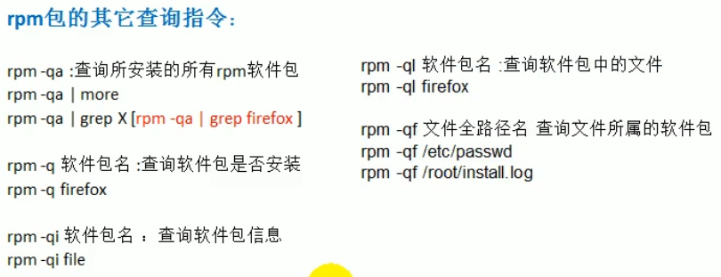


#### 4.12.2 YUM

**命令**

```bash
#查看yum服务器是否有需要安装的软件
yum list | grep xxx软件列表

#安装指定的yum包
yum install xxx #下载安装
```

**概念**

+ 介绍
  + 
  + 优点：
    + 自动处理依赖性关系
+ 原理
  + 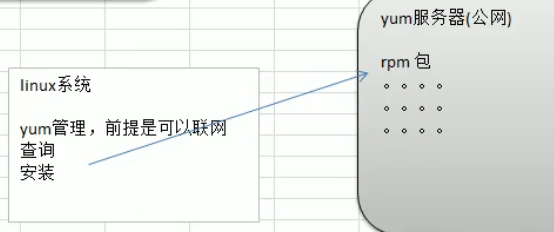

## 5.面试题

### 5.1 Linux常用命令，至少6个？

高级的

netstat

top

lsblk

find

ps

chkconfig

### 5.2 Linux查看内存、磁盘存储、io读写、端口占用、进程等命令？

内存：top

磁盘存储： df -lh

端口占用：netstat -tunlp

进程：ps -aux | grep 进程名

io读写：iotop （没有通过yum安装）（观察大内存读写）


## 6.相关

### 6.1 Linux配jdk

+ 解压jdk

+ 配环境变量

  + ```bash
    vim /etc/profile
    ------------------------------
    #找到export
    #注释掉
    #export PATH XXX
    export JAVA_HOME=/usr/local/jdk
    export PATH=$JAVA_HOME/bin:$PATH
    ------------------------------------
    #想让这个文件生效，必须source
    source /etc/profile
    #查看jdk版本
    java -version
    ```

### 6.2 安装vim

+ ```bash
  #查看Linux系统版本
  lsb_release -a
  
  #根据版本输入命令
  #centos
  yum -y install vim*
  #Ubuntu
  sudo apt-get install vim-gtk
  ```

### 6.3 安装无法连接库

问题：

```bash 
Could not retrieve mirrorlist http://mirrorlist.centos.org/?release=7&arch=x86_64&repo=os&infra=stock error was
12: Timeout on http://mirrorlist.centos.org/?release=7&arch=x86_64&repo=os&infra=stock: (28, 'Resolving timed out after 30569 milliseconds')
```

解决：

```bash
#查看是否有网
ping www.baidu.com

#查看网卡
nmcli d
#编辑网卡
cd /etc/sysconfig/network-scripts/ | ls
vim ifcfg-ens33
#查看网关等是否正确
------------------------------------------
BOOTPROTO=static
ONBOOT=yes
-------------------------------------------

#重启网络
systemctl restart network
#再ping

#注意各虚拟机配网的一致性，除了ip
```


