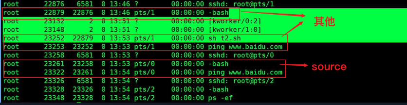

# Shell

> why?
>
> + 看懂运维人员编写的shell程序
> + 偶尔编写一些简单的shell程序来管理集群，提高开发效率

## 1. 概述

### 1.1 what

+ 命令行解释器
+ 接收应用程序/用户命令，然后盗用操作系统内核。
  + 
+ 功能强大的变成语言，易编写、易调试、灵活性强 。

+ `$`表示命令提示符

### 1.2 解析器

**命令**

```bash
#查看shells
sudo cat /etc/shells #sudo表示拥有最高权限

#查看sh和bash的关系
cd /bin/
ll | grep bash
#sh -> bash 软链接，表示最终sh调用的还是bash

#系统默认解析器
echo $SHELL
#结果 /bin/bash
```

## 2.shell脚本入门

### 2.1 脚本格式

+ 脚本以`#!/bin/bash`开头，指定解析器

### 2.2 第一个shell脚本

+ 需求：创建一个shell脚本，输出helloworld

+ 实操：

  + ```bash
    #创建脚本
    touch helloworld.sh
    #编辑脚本
    vim helloworld.sh
    
    #在其中输入
    #!/bin/bash
    echo "helloworld"
    
    #脚本执行方式
    #第一种：bash或sh+脚本的相对路径或绝对路径（不用赋予脚本+x权限）
    sh 脚本
    bash 脚本
    #第二种：./脚本（直接绝对路径或相对路径）（需要+x权限,即脚本自己执行，需执行权限）
    ./脚本
    ```

    

### 2.3 第二个shell脚本

+ 多命令处理

+ 需求：在/home/test/目录下创建一个banzhang.txt，在其中增加"nihao"。

+ 实操：

  + ```bash
    touch batch.sh
    vim batch.sh
    
    #其中写
    #!/bin/bash
    cd /home/test/
    touch banzhang.txt
    echo "nihao" >> banzhang.txt
    
    #出来
    bash batch.sh
    ```


## 3.shell的变量

### 3.1 系统变量

#### 3.1.1 常用

$HOME（家目录），$PWD（当前目录），$SHELL（解析器），$USER（当前用户）等

#### 3.1.2 实操

+ ```bash
  #查看系统变量的值
  echo $HOME
  
  #显示当前shell中所有变量：set
  set
  ```

### 3.2 自定义变量

####  3.2.1 基础语法

+ ```bash
  #定义变量
  变量=值
  A=1
  echo $A
  #重新赋值
  A=8
  
  #撤销变量
  unset 变量
  unset A
  
  #声明静态变量
  readonly 变量 #注意：这种变量无法unset
  
  #有空格的需要引号
  D="hello world !"
  
  #可把变量提升为全局环境变量，可供其他shell程序使用
  export 变量名
  
  #将刚才写的D写入sh文件中
  touch hello.sh
  vim hello.sh
  
  #!/bin/bash
  echo "你好"
  echo $D
  
  #执行hello.sh
  bash hello.sh
  #结果并没有输出D
  #需要将D这个局部变量设为全局变量
  export D
  #再次执行则输出
  bash hello.sh
  ```

  

#### 3.2.2 定义规则

+ 变量名称由这些组成，不能以数字开头，环境变量名建议大写！
  + 字母
  + 数字
  + 下划线
+ 等号两侧不能有空格！
+ 在bash中，变量默认类型都是字符串类型，无法直接进行数值运算。
+ 变量的值如果有空格，需要使用双引号或单引号括起来。

### 3.3 特殊变量

+ ```bash
  #命令行解释器
  #!/bin/bash 
  
  #n为数字，$0代表该脚本名称，$1-$9代表第1到第9个参数，10以上的参数需要用大括号包含，如${10} 
  $n
  
  #获取所有输入参数个数，常用于循环
  $#
  
  #代表命令行中所有的参数，$*把所有的参数看成一个整体
  $*
  
  #代表命令行中所有的参数，$@把每个参数区分对待
  $@
  
  #最后一次执行的命令的返回状态，如果这个变量的值为0，证明上一个命令正确执行;如果这个变量的值为非0（具体是哪个数，由命令自己决定），则证明上一个命令执行不正确
  $?
  
  #脚本运行过程中产生的进程ID
  $$ 
  ```

+ `$n`

  + ```bash
    vim a.sh
    ---------------------------------------------------------------------
    #!/bin/bash
    echo "$0 $1 $2 $3"
    ---------------------------------------------------------------------
    sh a.sh ni hao wo shi coredao
    #结果：a.sh ni hao wo
    #其中：$0表示脚本本身，故显示a.sh
    #$1~3表示3个参数，输入小于或等于3个参数都显示，大于3个只显示前三个
    ```

+ `$#`

  + ```bash
    vim a.sh
    ---------------------------------------------------------------------
    #!/bin/bash
    echo "$#"
    ---------------------------------------------------------------------
    sh a.sh ni hao wo shi coredao
    #结果：5
    #因为输入了5个参数
    ```

+ `$*`

  + ```bash
    vim a.sh
    ---------------------------------------------------------------------
    #!/bin/bash
    echo "$*"
    ---------------------------------------------------------------------
    sh a.sh ni hao wo shi coredao
    #结果：ni hao wo shi coredao
    ```

+ `$@`

  + ```bash
    vim a.sh
    ---------------------------------------------------------------------
    #!/bin/bash
    echo "$@"
    ---------------------------------------------------------------------
    sh a.sh ni hao wo shi coredao
    #结果：ni hao wo shi coredao
    ```

+ `$?`

  + ```bash
    ll
    echo $?
    0 #表示正确，非0表示上一个命令执行不正确
    ```

## 4.shell 运算符

### 4.1 基础语法

+ `$((运算式))`或`$[运算式]`
+ `expr +,-,\*,/,%`表示加，减，乘，除，取余（注意：expr运算符间要有空格）

### 4.2 案例实操

+ ```bash
  #3+2
  expr 2 + 3
  
  #(2+3)*4
  expr `expr 2 + 3` \* 4
  #等价于
  s=$[(2+3)*4]
  echo s
  ```


## 5.条件判断

### 5.1 基础语法

+ `[ condition ]` （注意：condition前后要有空格）
+ 只要是条件判断，**左右必须有空格**，后边的知识也是
+ 注意：条件非空即为true，[ nihao ]返回true，[  ]返回false。
+ 多条件判断（
  + `&&`表示前一条命令执行成功时，才执行后一条命令
  + `||`表示上一条命令执行失败后，才执行后一条命令）

### 5.2 常用判断条件

+ 两个整数之间比较

  `=`字符串比较

  `-lt`小于（less than）

  `-le`小于等于（less equal）

  `-eq`等于（equal）

  `-gt`大于（greater than）

  `-ge`大于等于（greater equal）

  `-ne`不等于（Not equal）

+ 按照文件权限进行判断

  `-r`有读的权限（read）

  `-W`有写的权限（Write）

  `-X`有执行的权限（execute）

+ 按照文件类型进行判断

  `-f`文件存在并且是一个常规的文件（file）

  `-e`文件存在（existence）

  `-d`文件存在并是一个目录（directory）

### 5.3 实操

+ ```bash
  #23是否大于等于22
  [ 23 -ge 22 ]
  echo $?
  0 #说明正确
  [ 23 -le 22 ]
  echo $?
  1 #非0，故上一个命令错误，表示23不小于或不等于22
  
  #hello.sh是否具有写的权限
  [ -W hello.sh ]
  echo $?
  
  #/home/mytmp/a.txt 目录中的文件是否存在
  [ -e /home/mytmp/a.txt ]
  echo $?
  
  #多条件判断
  [ condition ] && echo OK || echo notOK
  #结果OK
  [ condition ] && [ ] || echo notOK
  #结果notOK
  ```

## 6.流程控制:bangbang:

### 6.1 if 判断

#### 6.1.1 基本语法

+ ```bash
  if [ 条件判断式 ];then
  	程序
  fi
  ----------------------------------------------------------
  if [ 条件判断式 ]
  	then
  		程序
  fi
  ```

+ 注意

  + `[ 条件判断式 ]`,中括号和条件判断式之间必须有空格
  + `if`后要有空格

#### 6.1.2 实操

+ ```bash
  #输入一个数字，如果是1，则输出nihao；如果是2，则输出haha;如果是其他，什么也不输出
  vim if.sh
  --------------------------------------------
  #!/bin/bash
  if [ $1 -eq 1 ]
  then
  	echo "nihao"
  elif [ $1 -eq 2 ]
  then
  	echo "haha"
  fi
  --------------------------------------------
  bash if.sh 1
  bash if.sh 2
  bash if.sh 3
  ```

### 6.2 case语句

#### 6.2.1 基础语法

+ ```bash
  case $变量名 in
  "值1")
  	如果变量的值等于值1，则执行程序1
  ;;
  "值2")
  	如果变量的值等于值2，则执行程序2
  ;;
  ...省略其他分支...
  *)
  	如果变量的值都不是以上的值，则执行此程序
  ;;
  esac
  ```

+ 注意：

  + ease行尾必须为单词`in`，每一个模式匹配必须以右括号`)`结束。
  + 双分号`;;`表示命令序列结束，相当于Java中的`break`
  + 最后的`*)`表示默认模式，相当于Java中的`default`

#### 6.2.2 实操

+ ```bash
  #输入一个数字，如果是1，则输出nihao;如果是2，则输出haha;如果是其他，则输出lala
  vim case.sh
  -------------------------------------------------
  #!/bin/bash
  case $1 in
  1)
  	echo "nihao"
  ;;
  2)
  	echo "haha"
  ;;
  *)
  	echo "lala"
  ;;
  esac
  -------------------------------------------------
  bash case.sh 1
  ```

### 6.3 for 循环

#### 6.3.1 基础语法

+ ```bash
  #语法1
  for((初始值;循环控制条件;变量变化))
  do
  	程序
  done
  
  #语法2
  for 变量 in 值1 值2 值3 ...
  do
  	程序
  done
  ```

#### 6.3.2 实操

+ ```bash
  #从1加到100================================
  vim for1.sh
  --------------------------------------------
  #!/bin/bash
  s=0
  for((i=1;i<=100;i++))
  do
  	s=$[$s+$i]
  done
  echo $s
  --------------------------------------------
  bash for1.sh
  
  #打印所有输入的参数==========================
  vim for2.sh
  -------------------------------------------
  #!/bin/bash
  for i in "$*"
  do
  	echo "nihao $i"
  done
  
  for j in "$@"
  do
  	echo "nihao $j"
  done
  -------------------------------------------
  bash for2.sh haha lala niu
  #结果
  #nihao haha lala niu
  #nihao haha
  #nihao lala
  #nihao niu
  #因为$*和$@的区别，加了""成为一个整体，*本来就代表一个整体。而@是分开的，一次给j赋一次值。
  ```

### 6.4 while循环

#### 6.4.1 基础语法

+ ```bash
  while [ 条件判断式 ]
  do
  	程序
  done
  ```

+ `while`后有空格

#### 6.4.2 实操

+ ```bash
  #从1加到100
  vim while.sh
  ----------------------------------------------------
  #!/bin/bash
  s=0
  i=1
  while [ $i -le 100 ]
  do
  	s=$[$s + $i]
  	i=$[$i + 1]
  done
  echo $s
  ----------------------------------------------------
  bash while.sh
  ```

## 7.read读取控制台输入

>  不常用

### 7.1 基础语法

+ ```bash
  read(选项)(参数)
  
  #选项
  -p #指定读取值时的提示符
  -t #指定读取值时等待的时间（秒）
  
  #参数
  变量 #指定读取值得变量名
  ```

### 7.2 实操

+ ```bash
  #提示7秒内，读取控制台输入的名称
  vim read.sh
  ---------------------------------------------
  #!/bin/bash
  read -t 7 -p "Enter your name in 7 seconds" NAME
  echo $NAME
  ---------------------------------------------
  bash read.sh
  ```

## 8.函数

### 8.1 系统函数

#### 8.1.1 basename

```bash
basename[string/pathname][suffix]
#basename命令会删除所有的前缀包括最后一个('/')字符，然后将字符串显示出来

#选项
suffix #后缀，如果suffix被指定了，basename会将pathname或string中的suffix去掉。

#实操=========================================
#截取该/home/mytmp/aa.txt路径的文件名称
basename /home/mytmp/aa.txt
#结果：aa.txt
basenaem /home/mytmp/aa.txt .txt
#结果：aa
```

#### 8.1.2 dirname

```bash
dirname 文件绝对路径
#从给定的包含绝对路径的文件名中去除文件名（非目录的部分），然后返回剩下的路径（目录的部分）。

#实操======================================
#获取aa.txt文件的路径
dirname /home/mytmp/aa.txt
#结果：/home/mytmp
```

### 8.2 自定义函数

#### 8.2.1 基础语法

```bash
#[]中可写可不写
[function]funname[()]
{
	Action;
	[return int;]
}
funname

#计算两个输入参数的和
vim sum.sh
-------------------------------------------
#!/bin/bash
function sum()
{
	s=0;
	s=$[$1+$2]
	echo "$s"
}
read -p "input your num1:" P1
read -p "input your num2:" P2

sum $P1 $P2
-------------------------------------------
bash sum.sh
```


#### 8.2.2 经验技巧

+ 必须在调用函数地方之前，先声明函数，shell脚本是逐行运行。不会像其他语言一样先编译。
+ 函数返回值，只能通过`$?`系统变量获得，可以显示加：return返回，如果不加，将以最后一条命令运行结果，作为返回值。return后跟数值n(0-255)。
+ 开发中，运维写，会看就行

## 9.shell工具:bangbang:

### 9.1 cut

#### 9.1.1 基础

+ ```bash
  cut [选项参数] filename
  #默认分隔符是制表符（啥也不写按照Tab制表符分隔）
  
  #参数表示怎么切
  -f #列号，提取第几列
  -d #分隔符，按照指定分隔符分隔列
  ```

+ cut的工作是“剪”

+ 在文件中负责剪切数据

+ cut命令从文件的每一行剪切字节、字符和字段并将这些字节、字符和字段输出。

+ 工作中切割日志

#### 9.1.2 实操

+ ```bash
  #数据准备
  vim cut.txt
  ---------------------------
  ni hao
  ha ha
   la la
   bye bye
  ---------------------------
  #切割cut.txt第一列
  cut -d " " -f 1 cut.txt
  
  #切割cut.txt 第二列、第三列
  cut -d " " -f 2,3 cut.txt
  
  #在cut.txt中切割出hao
  cat cut.txt | grep hao | cut -d " " -f 2
  #查找到hao，看其位置进行切割
  
  #选取系统PATH变量值，第2个“：”开始后的所有路径
  echo $PATH | cut -d : -f 3-
  #以：分隔，选第三列（第二个：后的路径）
  #没有改变原文件
  
  #切割ifconfig后打印的ip地址
  #自己可能是eth3等
  ifconfig eth0 | grep "inet addr" | cut -d : -f 2 | cut -d " " -f 1
  ```

### 9.2 sed :bangbang::bangbang:

#### 9.2.1 基础

+ ```bash
  sed [选项参数] '命令' filename
  
  #选型
  -e #直接在指令列模式上进行sed的动作编辑
  #执行多个命令时用
  -f #以选项中指定的script文件来处理输入的文本文件。
  -n #仅显示处理后的结果
  -i #将修改直接添加到文件中
  
  #命令
  a #新增，a的后面可以接字串，在下一行出现
d #删除
  s #查找并替换
  
  c #取代
  i #插入
  p #打印
  ```
  
+ 流编辑器

+ 一次处理一行内容。

+ 执行后文件内容不改变。

+ 

+ 脚本之家网站可搜sed获取ip的命令行

+ 行选择模式

  + 10 第十行

  + m,n --> 第m行到第n行  [m,n]

  + m,+n-->第一行到第四行 [m,m+n]

  + m~n-->从m行开始，依次累加n，递增改

    + ```bash
      3~1
      从第三行开始，每1行修改
      3~2
      从第三行开始，每2行修改
      ```

  + m,$ -->从m开始到最后一行

  + /school/ -->匹配到school的行

  + /u1/,/u4/-->从匹配u1到匹配u4

#### 9.2.2 实操

+ ```bash
  vim sed.txt
  ---------------------------
  ni hao
  he he
  wo wo
  la la
   le le
  ---------------------------
  #将“mei nv”这个单词插入到第二行下，打印
  sed "2a mei nv" sed.txt
  #第二行2，加入a，内容mei nv
  #仅打印出来，原文件没有改变
  
  #删除sed.txt中包含wo的行
  sed "/wo/d" sed.txt
  #增加在前，删除在后写
  
  #替换
  sed "s/wo/ni/g" sed.txt
  #g表示全部替换global
  
  #多命令需要-e
  #删除第二行并将wo替换为ni
  sed -e "2d" -e "s/wo/ni/g" sed.txt
  ```

### 9.3 awk

#### 9.3.1 基础

+ ```bash
  awk [选项参数] 'pattern1{action1} pattern2{action2}...' filename
  #pattern:表示awk在数据中查找的内容，就是匹配模式（相当于正则匹配）
  #action:在找到匹配内容时所执行的一系列命令
  
  -F #指定输入文件的拆分隔符,后接用的分隔符（类似cut）
  -V #赋值一个用户定义变量
  
  #内置变量=========================================================
  FILENAME #文件名
  NR #已读的记录数
  NF #浏览记录的域的个数（切割后，列的个数）
  ```

+ 强大的文本分析工具

+ 把文件逐行的读入，以空格为默认分隔符将每行切片，切开的部分再进行分析处理。

#### 9.3.2 实操

+ ```bash
  #my用户下
  #数据准备
  sudo cp /etc/passwd /home/mytmp/
  sudo chown my:my passwd
  
  #搜索passwd文件以root关键字开头的所有行，并输出该行的第7列
  awk -F : '/^root/ {print $7}' passwd
  #结果：/bin/bash
  
  #搜索passwd文件以root关键字打头的所有行，并输出该行的第1列和第7列，中间以“，”分隔。
  awk -F : '/^root/{print $1","$7}' passwd
  #结果：root,/bin/bash
  #注意：只有匹配了pattren的行才会执行action
  
  #加头去尾
  #只显示/etc/passwd的第1列和第7列，以逗号分隔，且在所有行前面添加列名user，shell在最后一行添加“lala,/bin/haha”
  awk -F : 'BEGIN{print "user,shell"} {print $1","$7} END{print "lala,/bin/hah"}' passwd
  #BEGIN在所有数据读取行之前执行
  #END在所有数据执行之后执行
  
  #增加
  #将passwd文件中的用户id增加数值1并输出
  awk -F : -v i=1 '{print $3+i}' passwd
  #id在第三列故$3
  
  #内置变量===========================================================================
  #统计passwd文件名，每行的行数，每行的列数
  awk -F : '{print "FILENAME","NR","NF"}' passwd
  #切割ip
  ifconfig eth0 | grep "inet addr" | awk -F : '{print $2}' | awk -F : " " '{print $1}'
  
  #查询sed.txt中空行所在的行号
  awk '/^$/{print NR}' sed.txt
  ```

  

### 9.4 sort

#### 9.4.1 基础

+ ```bash
  #排序
  sort(选项)(参数)
  
  #选项
  -n #依照数值的大小排序
  -r #相反顺序paix
  -t #设置排序时所用的分隔字符
  -k #指定需要排序的列
  
  #参数
  #指定待排序的文件列表
  ```

+ 非常有用，将文件进行排序，并将排序结果标准输出。

#### 9.4.2 实操

+ ```bash
  #数据准备
  vim sort.sh
  ----------------------------------------------------
  bb:40:5.4
  bd:20:4.2
  xz:50:2.3
  cls:10:3.5
  ss:30:1.6
  ----------------------------------------------------
  #以:分隔，根据第二列倒序
  sort -t : -nrk 2 sort.sh
  ```


#### 9.5 wc（一般不用）

+ world count

+ 相当于 hello world

+ 统计单词的数量

+ ```bash
  wc xxx
  4 15 79 sxt
  -l  line
  -w word
  -c  char
  ```

+ 

## 10.面试题

```bash
1.#使用Linux命令查询file1中空行所在的行号
awk '/^$/{print NR}' file1

2.#计算第二列和并输出
#数据：chengji.txt
张三 40
李四 50
王五 60
------------
cat chengji.txt | awk -F “ ” ‘{sum+=$2} END{print sum}’

3.#shell脚本里如何检查一个文件是否存在？若不存在该如何处理？
#!/bin/bash
if [ -f file.txt ]
then
	echo "文件存在!"
else
	echo "文件不存在!"
fi
------------------------------

4.#用shell写个脚本，对文本中无序的一系列数字排序
sort -n test.txt | awk '{a+=$0;print $0} END{print "sum="a}'
#awk后是求和

5.#用shell脚本写出查找当前文件夹（/home）下所有的文本文件内容中包含有字符“shen”的文件名称
grep -r "shen" /home | cut -d ":" -f 1
```

## 11.相关

### 11.1 执行shell脚本方式

### 11.1.1 ./xxx.sh


### 11.1.2 sh xxx.sh


### 11.1.3 source xxx.sh

+ 

前两个是其他执行方式

第二个是source执行方式

+ 
+ 可以看到其他执行方式是新开辟一个子进程去执行脚本文件
  + 而source是在本进程下直接执行脚本文件
+ 局部变量source可以识别和获取，因为它直接获取
  + 但平时用的少，所以需要export提升位全局变量，然后前两种运行