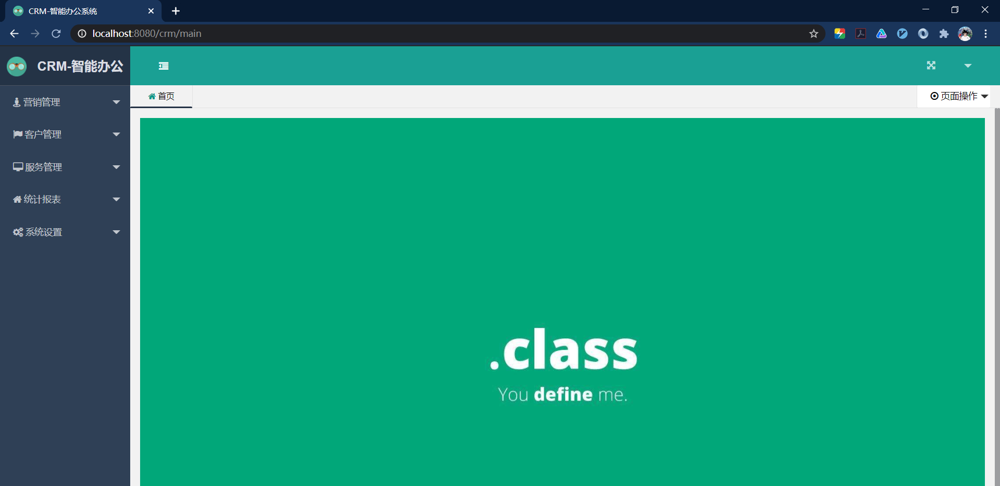

# CRM | 01 用户管理

## 1. what

### 1.1 奥义

1. 客户关系管理（Customer Relationship Management）
2. 目标
   + 吸引新客户
   + 保留老客户
   + 将已有客户转为忠实客户，增加公司市场份额
3. 实施目标
   + 全面提高企业业务流程的管理来降低企业成本
   + 通过提供快速和周到的优质服务来吸引和保持更多客户

### 1.2 分类

1. 根据客户类型
   + B to B （管理的客户是企业，如唯品会与大牌合作）
   + B to C（管理的客户是个人，如闲鱼）
2. 根据管理侧重点
   + 操作型（流程管理）
   + 分析型（数据分析）

### 1.3 企业项目开发流程


## 2. 准备

### 2.1 系统模块划分

#### 2.1.1 模块图

> 划分思路


#### 2.1.2 模块功能描述

##### 2.2.1 基础模块

##### 2.2.2 营销管理

##### 2.2.3 客户管理

##### 2.2.4 服务管理

##### 2.2.5 数据报表

##### 2.2.6 系统管理

### 2.2 数据库设计

> 设计思路

000_Java\009_CRM小项目\05_reference\03_数据库文件\crm.sql

#### 2.2.1 E-R图表简介

Navicat 中可逆向表到模型进行查看


效果：


#### 2.2.2 表结构详情

> 命名注意点

可在 Navicat 中设计表查看


## 3. 项目搭建

### 3.1 项目技术栈


### 3.2 环境搭建及测试

#### 3.2.1 搭建

##### 3.2.1.1 创建简单maven项目


##### 3.2.1.2 pom.xml（坐标依赖）

```xml
<?xml version="1.0" encoding="UTF-8"?>

<project xmlns="http://maven.apache.org/POM/4.0.0" xmlns:xsi="http://www.w3.org/2001/XMLSchema-instance"
  xsi:schemaLocation="http://maven.apache.org/POM/4.0.0 http://maven.apache.org/xsd/maven-4.0.0.xsd">
  <modelVersion>4.0.0</modelVersion>

  <groupId>com.xxxx</groupId>
  <artifactId>crm</artifactId>
  <version>1.0-SNAPSHOT</version>

  <name>crm</name>
  <!-- FIXME change it to the project's website -->
  <url>http://www.example.com</url>

  <properties>
    <project.build.sourceEncoding>UTF-8</project.build.sourceEncoding>
    <maven.compiler.source>1.8</maven.compiler.source>
    <maven.compiler.target>1.8</maven.compiler.target>
  </properties>

  <parent>
    <groupId>org.springframework.boot</groupId>
    <artifactId>spring-boot-starter-parent</artifactId>
    <version>2.2.2.RELEASE</version>
  </parent>

  <dependencies>
    <dependency>
      <groupId>junit</groupId>
      <artifactId>junit</artifactId>
      <version>4.12</version>
      <scope>test</scope>
    </dependency>

    <!-- web 环境 -->
    <dependency>
      <groupId>org.springframework.boot</groupId>
      <artifactId>spring-boot-starter-web</artifactId>
    </dependency>
    <!-- aop -->
    <dependency>
      <groupId>org.springframework.boot</groupId>
      <artifactId>spring-boot-starter-aop</artifactId>
    </dependency>

    <!-- freemarker -->
    <dependency>
      <groupId>org.springframework.boot</groupId>
      <artifactId>spring-boot-starter-freemarker</artifactId>
    </dependency>
    <!-- 测试环境 -->
    <dependency>
      <groupId>org.springframework.boot</groupId>
      <artifactId>spring-boot-starter-test</artifactId>
      <scope>test</scope>
    </dependency>
    <!-- mybatis -->
    <dependency>
      <groupId>org.mybatis.spring.boot</groupId>
      <artifactId>mybatis-spring-boot-starter</artifactId>
      <version>2.1.1</version>
    </dependency>
    <!-- 分⻚插件 -->
    <dependency>
      <groupId>com.github.pagehelper</groupId>
      <artifactId>pagehelper-spring-boot-starter</artifactId>
      <version>1.2.13</version>
    </dependency>

    <!-- mysql -->
    <dependency>
      <groupId>mysql</groupId>
      <artifactId>mysql-connector-java</artifactId>
      <scope>runtime</scope>
    </dependency>
    <!-- c3p0 -->
    <dependency>
      <groupId>com.mchange</groupId>
      <artifactId>c3p0</artifactId>
      <version>0.9.5.5</version>
    </dependency>
    <!-- commons-lang3 -->
    <dependency>
      <groupId>org.apache.commons</groupId>
      <artifactId>commons-lang3</artifactId>
      <version>3.5</version>
    </dependency>
    <dependency>
    <groupId>com.alibaba</groupId>
    <artifactId>fastjson</artifactId>
      <version>1.2.47</version>
    </dependency>
    <!-- DevTools 热部署 -->
    <dependency>
      <groupId>org.springframework.boot</groupId>
      <artifactId>spring-boot-devtools</artifactId>
      <optional>true</optional>
    </dependency>

  </dependencies>

  <build>
    <plugins>
      <plugin>
        <groupId>org.apache.maven.plugins</groupId>
        <artifactId>maven-compiler-plugin</artifactId>
        <version>2.3.2</version>
        <configuration>
          <source>1.8</source>
          <target>1.8</target>
          <encoding>UTF-8</encoding>
        </configuration>
      </plugin>
      <plugin>
        <groupId>org.mybatis.generator</groupId>
        <artifactId>mybatis-generator-maven-plugin</artifactId>
        <version>1.3.2</version>
        <configuration>
          <configurationFile>src/main/resources/generatorConfig.xml</configurationFile>
          <verbose>true</verbose>
          <overwrite>true</overwrite>
        </configuration>
      </plugin>
      <plugin>
        <groupId>org.springframework.boot</groupId>
        <artifactId>spring-boot-maven-plugin</artifactId>
        <configuration>
          <!-- 如果没有该配置，热部署的devtools不⽣效 -->
          <fork>true</fork>
        </configuration>
      </plugin>
    </plugins>
  </build>
</project>
```

##### 3.2.1.3 配置文件（application.yml）

src/main/resources/application.yml

```yaml
## 端⼝号 上下⽂路径
server:
  port: 8080
  servlet:
    context-path: /crm
## 数据源配置
## url中crm是数据库中自己的包名
## username和password是自己数据库的用户名及密码
spring:
  datasource:
    type: com.mchange.v2.c3p0.ComboPooledDataSource
    driver-class-name: com.mysql.cj.jdbc.Driver
    url: jdbc:mysql://127.0.0.1:3306/crm?useUnicode=true&characterEncoding=utf8&serverTimezone=GMT%2B8
    username: root
    password: jin123
  ## freemarker
  freemarker:
    suffix: .ftl
    content-type: text/html
    charset: UTF-8
    template-loader-path: classpath:/views/
  ## 启⽤热部署
  devtools:
    restart:
      enabled: true
      additional-paths: src/main/java
## mybatis 配置
mybatis:
  mapper-locations: classpath:/mappers/*.xml
  type-aliases-package: com.xxxx.crm.vo;com.xxxx.crm.query;com.xxxx.crm.dto
  configuration:
    map-underscore-to-camel-case: true
## pageHelper 分⻚
pagehelper:
  helper-dialect: mysql
## 设置 dao ⽇志打印级别
logging:
  level:
    com:
      xxxx:
        crm:
          dao: debug
```

##### 3.2.1.4  导入base包

main/java/com/xxxx/crm/dao

导入基础包，包括controller、service、dao、结果处理包等

000_Java\009_CRM小项目\05_reference\01_基础源代码\base

##### 3.2.1.5  视图转发（controller）

com/xxxx/crm/controller

```java
package com.xxxx.crm.controller;
import com.xxxx.crm.base.BaseController;
import org.springframework.stereotype.Controller;
import org.springframework.web.bind.annotation.RequestMapping;
@Controller
public class IndexController extends BaseController {
	/**
	* 系统登录⻚
	* @return
	*/
	@RequestMapping("index")
		public String index(){
		return "index";
	}
	// 系统界⾯欢迎⻚
	@RequestMapping("welcome")
	public String welcome(){
		return "welcome";
	}
	/**
	* 后端管理主⻚⾯
	* @return
	*/
	@RequestMapping("main")
	public String main(){
		return "main";
	}
}
```


##### 3.2.1.6 静态资源（前端js、css、lib、images）

src/main/resources/public

导入基础静态资源

000_Java\009_CRM小项目\05_reference\02_视图与静态资源\public

##### 3.2.1.7 视图模板（freemarker）

src/main/resources/views

导入基础视图模板

000_Java\009_CRM小项目\05_reference\02_视图与静态资源\views

> 在这个包中password.ftl可先删去

##### 3.2.1.8 启动类（springboot）

com.xxxx.crm下创建Starter.java

```java
package com.xxxx;


import org.mybatis.spring.annotation.MapperScan;
import org.springframework.boot.SpringApplication;
import org.springframework.boot.autoconfigure.SpringBootApplication;
/**
 * @author CoreDao
 */
@SpringBootApplication
@MapperScan("com.xxxx.crm.dao")
public class Starter
{
    public static void main( String[] args )
    {

        SpringApplication.run(Starter.class);

    }
}
```

##### 3.2.1.9 项目目录结构（基础）


#### 3.2.2 测试

Chrome浏览器访问登录⻚地址：http://localhost:8080/crm/index


Chrome浏览器访问系统主⻚地址：http://localhost:8080/crm/main



## 4. 功能实现

### 4.1 用户登录

#### 4.1.1 准备工作

##### 4.1.1.1 导入 utils 和 exceptions

【utils - 工具类】

+ 建包 com.xxxx.crm.utils
+ 000_Java\009_CRM小项目\05_reference\01_基础源代码\utils

【exceptions - 自定义异常类】

+ 建包 com.xxxx.crm.exceptions
+ 000_Java\009_CRM小项目\05_reference\01_基础源代码\exceptions

##### 4.1.1.2 逆向工程自动生成代码

###### 1.导入配置文件

src/main/resources 中添加 generatorConfig.xml 配置文件

```java
<?xml version="1.0" encoding="UTF-8"?>
<!DOCTYPE generatorConfiguration
        PUBLIC "-//mybatis.org//DTD MyBatis Generator Configuration 1.0//EN"
        "http://mybatis.org/dtd/mybatis-generator-config_1_0.dtd">

<generatorConfiguration>

    <!-- 数据库驱动路径：在左侧project边栏的External Libraries中找到mysql的驱动，右键选择copy path -->
    <classPathEntry
            location="E:\Mymvnrep\repository\mysql\mysql-connector-java\8.0.18\mysql-connector-java-8.0.18.jar"/>

    <!-- context 是逆向工程的主要配置信息，id：起个名字，targetRuntime：设置生成的文件适用于哪个mybatis版本 -->
    <context id="DB2Tables" targetRuntime="MyBatis3">

        <!--optional,指在创建class时，对注释进行控制-->
        <commentGenerator>
            <!-- 是否去除日期那行注释 -->
            <property name="suppressDate" value="true"/>
            <!-- 是否去除自动生成的注释 true：是 ： false:否 -->
            <property name="suppressAllComments" value="true"/>
        </commentGenerator>

        <!-- 数据库链接地址账号密码 -->
        <jdbcConnection
                driverClass="com.mysql.cj.jdbc.Driver"
                connectionURL="jdbc:mysql://127.0.0.1:3306/crm?serverTimezone=GMT%2B8"
                userId="root"
                password="jin123">
            <property name="nullCatalogMeansCurrent" value="true"/>
        </jdbcConnection>

        <!--
             java类型处理器
                用于处理DB中的类型到Java中的类型，默认使用JavaTypeResolverDefaultImpl；
                注意一点，默认会先尝试使用Integer，Long，Short等来对应DECIMAL和NUMERIC数据类型；
                true：使用 BigDecimal对应DECIMAL和NUMERIC数据类型
                false：默认，把JDBC DECIMAL和NUMERIC类型解析为Integer
        -->
        <javaTypeResolver>
            <property name="forceBigDecimals" value="false"/>
        </javaTypeResolver>


        <!-- 生成Model类存放位置 -->
        <javaModelGenerator targetPackage="com.xxxx.crm.vo" targetProject="src/main/java">
            <!-- 在targetPackage的基础上，根据数据库的schema再生成一层package，生成的类放在这个package下，默认为false -->
            <property name="enableSubPackages" value="true"/>
            <!-- 设置是否在getter方法中，对String类型字段调用trim()方法 -->
            <property name="trimStrings" value="true"/>

        </javaModelGenerator>


        <!--生成映射文件存放位置-->
        <sqlMapGenerator targetPackage="mappers" targetProject="src/main/resources">
            <property name="enableSubPackages" value="true"/>
        </sqlMapGenerator>


        <!--生成Dao类存放位置-->
        <javaClientGenerator type="XMLMAPPER" targetPackage="com.xxxx.crm.dao" targetProject="src/main/java">
            <property name="enableSubPackages" value="true"/>
        </javaClientGenerator>


        <!-- 数据库的表名与对应的实体类的名称，tableName是数据库中的表名，domainObjectName是生成的JAVA模型名 -->
        <table tableName="t_sale_chance" domainObjectName="SaleChance"
               enableCountByExample="false" enableUpdateByExample="false"
               enableDeleteByExample="false" enableSelectByExample="false" selectByExampleQueryId="false">
        </table>

    </context>
</generatorConfiguration>
```

###### 2. 执行命令

run中使用 mybatis-generator 生成 Mybatis 代码。可以生成：

+  vo类

+ mapper映射文件

+ mapper接口

命令：`mybatis-generator:generate -e`

> :exclamation: 注意只能启动一次，详见 7.3 问题


#### 4.1.2 :bulb: 核心思路

```java
--------用户登录--------
【前端】
1. 框架：layUI
2. 数据传递：Ajax发出请求传输JSON数据
3. 处理结果：
    成功：用户数据存入cookie中，跳转到主页面
    失败：提示

【后端】
1. 流程分析
    --对前端传进来的数据进行校验--
    1.1 对用户名校验
        ① 是否为空
        ② 是否存在（与数据库比对）
    1.2 对密码校验（注意加密操作）
        ① 是否为空
        ② 是否正确（与数据库比对）
    1.3 信息正确，登录成功
        ① 返回数据resultInfo（封装了UserModel对象，前台需要存入cookie的用户数据）
2. 分层思想
    2.1 controller层
        调用service层，返回处理结果
    2.2 service层
        --数据处理--
        完成上述的流程分析
    2.3 dao层
        通过用户名访问数据库用户信息
```

#### 4.1.3 代码实现

##### 4.1.3.1 后端（分层思想）

###### 1. dao层

继承BaseMapper（里面有一些封装好的方法）

作用：这个接口类中定义对应的查询方法

建包：com/xxxx/crm/dao/UserMapper.java

```java
package com.xxxx.crm.dao;

import com.xxxx.crm.base.BaseMapper;
import com.xxxx.crm.vo.User;

/**
 * @author CoreDao
 */
public interface UserMapper extends BaseMapper<User,Integer> {
    /**
     * 通过姓名查询用户信息
     * @param userName
     * @param userPwd
     * @return
     */
    User selectUserByName(String userName);
}
```

###### 2. UserMapper.xml

> :exclamation: 这个文件逆向工程会自动生成一些语句对应base中BaseMapper的方法，但我们自己写的dao层的方法需要加进来。

作用：配置查询对应的sql语句

写 sql 语句来实现`UserMapper.java`中`selectUserByName`方法的功能。

```xml
<!--这里id可能会标红，若出现则按照下面问题7.9方式解决-->
  <sql id="Base_Column_List" >
    id, user_name, user_pwd, true_name, email, phone, is_valid, create_date, update_date
  </sql>
<!--我们自己写的方法的sql语句加进来，这里的id与方法名相同-->
<select id="selectUserByName" parameterType="String" resultType="com.xxxx.crm.vo.User">
    select * from t_user where is_valid = 1 and user_name = #{userName}
  </select>
```

###### 3. service层

作用：这里是服务层，用户登录具体的业务逻辑的实现

建包：com/xxxx/crm/service/UserService.java

```java
package com.xxxx.crm.service;

import com.xxxx.crm.base.BaseService;
import com.xxxx.crm.dao.UserMapper;
import com.xxxx.crm.model.UserModel;
import com.xxxx.crm.utils.AssertUtil;
import com.xxxx.crm.utils.Md5Util;
import com.xxxx.crm.vo.User;
import org.apache.commons.lang3.StringUtils;
import org.springframework.stereotype.Service;

import javax.annotation.Resource;

/**
 * @program: crm
 * @description:
 * @author: CoreDao
 * @create: 2020-11-30 14:01
 **/
@Service
public class UserService extends BaseService<User, Integer> {

    @Resource
    private UserMapper userMapper;

    /**
     * 1.校验前台传来的参数（用户名和密码）
     *       如果为空，抛出异常
     * 2.调用dao层 用户名查询数据库，判断账号是否存在
     *       如果为空，抛出异常，账号不存在
     * 3.用前台接收来的密码和数据库中的密码对比（将前台密码加密，再比对）
     *       如果不一致，抛出异常，密码错误
     * 4.登录成功，返回数据 ResultInfo(封装了UserModel对象，前台需要存入cookie的用户数据)
     */
    /**
     * 登录验证
     * @param userName
     * @param userPwd
     */
    public UserModel userLogin(String userName,String userPwd){
        checkUserParams(userName,userPwd);
        User user = userMapper.selectUserByName(userName);
        AssertUtil.isTrue(user == null, "用户不存在");
        checkUserPwd(user.getUserPwd(),userPwd);
        UserModel userModel = buildUserModel(user);
        return userModel;
    }

    /**
     * 建立用户模型，获取想要的信息
     * @param user
     * @return
     */
    private UserModel buildUserModel(User user) {
        UserModel userModel = new UserModel();
        userModel.setUserId(user.getId());
        userModel.setUserName(user.getUserName());
        userModel.setTrueName(user.getTrueName());
        return userModel;
    }

    /**
     * 需要对用户输入的密码进行加密，然后进行比对
     * @param dbPwd
     * @param userPwd
     */
    private void checkUserPwd(String dbPwd,String userPwd) {
        String encodePwd = Md5Util.encode(userPwd);
        AssertUtil.isTrue(!encodePwd.equals(dbPwd),"用户密码错误");
    }
    
    /**
     * 检查用户名和密码是否为空
     * @param userName
     * @param userPwd
     */
    private void checkUserParams(String userName, String userPwd) {
        AssertUtil.isTrue(StringUtils.isBlank(userName),"用户名不能为空");
        AssertUtil.isTrue(StringUtils.isBlank(userPwd),"密码不能为空");
    }
}
```

###### 4. 封装UserModel

这个实体类是公司或者上级规定的需要存储的信息，是可变的。

作用：用来返回登录成功后的信息，我们这里只取 id、userName、trueName。

建包：com/xxxx/crm/model/UserModel.java

```java
package com.xxxx.crm.model;

/**
 * @program: crm
 * @description:
 * @author: CoreDao
 * @create: 2020-11-30 19:55
 **/

public class UserModel {
    private Integer userId;
    private String userName;
    private String trueName;

    /**
    * get和set方法省略
    * Alt+Insert选Getter and Setter自己生成
    */
}

```

###### 5. controller层

功能：定义接口，对接前台。

过程：控制层调用 service层 `userLogin` 方法，捕获 service 方法的异常，获取登录的结果`ResultInfo`，并将 `ResultInfo`对象通过JSON格式相应给客户端。

建包：com/xxxx/crm/controller/UserController.java

```java
package com.xxxx.crm.controller;

import com.xxxx.crm.base.BaseController;
import com.xxxx.crm.base.ResultInfo;
import com.xxxx.crm.exceptions.ParamsException;
import com.xxxx.crm.model.UserModel;
import com.xxxx.crm.service.UserService;
import org.springframework.stereotype.Controller;
import org.springframework.web.bind.annotation.RequestMapping;
import org.springframework.web.bind.annotation.ResponseBody;

import javax.annotation.Resource;

/**
 * @program: crm
 * @description:
 * @author: CoreDao
 * @create: 2020-11-30 20:22
 **/
@Controller
@RequestMapping("/user")
public class UserController extends BaseController{

    @Resource
    private UserService userService;

    /**
     * 返回json对象
     * @param userName
     * @param userPwd
     * @return
     */
    @RequestMapping("/login")
    @ResponseBody
    public ResultInfo userLogin(String userName, String userPwd){
        //结果，在Base包中，ResultInfo这个类返回三个值
        ResultInfo resultInfo = new ResultInfo();

        try {
            UserModel userModel = userService.userLogin(userName, userPwd);
            resultInfo.setResult(userModel);
        } catch (ParamsException e) {
            e.printStackTrace();
            resultInfo.setCode( e.getCode());
            resultInfo.setMsg( e.getMsg());
        }catch (Exception e) {
            e.printStackTrace();
            resultInfo.setCode(500);
            resultInfo.setMsg("登录失败");
        }
        return resultInfo;
    }
}
```

##### 4.1.3.2 启动及测试

###### 1. 启动类（Starter）

修改启动类，加入@MapperScan注解，设置扫描包的范围。

```java
package com.xxxx;

import org.mybatis.spring.annotation.MapperScan;
import org.springframework.boot.SpringApplication;
import org.springframework.boot.autoconfigure.SpringBootApplication;

/**
 * @author CoreDao
 */
@SpringBootApplication
@MapperScan("com.xxxx.crm.dao")
public class Starter{
    public static void main( String[] args ){
        SpringApplication.run(Starter.class);
    }
}

```

###### 2. PostMan测试

对用户登录的接口进行测试


##### 4.1.3.3 前端

建 `index.ftl` 对应的 js 文件 `index.js`

src/main/resources/public/js/index.js

使用 layUI 表单组件实现表单提交操作。

参考API：https://www.layui.com/doc/modules/form.html#onsubmit


```js
layui.use(['form','jquery','jquery_cookie'], function () {
    var form = layui.form,
        layer = layui.layer,
        $ = layui.jquery,
        $ = layui.jquery_cookie($);

    /**
     * 监听登录表单的提交功能
     *      on监听submit提交事件，submit后面跟着的是：触发提交/目标元素
     */

    form.on('submit(login)', function(data){
         //当前容器的全部表单字段，名值对形式：{name: value}
        console.log(data.field);

        //ToDo 校验用户名和密码
        /*if(istrue(data.field.username)){
            layer.msg("用户不能为空",{icon:5});
            return ;
        }*/

        //发送请求
        /*
        * 1. 里面的url中ctx是common.ftl中的对象，代表项目的路径后面必须以/开始，因为ctx结束时没有/，只是路径。
        * 2. 这里的data是返回的resultInfo对象数据
        *
        * */
        $.ajax({
            type:'post',
            url:ctx + "/user/login",
            data:{
                userName:data.field.username,
                userPwd:data.field.password
            },
            dataType:'json',
            success:function (data) {
                //判断是否登录成功
                if (data.code == 200){
                        //将用户信息存到cookie中
                        var result = data.result;
                        $.cookie("userId", result.userId);
                        $.cookie("userName", result.userName);
                        $.cookie("trueName", result.trueName);

                        //登录成功后，跳转到首页
                        window.location.href = ctx + "/main";
                }else{
                    //提示信息
                    layer.msg(data.msg);
                }
            }
        });
        //阻止表单跳转。如果需要表单跳转，去掉这段即可。
        return false;
    });
    
});
```

> 注意点可看 7.4 和 7.10 问题

测试：


##### 4.1.3.4 修改Cookie 数据

###### 1. 修改前

`userId`未进行加密处理，我们要对其进行加密。


###### 2. 修改过程

1. UserModel

   将`Integer userId`改为`String userIdStr`

   ```java
   public class UserModel {
       private String userIdStr;
       private String userName;
       private String trueName;
       
       /*
       * get和set方法省略
       */
   }
   ```

2. UserService

   修改建立 UserModel 对应的方法，将`userId` 的值加密

   ```java
   /**
        * 建立用户模型，获取想要的信息
        * @param user
        * @return
        */
       private UserModel buildUserModel(User user) {
           UserModel userModel = new UserModel();
           
           //设置用户信息（将userId加密）
     userModel.setUserIdStr(UserIDBase64.encoderUserID(user.getId()));
           
           userModel.setUserName(user.getUserName());
           userModel.setTrueName(user.getTrueName());
           return userModel;
       }
   ```

3. index.js

   修改ajax的success中存储cookie的值

   ```js
    $.cookie("userIdstr", result.userIdStr);
   ```

###### 3. 修改后

  先清理谷歌浏览器cookie缓存： Ctrl+Shift+Delete


### 4.2 密码修改

#### 4.2.1 核心思路

#### 4.2.2 代码实现

##### 4.2.2.1 后端代码

##### 4.2.2.2 前端代码

#### 4.2.3 测试

### 4.3 用户退出

#### 4.3.1 代码实现

## 5. 处理情况

### 5.1 异常处理（全局统一）

#### 5.1.1 实现思路


#### 5.1.2 拦截器实现

#### 5.1.3 消除try-catch代码

### 5.2 非法请求拦截

#### 5.2.1 实现思路

#### 5.2.2 定义拦截器

#### 5.2.3 配置

#### 5.2.4 测试

## 6. 实现记住我功能


## 7. :question: 问题

### 7.1 绝对路径与相对路径

|      | 绝对路径 | 相对路径 |
| ---- | -------- | -------- |
| 起点 | 根目录   | 某个目录 |
| 终点 | 当前目录 | 当前目录 |
| 例子 | 盘符:/A  | ../A     |

### 7.2 mybatis中sql转vo驼峰转化

 数据库的_自动转为驼峰

在mybatis中添加的

configuration：

​	map-underscore-to-camel-case:true


### 7.3 逆向工程只能搞一次

generatorConfig.xml生成vo、dao、mappers，逆向工程只能运行一次，多次运行会出现多个同名文件而不会覆盖。

故一次没成功，需要删除所有生成的文件，再重新执行。

### 7.4 前后台data数据关系

前台传进来的数据与数据库的数据进行比对，

cookie缓存的数据与数据库的数据进行比对。


前台的数据来自

+ .ftl前台模板
+ .js前台操作处理
+ .java后台处理

### 7.5 try-catch快捷键

ctrl + alt + T

### 7.6 mybatis逆向工程字段缺失

:exclamation: 问题：生成数据库中t_user的bean对象属性缺失，生成的Mapper.xml文件中，sql语句两份。

:heavy_check_mark: 解决：在逆向文件数据库标签中添加标签

```xml
<!-- 数据库链接地址账号密码 -->
<jdbcConnection
      driverClass="com.mysql.cj.jdbc.Driver"
      connectionURL="jdbc:mysql://127.0.0.1:3306/crm?serverTimezone=GMT%2B8"
      userId="root"
      password="jin123">
      <!--解决字段缺失的标签-->
      <property name="nullCatalogMeansCurrent" value="true"/>
</jdbcConnection>
```

:question: 原因：

1. 数据库中存在多张相同的表，不一定是同一个库。生成两份sql是因为存在两个同名表。

   

2. 逆向工程与数据库是否连接无关，


### 7.7 idea无法加载主类


### 7.8 阻止表单提交

return false

### 7.9 mapper.xml 文件中 sql 中 id 标红

:question: 问题：


:heavy_check_mark: 解决：


### 7.10 js 与 ftl 中的数据传输（监听）


