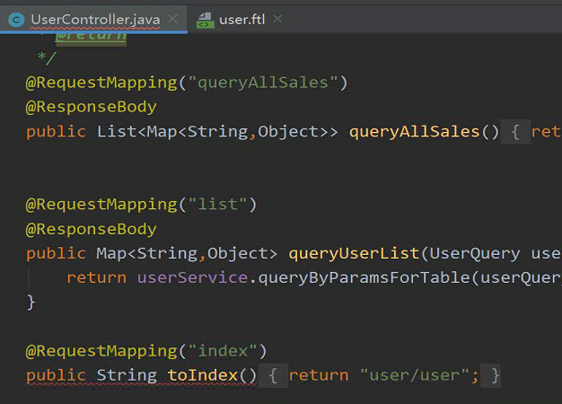
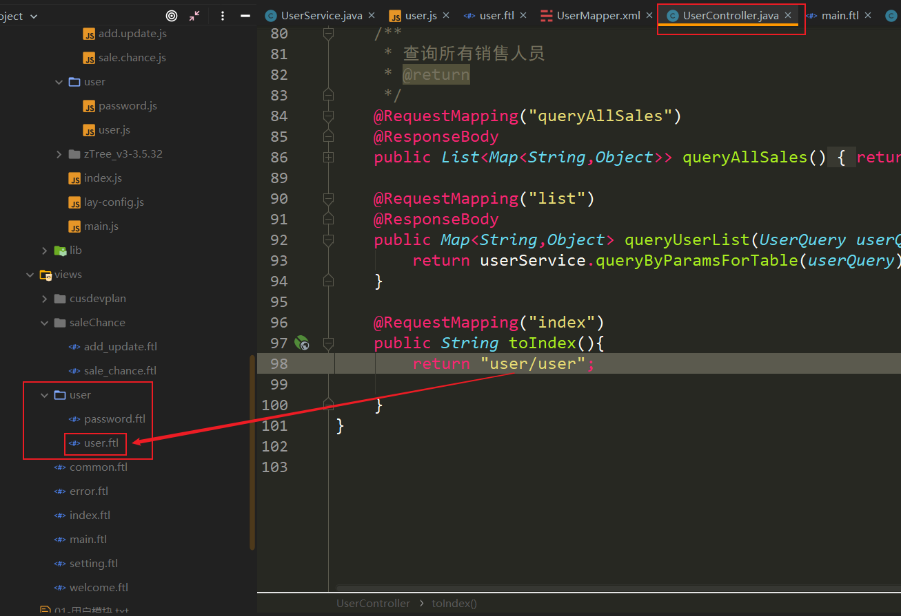
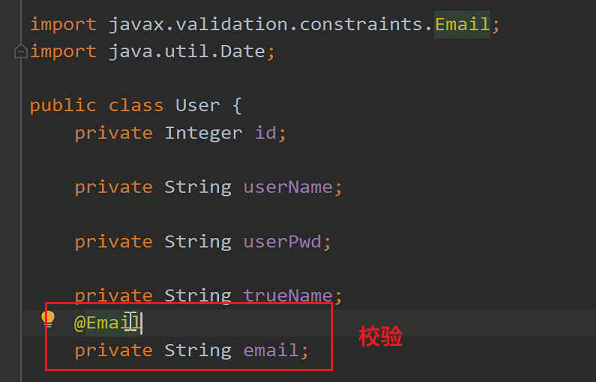

# CRM | 权限管理（RBAC）

## :question: 问题

### .1 

grade层级-等级

### .2 

JSONFormat是传出去的格式化

### .3

前端 表（table），渲染

后端 多条件查询，Qurey->mapper->

### .4 页面跳转




main.ftl 中对应的 data_tab属性`data-tab="user/index"`，controller层进行请求转发，返回的页面是freemarker页面



### .5 邮箱校验



在校验对象前加 @Vaild

### .6 添加用户

【service层】

```java
1. 参数校验
		⽤户名 ⾮空 唯⼀性
		邮箱 ⾮空
		⼿机号 ⾮空 格式合法
2. 设置默认参数
		isValid 1
		creteDate 当前时间
		updateDate 当前时间
		userPwd 123456 -> md5加密
3. 执⾏添加，判断结果
```


### .7 角色分配

.ftl 手机号下插入角色的`<div>`修改样式与手机号同

.js中加载插件和下拉框(user的add_update)【头部加载插件，内容中加载下拉框】

逆向工程role

建包 继承Base

​	dao 

​	service

​	controller

方法

​	sql 写方法，与add_updates中searchUrl相同

​	mapper 配置方法

​	service 加载mapper中方法

​	controller 调用service

### .8 绑定Id

:exclamation: 前台下拉框（角色）传回来的值是字符串

1.service层写绑定业务逻辑

2.添加roleIds

3.百度：mybatis返回插入数据的主键.

​	用base中的insertHasKey方法

4.逆向工程生成中间表

5.dao.service,controller继承Base

6.【service层】绑定角色方法：对传来的数据，循环添加，一个对象对应一条数据

7.写批量添加sql

### .9 修改和删除

【service层】

1.角色绑定修改，

2.mapper中自定义方法查询和删除用户角色

在service中绑定角色方法中对角色进行删除

3.删除用户中删除角色

### 	.10 编辑显示信息

sql语句注意获取值筛选

e

隐藏域获取id


