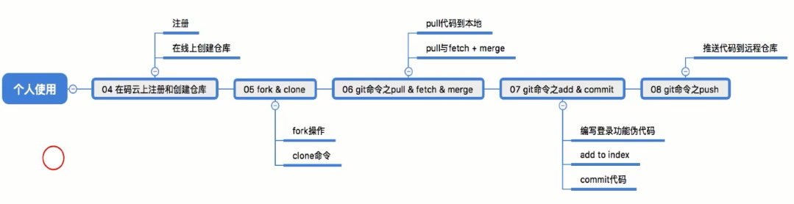
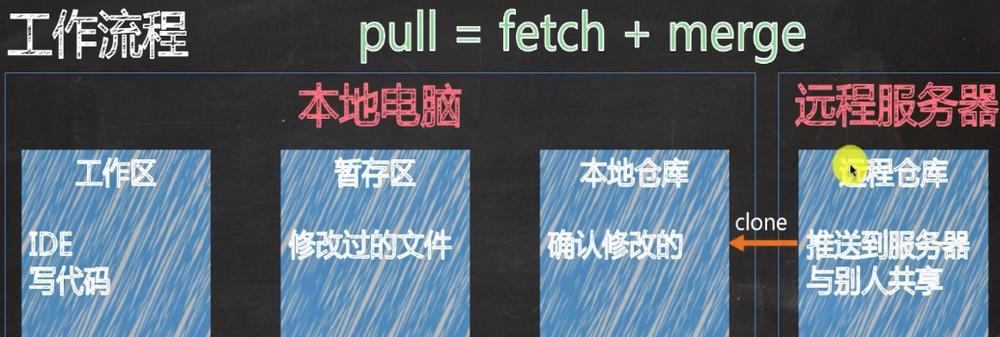

# Git之码云

## 1、案例流程

## 2、个人使用

#### 2.1 fork操作

+ 从别人开放的远程仓库复制到自己的远程仓库
+ 码云界面的`fork`按钮

#### 2.2 clone命令

+ 从远程仓库克隆到自己的电脑
+ `git clone 地址`

#### 2.3 fork vs clone

+ 

## 3、基本操作

### 3.1 拉取命令

#### 3.1.1 pull

命令：

+ `git pull`后可追加分支，标签，其他仓库（默认master）

前提：

+ 本地库内

vs clone

+ 

#### 3.1.2 fetch&merge

> 本地仓库（.git中）
>
> 工作区（working Tree中，本地可编辑的部分）

fetch：

+ 从远程仓库合并代码到自己的本地仓库，并不会合并到工作区
+ `git fetch`

merge:

+ 从自己的本地仓库合并代码到自己的工作区
+ `git merge`

### 3.2 提交代码

#### 3.2.1 add

> 暂存区（add）
>
> 本地仓库（commit）

添加全部

+ `git add .`

添加部分

+ `git add 文件名`

查看是否添加

+ `git status`
+ 绿色已添加，红色未添加

#### 3.2.2 commit

+ 把修改的内容，添加到暂存区

+ `git commit -m "注释"`

#### 3.3.3 push

+ 把本地

