# Redis

## .1 奥义

### 1.1 what

定义：开源（BSD许可）的基于内存的==数据结构存储系统==

作用：可数据库、缓存和消息中间件、注册中心

+ 缓存，主要读取（压力大），写入少

高级功能：范围查询，    [bitmaps](http://www.redis.cn/topics/data-types-intro.html#bitmaps)，    [hyperloglogs](http://www.redis.cn/topics/data-types-intro.html#hyperloglogs) 和     [地理空间（geospatial）](http://www.redis.cn/commands/geoadd.html) 索引半径查询。     Redis 内置了    [复制（replication）](http://www.redis.cn/topics/replication.html)，[LUA脚本（Lua scripting）](http://www.redis.cn/commands/eval.html)，    [LRU驱动事件（LRU eviction）](http://www.redis.cn/topics/lru-cache.html)，[事务（transactions）](http://www.redis.cn/topics/transactions.html)    和不同级别的    [磁盘持久化（persistence）](http://www.redis.cn/topics/persistence.html)，    并通过    [Redis哨兵（Sentinel）](http://www.redis.cn/topics/sentinel.html)和自动    [分区（Cluster）](http://www.redis.cn/topics/cluster-tutorial.html)提供高可用性（high availability）。

优：快:

+ 1、C写的直接调用硬件。
+ 2、内存中（CPU不是瓶颈）：单线程（6.0 更新了接收数据多线程，不是用户使用时多线程 -> 接收数据更快）多重复用模型

缺：小、容易丢数据（磁盘持久化）

### 1.2 性能

bench-mark数据：

测试完成了50个并发执行100000个请求。

设置和获取的值是一个256字节字符串。

结果:读的速度是110000次/s,写的速度是81000次/s

### 1.3 数据类型

字符串（strings）

散列（hashes）

列表（lists）

集合（sets）

有序集合（sorted sets）

> key一般都是String  5中数据类型针对Value

## .2 安装注意点

### 2.1 安装

#### 2.1.1 命令

```bash
tar zxvf 压缩包//循环递归解压
make //在redis包下使用（cd redis-6.0.9/）

yum -y install gcc-c++ autoconf automake //redis是c写的，下载c环境依赖
make MALLOC=libc //解决指明错误


//升级
yum -y install centos-release-scl 
yum -y install devtoolset-9-gcc devtoolset-9-gcc-c++ devtoolset-9-binutils

//永久改变gcc到9以上
echo "source /opt/rh/devtoolset-9/enable" >>/etc/profile 
source /etc/profile


mkdir -p 目录//设置安装目录 /usr/local/redis（注意Linux中不是user是usr）
//redis-6.0.9目录下运行
make PREFIX=安装目录 install  //安装

./redis-server //启动

注：
//可临时将此时的gcc版本改为9
scl enable devtoolset-9 bash
```

#### 2.1.2 注意点

1、xftp传文件

2、致命错误：jemalloc/jemalloc.h：没有那个文件或目录 `make MALLOC=libc`

之后出现的就是6.0与5.0的问题，见问题 10.1

编译只是编译，为了检查文件有没有问题，不是安装

3、make问题可见问题10.14

### 2.2 启动

#### 2.2.1 后台启动设置

redis.conf（拷贝，以防改错）【启动时可指定路径】

```bash
//在redis-6.0.9中运行 拷贝 redis.conf 到bin下
cp redis.conf /usr/local/redis/bin/
vim redis.conf

//name搜索 ，小写n下一个，N是上一个

//read后台启动
1、daemonize yes

./redis-server redis.conf //启动【指定redis.conf路径】
ps -ef|grep redis //查看进程

//改bind解决可视化工具连接不上问题
注释掉任何人可访问，工作中不可
2、#bind

//重启
ps -ef|grep redis //查看进程号
kill -9 进程号
./redis-server redis.conf//启动

//关闭保护模式
3、protected-mode no

//添加访问认证
4、requirepass 密码  // root

//databases 默认16个数据库

连接可视化界面

//多线程配置（了解）
io-threads-do-reads yes //默认关闭
io-threads 4 //线程数，不是越大越好。cpu4核，2~3够用。

//展示行号
set nu
```

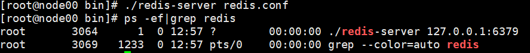


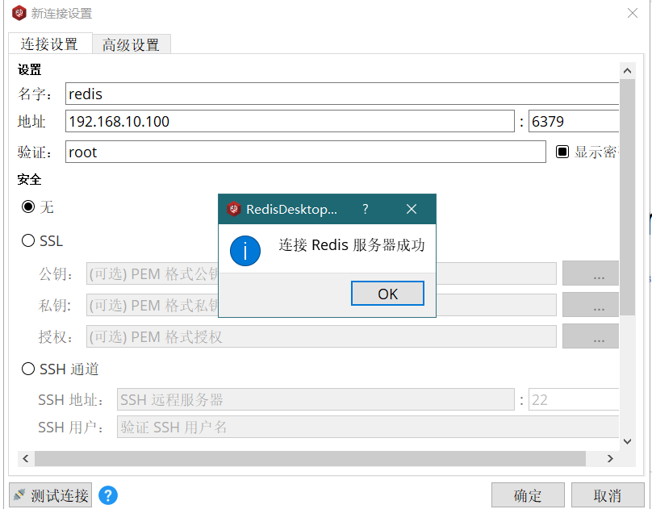

## .3 关系型与非关系型数据库

3.1 对比

|      | 关系型                                                       | 非关系型                                                     |
| :--: | :----------------------------------------------------------- | :----------------------------------------------------------- |
| 定义 | 关系模型（二维表格模型）来组织数据的数据库。<br />一张二维表：<br />表名——关系<br />一行——一条记录<br />一列——一个字段 | 分布式，一般不保证遵循ACID原则的数据存储系统。<br />存储：键值对<br />结构不稳定 |
| 优点 | 1、易理解<br />2、使用方便，通用sql语言<br />3、易维护，丰富的完整性（实体完整性、参照完整性和用户自定义的完整性）大大降低了数据冗余和数据不一致的概率 | 1、根据需要添加字段，不需要多表联查。仅需id取出对应value<br />2、适用于SNS（社会化网络服务软件。比如facebook，微博）<br />3、严格上讲不是一种数据库，而是一种数据结构化存储方法的集合 |
| 缺点 | 1、磁盘I/O时并发的瓶颈<br />2、海量数据查询效率低<br />3、横向扩展困难，无法简单的通过添加硬件和服务节点来扩展性能和负载能力，当需要对数据库进行升级和扩展时，需要停机维护和数据迁移【数据库优化、用第三方集群】<br />4、多表的关联查询以及复杂的数据分析类型的复杂sql查询，性能欠佳。因为要保证ACID，必须按照三范式设计。【sql优化】 | 1、只适合存储一些较为简单的数据<br />2、不适合复杂查询的数据<br />3、不适合持久存储的海量数据 |
| 例子 | Oracle、Sql Server、MySql、DB2                               | K-V：Redis,Memcache<br />文档：MongoDB<br />搜索：Elasticsearch、Solr<br />可扩展性分布式：HBase |


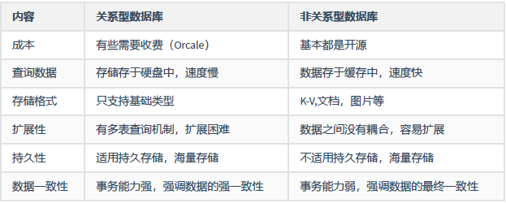

最终一致性：结果正确，过程不要求

强一致性：每一步都正确（例如银行转账）

## .4 Redis-cli

```bash
./redis-cli
./redis-cli -h 服务器 //指定ip
./redis-cli -p 端口号 //指定端口
./redis-cli -a 密码 //授权

ping  //PONG 测试连接是否成功，心跳机制，确保对方是否在线
SELECT 1 //选择库（默认16个），不同库之间是分离的
```

### 4.2 操作数据类型

> 命令大全：http://www.redis.cn/commands.html

#### 4.2.1 String

```bash
//设值
set key value
//取值
get key
//批量设
mset key value key value
//批量取
mget key key
```

#### 4.2.2 Hash

```bash
//加入
hset key field value field value ...
//取
hget key field //这里属性只能一个
//批量加
hmset key field value field value ...
//批量取
hmget key field field ...
//获取key下所有数据
hgetall key
//删除
hdel key field field ...
```

#### 4.2.3 List

> 有序可重复，可左加右加

```bash
//加 挤（l：从左往右挤，r：从右往左挤）、栈
lpush key element ele
rpush key ele ele

//查看【超过[显示全部ele]，负数[正向0开始；反过来最后一个是-1，当-a,a大于存在的ele值时，查询到空]】
LRANGE key 索引游标[start stop]

//长度
llen key

//删除 【大于已有key数量全删】【负数，反过来删除,-a,a大于ele存在个数时，全删】
LREM key count element //count 要删几个此元素
```

#### 4.2.4 Set

```bash
//set(无序不可重复)
SADD key member member...
//查看
SMEMBERS key
//长度
SCARD key
//删除
SREM key member member ...
```

#### 4.2.5 Sorted Set

```bash
//sorted set(有序)
ZADD key 索引下标（score分数） member
//获取 【大于则全显示】【负数同list查看的原理】
ZRANGE key 索引下标
//长度
ZCARD key
//删除
ZREM key member member ... 
```

### 4.3 其他

#### 4.3.1 层级存储数据

```bash
//层级目录
set file:file:file 信息
get file:file:file
//查看本数据库所有key
keys pattern //pattern为*时，看所有
key xxx* //模糊查询
//有多少数据
dbsize
//清空数据库
FLUSHALL
```

#### 4.3.2 设置Key失效时间

```bash
//失效时间(两种：设值时的设置，已存在key的设置)
//设置时设置
set key value ex 秒
//获取
get key
//查询
ttl key //秒，-2标识失效，-1永久有效
pttl key//毫秒,-2标识失效，-1永久有效
//存在时设置
EXPIRE key ttl //设置生存秒
PEXPIRE key ttl //毫秒


//NX XX
//可用来做锁
set key value xx存在能设置成功
set key value nx不存在能设置成功

//会有死锁问题，解决：设置失效时间
set key value ex time nx
//但有会乱的问题
删锁时比对value
//redrock(常用-锁)

//删除(通用5种数据类型)
del key key ...
hdel //删除hash类型数据
```

## .5 Java操作redis

### 5.1 配置

#### 5.1.1 pom.xml

+ 创建spring项目

+ selected dependencies: 

  + spring Web 
  + NoSQL: spring data redis

+ 添加依赖，springboot用2.3.5.RELEASE,版本太新会出一些错

  + spring data redis 组件

    + 使用jedis连接池注意排除Lettuce的依赖

    + ```xml
      <!--
         1.x 的版本默认采用的连接池技术是 Jedis，
         .0 以上版本默认连接池是 Lettuce,
         如果采用 Jedis，需要排除 Lettuce 的依赖。
      -->
      <exclusions>
          <exclusion>
              <groupId>io.lettuce</groupId>
              <artifactId>lettuce-core</artifactId>
          </exclusion>
      </exclusions>
      ```

      

  + jedis依赖

  + web组件

  + test组件

### 5.2 Java连接redis

#### 5.2.1 基本

springBoot启动类中

```java
 /**
  * 连接redis
  */
@Test
public void initConn01(){
    //创建一个jedis对象，连接redis服务 ip和端口
    Jedis jedis = new Jedis("192.168.10.100",6379);

    //设置认证密码
    jedis.auth("root");

    //指定数据库，默认是0
    jedis.select(1);

    //使用ping命令，测试连接是否成功
    System.out.println(jedis.ping());

    //添加一条数据
    jedis.set("name","dijia");

    //获取这条数据
    System.out.println(jedis.get("name"));

    //释放资源
    if (jedis != null){
        jedis.close();
    }
}
```

#### 5.2.2 线性池

> 获取连接对象并操作服务器，解决jedis线程不安全问题

```java
 /**
  * 线性池获取连接对象并操作服务器
  */
@Test
public void initConn02(){
    //初始化连接池
    JedisPool pool = new JedisPool(new JedisPoolConfig(), "192.168.10.100", 6379, 100000, "root");

    //从连接池获取连接
    Jedis jedis = pool.getResource();

    //指定数据库
    jedis.select(2);

    //ping
    System.out.println(jedis.ping());

    //添加数据
    jedis.set("name","tailuo");

    //获取数据
    System.out.println(jedis.get("name"));

    //释放资源
    if (jedis != null){
        jedis.close();
    }
}
```

#### 5.2.3 封装

> 前两种方法，在使用redis时，每次都需要创建线性池，获取连接，释放，这样很麻烦，每次都开启线性池，然后关掉。
>
> 那么我们将线性池封装起来，每次运行项目时，都已经有线性池，然后从里面获取实例，进行操作，操作完成后把实例关闭，还给线性池。

##### 5.2.3.1 application.yml

```yml
spring:
  redis:
    # Redis服务器地址
    host: 192.168.10.100
    # Redis服务器端口
    port: 6379
    # Redis服务器密码
    password: root
    # 选择哪个库，默认0库
    database: 0
    # 连接超时时间
    timeout: 10000ms
    jedis:
      pool:
        # 最大连接数，默认8
        max-active: 1024
        # 最大连接阻塞等待时间，单位毫秒，默认-1ms
        max-wait: 10000ms
        # 最大空闲连接，默认8
        max-idle: 200
        # 最小空闲连接，默认0
        min-idle: 5
```

##### 5.2.3.2 配置类

> JedisUtil对外提供连接对象获取方法

建包：com/xxxx/redisdemo01/config/RedisConfig.java

思路;

```java
@Configuration //配置类中
	@Bean //注入
```

代码：

```java
package com.xxxx.redisdemo01.config;

import org.springframework.beans.factory.annotation.Value;
import org.springframework.context.annotation.Bean;
import org.springframework.context.annotation.Configuration;
import redis.clients.jedis.JedisPool;
import redis.clients.jedis.JedisPoolConfig;

/**
 * @program: redis-demo01
 * @description: 对外提供连接对象获取方法
 * @author: CoreDao
 * @create: 2020-12-10 20:00
 **/
@Configuration
public class RedisConfig {

    @Value("${spring.redis.host}")
    private String host;

    @Value("${spring.redis.port}")
    private Integer port;

    @Value("${spring.redis.password}")
    private String password;

    @Value("${spring.redis.timeout}")
    private String timeout;

    @Value("${spring.redis.jedis.pool.max-active}")
    private Integer maxActive;

    @Value("${spring.redis.jedis.pool.max-wait}")
    private String maxWait;

    @Value("${spring.redis.jedis.pool.max-idle}")
    private Integer maxIdle;

    @Value("${spring.redis.jedis.pool.min-idle}")
    private Integer minIdle;

    @Bean
    public JedisPool jedisPool() {
        JedisPoolConfig jedisPoolConfig = new JedisPoolConfig();
        jedisPoolConfig.setMaxIdle(maxIdle);
        jedisPoolConfig.setMinIdle(minIdle);
        jedisPoolConfig.setMaxIdle(maxActive);
        //string转换成long 截字符串，后两位时ms，所以去掉--长度-2
        jedisPoolConfig.setMaxWaitMillis(Long.valueOf(maxWait.substring(0,maxWait.length()-2)));
        JedisPool jedisPool = new JedisPool(jedisPoolConfig, "192.168.10.100", 6379, Integer.parseInt(timeout.substring(0, timeout.length() - 2)), "root");
        return jedisPool;
    }

}
```

启动类中：

```java
@RunWith(SpringRunner.class)//加这个是用来加载配置文件yml，不加载则config无法查找到yml中的值
启动类

import org.junit.After;
import org.junit.Before;
//因为junit注解的，故test需要导入junit的，否则无效
import org.junit.Test;

@Autowired
private JedisPool jedisPool;

private Jedis jedis = null;

/**
 * 获取资源
 */
@Before
public void init(){
    jedis = jedisPool.getResource();
}

/**
 * 释放资源
 */
@After
public void close(){
    if (jedis != null){
        jedis.close();
    }
}
```

### 5.4 java操作数据类型

#### 5.4.1 string

```java
/**
 * String
 */
@Test
public void testString(){
    //加单
    jedis.set("name","leiou");
    //取单
    System.out.println(jedis.get("name"));
    //加多
    jedis.mset("age","18","addr","光之国");
    //取多
    System.out.println(jedis.mget("name", "age", "addr"));
    List<String> list = jedis.mget("name","age","addr");
    list.forEach(System.out::println);
    //删除
    jedis.del("name","age");
}
```

#### 5.4.2 hash

```java
/**
 * Hash
 */
@Test
public void testHash(){
    //加
    jedis.hset("aoteman","name","tailuo");
    //取
    System.out.println(jedis.hget("aoteman", "name"));
    //批量加
    HashMap<String, String> hashMap = new HashMap<>();
    hashMap.put("name","kobe");
    hashMap.put("age","34");
    jedis.hmset("player",hashMap);
    //批量取
    List<String> list = jedis.hmget("player", "name", "age");
    list.forEach(System.out::println);
    Map<String,String> map = jedis.hgetAll("player");
    map.forEach((k,v)-> System.out.println());
    //删除
    jedis.hdel("player","age");
}
```

#### 5.4.3 list

```java
/**
 * List
 */
@Test
public void testList(){
    //加
    jedis.lpush("school","linsan","linyi");
    jedis.rpush("school","liner","linqi");
    //取
    List<String> school = jedis.lrange("school", 0, 3);
    school.forEach(System.out::println);
    //长度
    System.out.println(jedis.llen("school"));
    //删除
    jedis.lrem("school",1,"linqi");
}
```


#### 5.4.4 set

```java
/**
     * set
     */
    @Test
    public void testSet(){
        //加
        jedis.sadd("nba","kobe","james","dong77","zimuge","nngmei");
        //取
        Set<String> nba = jedis.smembers("nba");
        nba.forEach(System.out::println);
        //长度
        System.out.println(jedis.scard("nba"));
        //删除
        jedis.srem("nba","zimuge","nngmei");
    }
```


#### 5.4.5 sorted set

```java
/**
     * sorted set
     */
    @Test
    public void testSortedSet(){
        //加
        jedis.zadd("cba",1D,"yaoming");
        jedis.zadd("cba",3D,"yijianlian");
        jedis.zadd("cba",8D,"guoailun");
        //取
        Set<String> cba = jedis.zrange("cba", 0, 1);
        cba.forEach(System.out::println);
        //长度
        System.out.println(jedis.zcard("cba"));
        //删除
        jedis.zrem("cba","yijianlian");
    }
```


### 5.5 常用

#### 5.5.1 层级

```java
 /**
  * 层级
  */
@Test
public void testCeng(){
    //层级目录
    jedis.set("basketball:nba:players","kobe");
    System.out.println(jedis.get("basketball:nba:players"));
    //数据库大小
    System.out.println(jedis.dbSize());
    //查询数据库所有的key
    Set<String> keys = jedis.keys("*");
    keys.forEach(System.out::println);
    //清空数据库
    jedis.flushAll();
}
```


#### 5.5.2 失效时间

```java
/**
 * 失效时间
 */
@Test
public void testTimeOut(){
    //设值时设置
    jedis.setex("code",20,"test");
    //存在时设置
    jedis.expire("code",10);
    //查询失效时间
    System.out.println(jedis.ttl("code"));
    //nx xx
    //因已存在故用xx
    SetParams setParams = new SetParams()
        .xx()
        .ex(10);
    jedis.set("code","test",setParams);
}
```

#### 5.5.3 事务

```java
/**
 * 操作事务
 */
@Test
public void testMulti(){
    Transaction tx = jedis.multi();
    //开启事务
    tx.set("tel","10010");
    //提交事务
    tx.exec();
    //回滚事务
    tx.discard();
}
```


### 5.6 存储pojo类(操作byte)

> 工具类转byte
>
> 数据库查看，序列化

```java
/**
 * 操作byte
 */
@Test
public void testByte(){
    User user = new User();
    user.setId(8);
    user.setUsername("kobe");
    user.setPassword("24");

    //序列化
    byte[] valueBytes = SerializeUtil.serialize(user);
    byte[] keyBytes = SerializeUtil.serialize("user");
    jedis.set(keyBytes,valueBytes);

    //获取数据
    byte[] bytes = jedis.get(keyBytes);

    //反序列化
    User user1 = (User)SerializeUtil.unserialize(bytes);
    System.out.println(user1);
}
```

建包：com/xxxx/redisdemo01/pojo/User.java

```java
package com.xxxx.redisdemo01.pojo;

import java.io.Serializable;

/**
 * @program: redis-demo01
 * @description:
 * @author: CoreDao
 * @create: 2020-12-10 20:18
 **/

public class User implements Serializable {
    private static final long serialVersionUID = 9148937431079191022L;
    private Integer id;
    private String username;
    private String password;
    
    /*
    *get和set方法，toString方法
    */
    
}
```


建包：com/xxxx/redisdemo01/utils/SerializeUtil.java

```java
package com.xxxx.redisdemo01.utils;

import java.io.ByteArrayInputStream;
import java.io.ByteArrayOutputStream;
import java.io.ObjectInputStream;
import java.io.ObjectOutputStream;

/**
 * @program: redis-demo01
 * @description: 序列化工具类
 * @author: CoreDao
 * @create: 2020-12-11 10:32
 **/

public class SerializeUtil {
    /**
     * 将java对象转换为byte数组 序列化过程
     */
    public static byte[] serialize(Object object) {
        ObjectOutputStream oos = null;
        ByteArrayOutputStream baos = null;
        try {
// 序列化
            baos = new ByteArrayOutputStream();
            oos = new ObjectOutputStream(baos);
            oos.writeObject(object);
            byte[] bytes = baos.toByteArray();
            return bytes;
        } catch (Exception e) {
            e.printStackTrace();
        }
        return null;
    }
    /**
     * 将byte数组转换为java对象 反序列化
     */
    public static Object unserialize(byte[] bytes) {
        if(bytes == null) {
            return null;
        }
        ByteArrayInputStream bais = null;
        try {
            // 反序列化
            bais = new ByteArrayInputStream(bytes);
            ObjectInputStream ois = new ObjectInputStream(bais);
            return ois.readObject();
        } catch (Exception e) {
            e.printStackTrace();
        }
        return null;
    }
}
```


## .6 redis持久化

> 磁盘持久化
>
> 1、快照（RDB）全量
>
> 2、追加模式（AOF）增量

### 6.1 RDB&AOF

三种存储机制

+ save（手动）
  
  + 保存时会阻塞当前redis服务器，直到rdb过程完成为止。
+ bgsave（手动）
  
  + 不会阻塞redis服务器，开启一个进程
+ 自动化
  + 配置，让redis自启bgsave
  
  + 342 `dump.rdb`保存文件  、365 保存文件路径、307保存实现
  
  + 缺点：可能会丢失数据 
  
  + 原因：307有时间定义
  
  + 解决：AOF持久化`appendonly yes`，存储到 .aof（
  
    + 优点：实时存储，
  
    + 缺点：消耗、数据量大，
  
    + 解决：自动重写
  
      ），开启后。redias优先读取aof，后读取rdb。
  
  + 项目能否允许数据丢失，选 rdb 或 aof 或者 同时（老版本默认关闭，新版本默认开启）

> 每次修改配置文件需要==重启redis==

命令：

```bash
//save 相当于前台执行
操作完成后
save

//bgsave 相当于后台执行
操作完成后
bgsave

//自动化
修改redis.conf中307

//rdb
//redis.conf中
save 900 1 //900秒内检测1个key的变化
dbfilrename dump.rdb //快照文件名
dir ./ //快照文件路径

//aof
appendonly //开启aof，默认关闭
appendfilename //aof存储的文件名
```

### 6.2 两者对比

|      | RDB                                                          | AOF                                                          |
| ---- | ------------------------------------------------------------ | ------------------------------------------------------------ |
| 定义 | 快照（全量）                                                 | 追加（增量）                                                 |
| 存储 | 之前的key和value值                                           | 之前的命令                                                   |
| 优点 | 1、适合用于进行备份和灾难恢复（文件紧凑，全量备份）<br />2、生成tdb文件时，redis主进程会fork()一个子进程来处理所有保存工作，主进程不需要进行任何磁盘I/O操作。<br />3、在恢复大数据集时的速度比aof快 | 1、更好保护数据不丢失（一般每个1秒，通过一个后台线程执行一次fsync操作，最多丢失1秒的数据）<br />2、写入性能高，文件不易破损（其日志文件没有任何磁盘寻址的开销）<br />3、适合灾难性误删的紧急恢复（其日志文件的命令通过非常可读的方式进行记录） |
| 缺点 | 可能丢失数据<br />（rdb快照是一次全量备份，存储的是内存数据的二进制序列化形式，存储上非常紧凑。当进行快照持久化时，会开启一个子进程专门负责快照持久化，子进程会拥有父进程的内存数据，父进程修改内存，子进程不会反应出来，所以在快照持久化期间修改的数据不会被保存。） | 1、同一份数据，aof日志文件比rdb数据快照文件大<br />2、开启后，支持的写QPS比rdb支持的写QPS低（原因：aof一般会配置成每秒fsync一次日志文件） |

## .7 redis搭建主从复用

### 7.1 why

概念：redis单点

优点：简单

缺点：单点故障

解决：

+ 主从
+ 搭集群

思路：

单点（缓存，一般读取）--> 主从（主挂掉）--> 哨兵（资源浪费）--> 集群

### 7.2 主从

> 根据挂掉时判断：
>
> 最好为奇数（3\5\7....）,偶数会浪费资源
>
> 挂掉大于一半不可用，则整个集群不可用

作用：

+ 提高可用性，一点出错其他可用

+ 减小单点压力

缺点：

+ 主节点挂了怎么办，则无法写

优化：

  +  不能让从有写功能，则再选一个从节点变为新的主节点，其他节点挂到这个新节点下【引入哨兵概念】

  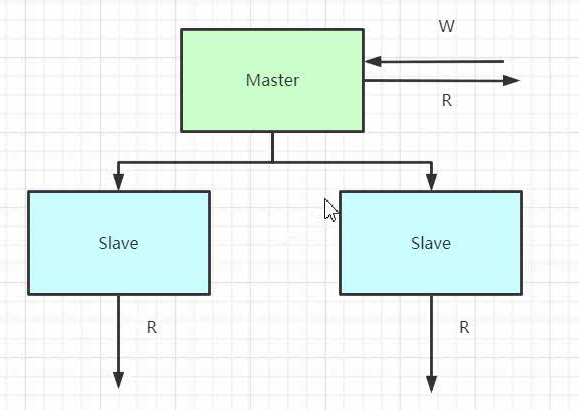

```linux
//远程复制
scp redis-6.0.9 root@node01:/root/ //将redis复制到node01的root用户下的root目录中，这里失败，因为必须拷贝文件
scp redis-6.0.9.tar.gz root@node01:/root/  //正确
//拷贝不通，直接把node01改为地址
```

#### 7.2.1 配主从(读写分离)

##### 1、主：node00

```linux
node00
//关闭服务
kill -9 redis进程号

//在bin下执行 复制一个redis-master.conf
cp redis.conf ./redis-master.conf

//修改配置
1.#bind
2.关掉protected-mode no
3.后台启动 daemonize yes
4.个人密码 requirepass root
5.masterauth root
```

关键：masterauth root（心跳密码）

##### 2、从：node01 和 node02

```linux
node01
//修改配置
1.#bind
2.关掉protected-mode no
3.后台启动 daemonize yes
4.个人密码 requirepass root
5.主节点的密码 masterauth root

6.replicaof host port //确定主从的配置 replicaof 192.168.10.100 6379

node02 同理
```

关键：

+ 配置主节点密码
+ 确定主从的配置

##### 3、检测

```linux
//启动redis
./redis-server redis.conf //注意100启动redis-master.conf
./redis-cli -a root

//查看主从
info replication
//主：role:master 从：role:slave

//主节点写入，从节点可获取{用发布订阅原理--微信公众号，数据：dump.rdb，全量更新/增量更新}
//从节点redis.conf中，是否只读（默认）
replica-read-only yes
```

#### 7.2.2 哨兵

http://www.redis.cn/topics/sentinel.html

作用：

+ 监督节点，
  + 选举新主节点
  + 将其他节点挂到新主节点
+ 留言协议：传播快，整体一致性偏差小（哨兵能找到其他节点的原因）

缺点：

+ 写的压力没有分散
+ 服务器资源浪费（rdb每个节点都备份，数据冗余）

优化：

+ 集群

配置：

```linux
sentinel.conf
//在redis-6.0.9包下复制到/usr/local/redis/bin下
cp sentinel.conf /usr/local/redis/bin/

//配置
vim sentinel.conf

1.sentinel monitor mymaster host port 2 //sentinel monitor mymaster 192.168.10.100 6379 2
//mymaster:整个集群的别名; 
//host主节点ip; 
//port主节点端口; 
//2是哨兵节点的50%，3个节点2，5个节点3...
2.sentinel auth-pass master-name password //连接主节点 sentinel auth-pass mymaster root
3.关闭保护模式
protected-mode no

//了解
sentinel down-after-milliseconds mymaster 30000 //连续 30s ping不通才选举，否则可能出现脑裂情况(多个主节点)
sentinel failover-timeout mymaster 180000  //3分钟没选举成功，重新选举

//将设置好的哨兵远程复制到其他两个
```

测试

```linux
//启动
./redis-sentinel sentinel.conf

//杀死主节点进程进行模拟宕机
kill -9 主机redis进程号

//哨兵先自己选举，然后leader去选举新主节点
new-epoch //纪元
```

#### 7.2.3 集群

##### 1、相关概念

伪集群（改端口号）

哈希

哈希巢 --> 一致性hash：缺点：节点少时，工作量大

带巢位的哈希巢，巢位迁移，没有节点时的迁移运算。

##### 2、搭建集群：

1、meet 全部关联

2、分配巢位（主节点分配，redis4.0以前手动中间件[codis]，trib.rb命令，5.0后redis-cli）

3、分配主从

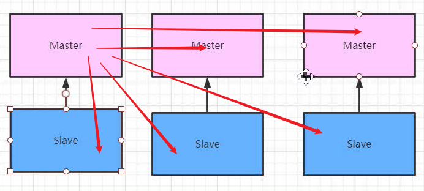

## .8 SpringDataRedis

### 8.1 项目搭建

#### 8.1.1 依赖

```xml
<!-- spring data redis 组件 -->
<dependency>
	<groupId>org.springframework.boot</groupId>
	<artifactId>spring-boot-starter-data-redis</artifactId>
</dependency>
<!-- commons-pool2 对象池依赖 -->
<dependency>
	<groupId>org.apache.commons</groupId>
	<artifactId>commons-pool2</artifactId>
</dependency>
<!-- web 组件 -->
<dependency>
	<groupId>org.springframework.boot</groupId>
	<artifactId>spring-boot-starter-web</artifactId>
</dependency>
<!-- test 组件 -->
<dependency>
	<groupId>org.springframework.boot</groupId>
	<artifactId>spring-boot-starter-test</artifactId>
	<scope>test</scope>
</dependency>
```


#### 8.1.2 yml

```yml
spring:
  redis:
    # Redis服务器地址
    host: 192.168.10.100
    # Redis服务器端口
    port: 6379
    # Redis服务器端口
    password: root
    # Redis服务器端口
    database: 0
    # 连接超时时间
    timeout: 10000ms
    lettuce:
      pool:
        # 最大连接数，默认8
        max-active: 1024
        # 最大连接阻塞等待时间，单位毫秒，默认-1ms
        max-wait: 10000ms
        # 最大空闲连接，默认8
        max-idle: 200
        # 最小空闲连接，默认0
        min-idle: 5
```

#### 8.1.3 测试

> 所有的springdata都是通过模板的方式提供，把所有的操作封装成了模板

RedisTemplate

+ 问题：默认二进制存储

  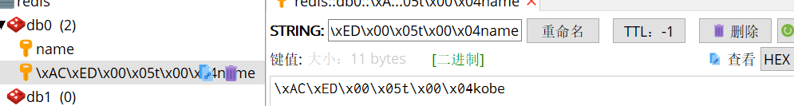

+ 解决：加泛型

  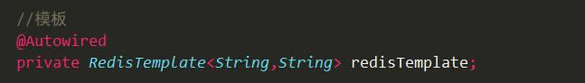

+ 问题：模板RedisTemplate中泛型必须一致，若换成object会报错，换成@Resource成功，but存储依旧是二进制

+ 那么自己写一个实现Key是string类型，类型是object。同时解决序列化问题。

> 默认情况下的模板 RedisTemplate<Object, Object>，默认序列化使用的是`JdkSerializationRedisSerializer `，存储二进制字节码。这时需要自定义模板，当自定义模板后又想存储 String 字符串时，可以使用StringRedisTemplate的方式，他们俩并不冲突。

#### 8.1.4 序列化问题

要把 domain object 做为 key-value 对保存在 redis 中，就必须要解决对象的序列化问题。Spring DataRedis给我们提供了一些现成的方案：

1、`JdkSerializationRedisSerializer` 使用JDK提供的序列化功能。

+ 优点是反序列化时不需要提供类型信息(class)

+ 缺点是序列化后的结果非常庞大，是JSON格式的5倍左右，这样就会消耗 Redis 服务器的大量内存。

2、`Jackson2JsonRedisSerializer` 使用 Jackson 库将对象序列化为JSON字符串。

+ 优点是速度快，序列化后的字符串短小精悍。

+ 缺点也非常致命，那就是此类的构造函数中有一个类型参数，必须提供要
  序列化对象的类型信息(.class对象)。通过查看源代码，发现其只在反序列化过程中用到了类型信息。

3、`GenericJackson2JsonRedisSerializer` 通用型序列化，这种序列化方式不用自己手动指定对象的 Class。


### 8.2 spring操作数据类型

#### 8.2.1 String


#### 8.2.2 hash


#### 8.2.3 list

```java
//插入到pivot(坐标值)的左边，【坐标不存在，不添加】
leftPush(key,pivot,value)
    
//按照索引下标查询
index(key,count)
//弹出
//左弹出
leftPop(key)
    
//左右弹出和左右添加可完成队列，简单的消息中间件

```


#### 8.2.4 set


#### 8.2.5 sorted set


### 8.3  常用操作

#### 8.3.1 获取所有key&删除

```java

```


#### 8.3.2 失效时间


### 8.4 整合哨兵机制

作用：

+ 改变主节点后依旧可以访问，不会出现权限只读的问题（yml中master的ip没有改变）

1、yml中配置

+ master与 sentinel.conf mointer对应
+ 哨兵密码
+ nodes 哨兵节点

2、config中配置（优先考虑）

+ @Bean

```java

```


## .9 缓存穿透、击穿、雪崩

### 9.1 key的淘汰机制

机制：

1、定期删除

+ 随机

2、惰性删除

+ 

内存淘汰机制

+ 常用6种数据淘汰策略：
  + `volatile-lru`（推荐）


### 9.2 缓存击穿

防弹衣，就这有个洞，但就被打中这个洞了

> 但凡加锁，就会降低性能。故此为没有办法后的办法（三个都可用锁解决）

### 9.3 缓存穿透

> 布隆过滤器


### 9.4 缓存雪崩


## 10. 问题

### 10.1 6.0安装会有错误

原因：

centos7的默认gcc版本是4.x

6.0需要gcc的5.x

### 10.2 索引游标

```linux
//查看【超过[显示全部ele]，负数[正向0开始；反过来最后一个是-1，当-a,a大于存在的ele值时，查询到空]】
LRANGE key 索引游标[start stop]


//删除 【大于已有key数量全删】【负数，反过来删除,-a,a大于ele存在个数时，全删】
LREM key count element //count 要删几个元素
```


### 10.3 redis-clis的ping报错

NOAUTH Authentication required

` ./redis-cli -a root`

### 10.4 springBoot1.0到2.0变( lettuce和jedis区别)

```java
1.x 的版本默认采用的连接池技术是 Jedis，
2.0 以上版本默认连接池是 Lettuce,
如果采用 Jedis，需要排除 Lettuce 的依赖。
```

jedis线程不安全（线程池）

lettuce线程安全

```java
Jedis 是一个优秀的基于 Java 语言的 Redis 客户端，但是，其不足也很明显：
/*
	Jedis 在实现上是直接连接 Redis-Server，在多个线程间共享一个Jedis 实例时是线程不安全的，如果想要在多线程场景下使用 Jedis ，需要使用连接池，每个线程都使用自己的 Jedis 实例，当连接数量增多时，会消耗较多的物理资源。
*/
Lettuce 则完全克服了其线程不安全的缺点： 
/*
  Lettuce 是基于 Netty 的连接（StatefulRedisConnection），Lettuce 是一个可伸缩的线程安全的 Redis 客户端，支持同步、异步和响应式模式。多个线程可以共享一个连接实例，而不必担心多线程并发问题。它基于优秀 Netty NIO 框架构建，支持 Redis 的高级功能，如 Sentinel，集群，流水线，自动重新连接和 Redis 数据模型。
*/
```


### 10.5 Java与linux中命令

#### 10.5.1 命令为Java中方法名，参数：去除括号，引号和将逗号变空格即可

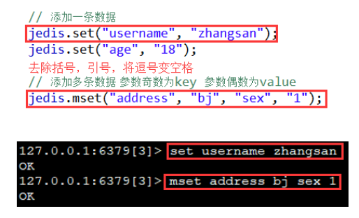

#### 10.5.2 添加sorted set时注意

zadd需将float或者double类型参数，放置在值参数之前

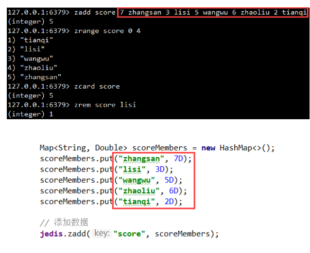

### 10.6 application.yml中文乱码问题

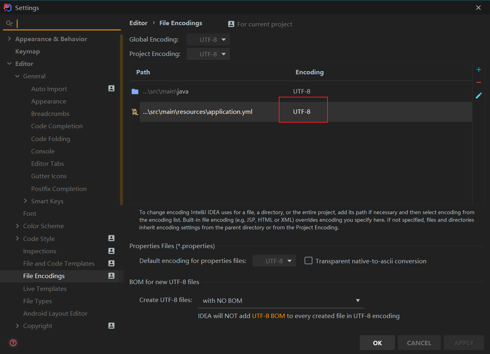

### 10.7 spring进不去

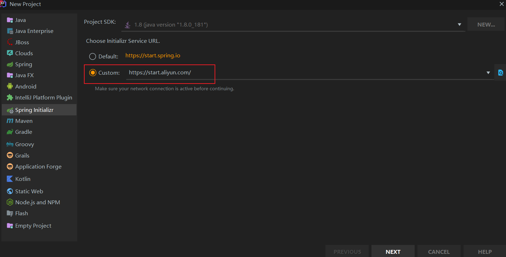

### 10.8 HashMap

1.分版本

+ 1.8之前    数组+链表（hash冲突）

+ 1.8之后 （红黑树（链表长度>8、数组长度>64））

2.[ConcurrentHashMap](https://www.cnblogs.com/study-everyday/p/6430462.html)

### 10.9 linux创建多个虚拟机设置静态ip

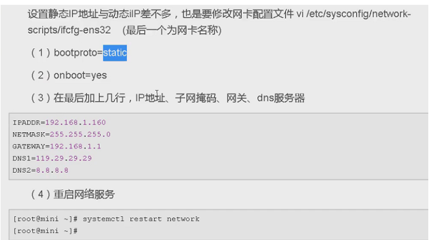

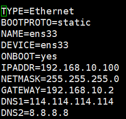


### 10.10 伪集群

1、一个redis创建多个config，设置不同端口

2、安装多个redis，同时开启，一个redis相当于一个应用

### 10.11 升级gcc错误

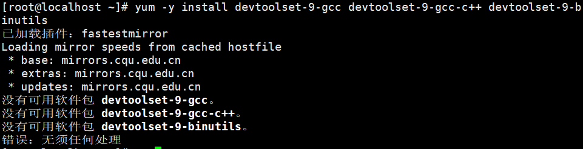

解决：执行`yum install -y epel-release`

原因：当在Linux系统中使用yum安装软件时提示 “没有可用软件包”时，代表在linux系统yum源中已经没有对应的安装包了，这时，我们需要安装EPEL（EPEL（Extra Packages for Enterprise Linux），企业版Linux额外包，RHEL分布非标准包的社区类库）。

过程：yum没有找到对应依赖包，更新epel第三方软件库。更新完后再更新yum。

### 10.12 安装vim

原因：纯净Linux没有vim，只有vi

解决：

```linux
//查看vim命令在什么软件包中
rpm -qa | grep vim
出现vim-minimal-7.4.629-6.el7.x86_64

//缺少哪个按哪个
vim-filesystem
vim-enhanced
vim-minimal
vim-common

//整体安装
yum -y install vim*

//分开安装
yum -y install vim-minimal
yum -y vim-common
yum -y install vim-enhanced
```

### 10.13 java报错中redis只能读取

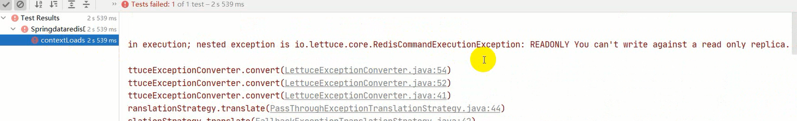

解决：

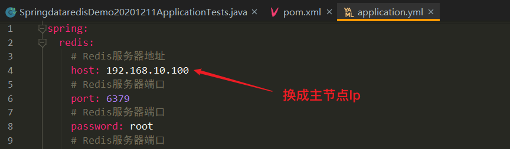

### 10.14 安装redis报错

问题：

```bash
cc: error: ../deps/hiredis/libhiredis.a: 没有那个文件或目录
cc: error: ../deps/lua/src/liblua.a: 没有那个文件或目录
```

解决：

```bash
cd redis-6.0.9
cd deps
make lua hiredis linenoise
```

## 11. 扩展

### 11.1 端口号 6379

MERZ  

### 11.2 String（不用C语言的）

动态字符串（SDS 

+ 扩容
+ 释放）与C字符串区别

### 11.3 List

复合结构，压缩链表+linkelist混合体

### 11.4 Hash

数组+链表 解决 哈希冲突

两个hash，一旧一新

渐进式rehash

扩缩容的条件

hash攻击

### 11.5 Set

HashSet与Java基本一致

### 11.6 Sorted Set

hash

skiplist（跳表）

