# RabbitMQ

## .1 MQ

### 1.1 what

消息队列（消息中间件）

### 1.2 特点

+ 消费者-生产者模型，一端往消息队列写入，一端读取或订阅队列消息
+ AMQP，协议（主流MQ都实现了）
+ JMS，Java消息服务应用程序接口

### 1.3 优缺点

#### 1.3.1 优点（功能）

1、异步处理

+ 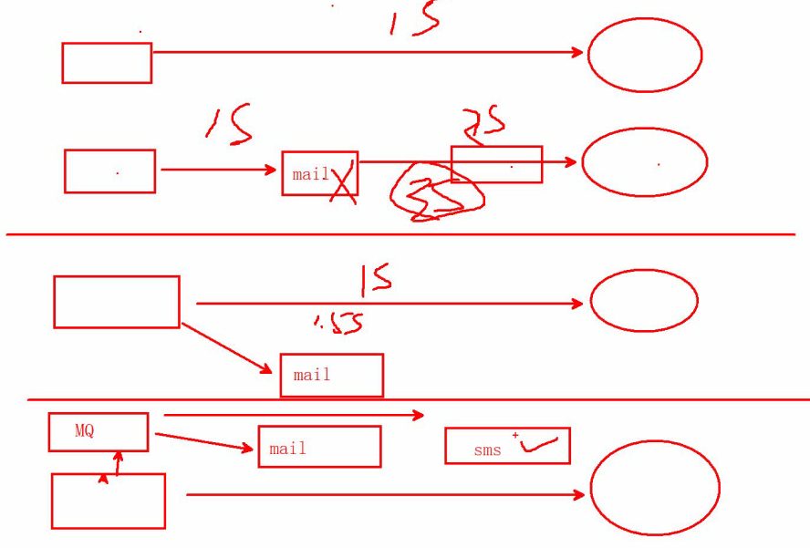

2、解耦（应用耦合）

3、流量区分（流量削锋）

+ 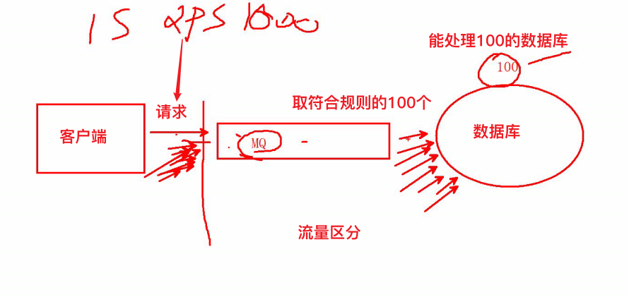

#### 1.3.2 缺点

+ 系统可用性降低

+ 系统复杂性增加

### 1.4 使用场景

+ 不需要立即获得结果，但并发量又需控制时使用

### 1.5 why使用RabbitMQ

#### 1.5.1 主流

+ RabbitMQ（
  + 并发能力挺高
  + 消息100%不丢失，方便恢复数据）
+ RocketMQ（
  + Kafka塞班
  + 解决Kafka消息丢失问题
  + 高级功能收费）
+ ActiveMQ（老牌，并发能力低）
+ Kafka（
  + 并发能力最高的
  + 为收集日志
  + 信息准确性较差，新版本修补了）:exclamation:大数据必学

#### 1.5.2 why

+ 开源，服务器端用Erlang语言实现，支持多客户端。分布

+ 基于AMQP协议

+ 三高（

  + [^高并发]: 容量概念：服务器可接受的最大任务量

  + [^高性能]: 速度概念：单位时间内服务器可处理的任务数

  + [^高可用]: 持久概念：单位时间内服务器可正常工作的时间比例

    ）

+ 插件

+ 多语言

## .2 安装

+ erlang与rabbitmq版本需对应（官网可查看）[先安装Erlang环境]

+ 集群安装比较麻烦（m）

### 2.1 安装Erlang环境

```bash
//安装rpm
//安装erlang
yum -y install esl-erlang_23.0.2-1_centos_7_amd64.rpm 
//检测erlang
erl
```

### 2.2 安装RabbitMQ

#### 2.2.1 安装

```bash
//查看
rabbitmq
    
//安装
yum -y install rabbitmq-server-3.8.5-1.el7.noarch.rpm

//启用rabbitMQ 管控台(UI插件)
rabbitmq-plugins enable rabbitmq_management

//启动
systemctl start rabbitmq-server.service
//查看状态
systemctl status rabbitmq-server.service

//不是必须的-------------------------------------------------------
//修改防火墙，添加规则
-A INPUT -p tcp -m state --state NEW -m tcp --dport 15672 -j ACCEPT
-A INPUT -p tcp -m state --state NEW -m tcp --dport 5672 -j ACCEPT 
//重启防火墙
systemctl restart iptables.service
```

#### 2.2.2 查看管控台

```bash
//查看管控台
浏览器输入:http://192.168.10.100:15672/
Username:guest(最大权限)
Password:guest

//会报错
User can only log in via localhost
//想远程登录则需改配置
```

#### 2.2.3 改配置

```bash
//修改配置
cd /etc/rabbitmq
//创建配置文件
vim rabbitmq.config //[{rabbit, [{loopback_users, []}]}].

//重启
systemctl restart rabbitmq-server.service

//管控台登录则成功
```

### 2.3 管控台

virtual host 虚拟主机 - 类比 - 数据库

#### 2.3.1 Overview（概览）

nodes （rabbitmq默认存储在内存）

端口

升级导入导出

#### 2.3.2 Connections（连接信息）

#### 2.3.3 Channels（信道）

#### 2.3.4 Exchanges（交换机）

交换机（默认7个）

队列

用户：

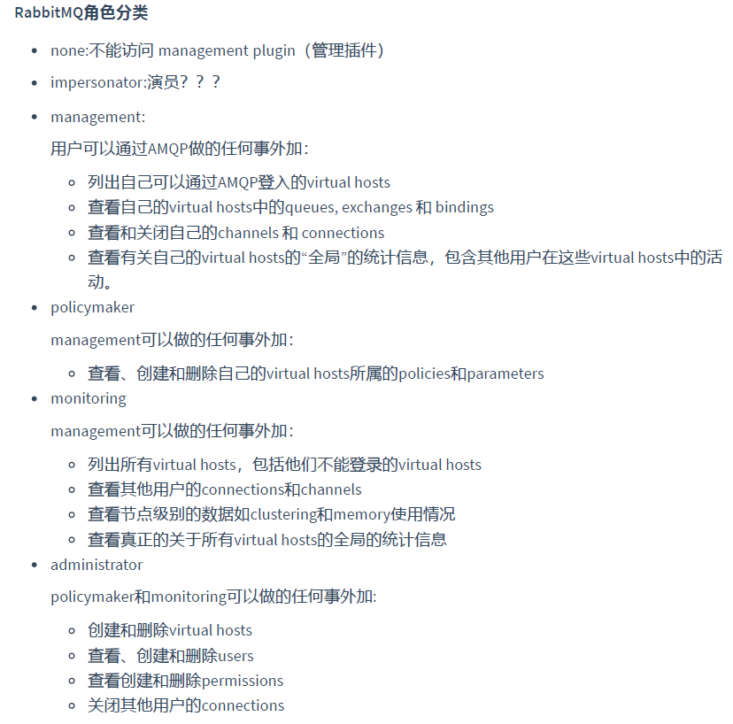

Tags

两种：

虚拟机配用户

用户配虚拟机

#### 2.3.5 Queues（队列）


#### 2.3.6 Admin（用户）

+ 添加用户

  + Tags给角色，管理员administractor
  + 用户状态为`No access`

+ 分配权限

  + 创建`virtual hosts`类比创建数据库

    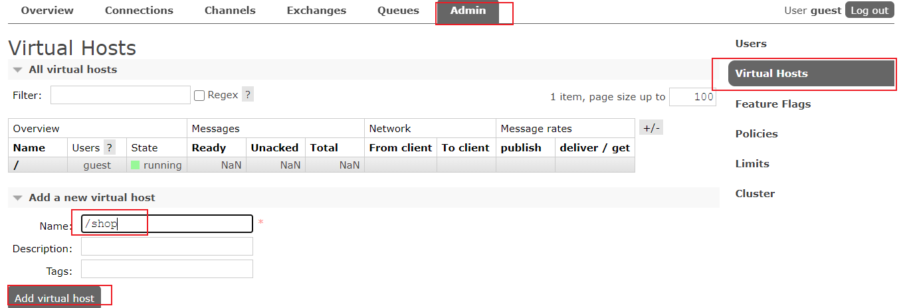

+ 给虚拟库中添加shop用户

  + 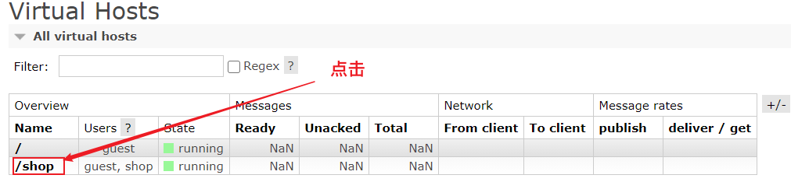
  + 
  + 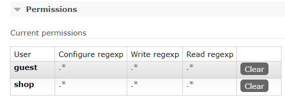
  + clear表示清除用户

+ 给shop用户添加权限

  + Users界面点击shop用户，进入权限分配页面

## .3 专业术语

https://www.rabbitmq.com/getstarted.html

## .4 入门案例

### 4.1 邮箱例子

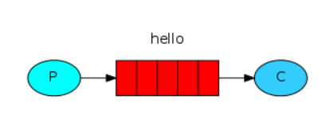

排他队列

缺点：

解决：准备多个消费者

默认使用交换机`(AMQP default)`默认模式`direct`

### 4.2 工作队列

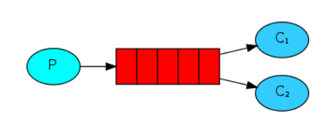

+ 两种模式

  + 轮询（

    + 一个消费者消费一条，轮着消费数据
    + 问题：消费速度不同，快的处理结束后等待其他消费者消费完成时造成资源浪费，水桶理论
    + 解决：能者多劳）

  + 公平（时间）（

    + basicQos 中设置prefetchCount=1，每次生产者只发1条消息，消费者处理完再发送下一条

    + 消费队列确认改为手动确认`autoAck:false`

    + 三处代码变动

      ```java
      //
      
      //
      
      //
      
      ```

      ）

+ 需求：

  + 生产者发送消息，所有消费者都收到
  + 解决：广播（发布订阅）

### 4.3 发布订阅队列

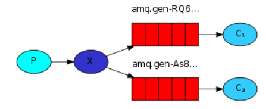

+ 实现：交换机（
  
+ 四种类型）
  
+ why使用排他队列

  + 连接关闭或客户端关闭，自动删除
  + 不需要手动一个个删除

+ 改变：生产者绑定交换机，交换机与队列绑定，，队列不与生产者绑定（

  + 三处

    ```java
    //
    
    //
    
    //
    ```

  + 注意提前生成交换机）
  
+ 需求：

  + 权限，有的消息给特定消费者

### 4.4 路由模式

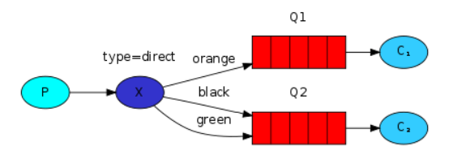

+ 交换机推送消息时携带路由键（

  + 交换机与队列绑定时

    ```java
    /**
    *
    *
    */
    ```

    

  + ）

+ 问题：路由键太多时，管理麻烦

+ 优化：

### 4.5 主题模式队列

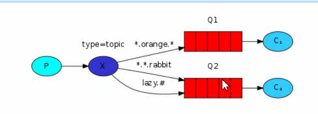

+ 通配符
  + *，可匹配唯一的单词
  + #，可匹配0个或多个单词
+ 用的最多，之前的模式都可以实现

### 4.6 RPC 远程过程调用模式队列

同步

一般不用

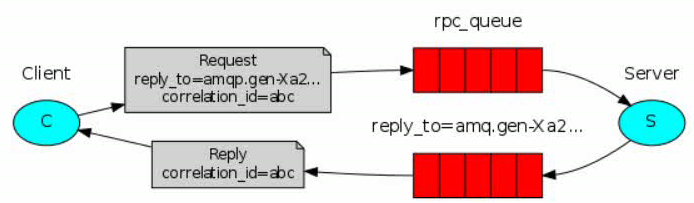

 		了解即可

## .5 RabbitMQ中AMQP协议机制

### 5.1 AMQP协议机制

#### 5.1.1 消息事务控制

三个方法

+ txSelect() 开启事务
+ txCommit() 提交
+ txRollback() 回滚

try中开启和提交，catch中回滚

+ 并行变成串行

+ 问题：容易阻塞

#### 5.1.2 confirm确认模式

##### 5.1.2.1 confirm 确认模式原理

+ 异步
+ 

##### 5.1.2.2 confirm 确认机制代码实现

三种机制

+ 普通confirm（串）

```java
//开启确认模式
confirmSelect()
//发送单条确认

```


+ 批量confirm（串）

```java


```

前两种，处理完后继续接收，与事务没什么区别，推荐第三种

+ 异步confirm（并）
+ 有唯一序列号（监听）
+ Sorted Set 

```java


```


##### 5.1.2.3 同步confirm


确保消息保障

问题：但可能发送相同的信息

解决：幂等性校验

方式一：

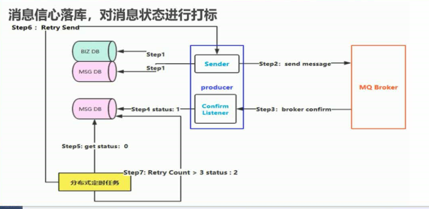

方式二：

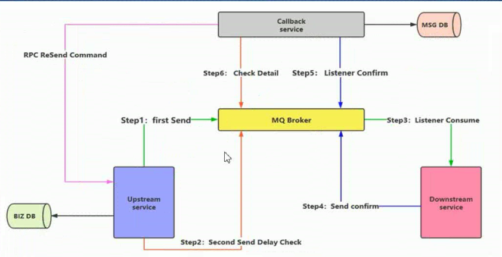


确保消费者不重复的消费消息

幂等性校验

问题：唯一序号短时间内会出现两条一样的

解决：加长唯一标识的长度，越长越不易重复

问题：容量变大

解决：存radis

问题：时效性，是否入库（一致性）

## .6 Spring继承RabbitMQ

RabbitMQ实现了AMQP协议

Spring AMQP


## 7. 问题

### 7.1 处理消息

控制台 pure 去掉消息

### 7.2 死性队列

vue

spring

缓存+MQ 替代 锁

快速响应

大并发（

+ 针对秒杀的作弊方法：
  + 预约功能，统计有多少人参与
  + 在这些人中，筛出一部分人分好cookie
  + 秒杀时，有cookie的人可以访问到后台进行抢货
  + 其他的人给静态页面或动画，无法访问到后台）
+ 黄牛：（
  + 低级：同一个ip重复访问
  + 高级点：代理，肉机）
+ 网关，限流