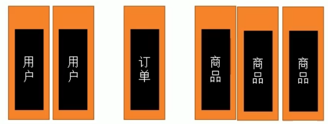
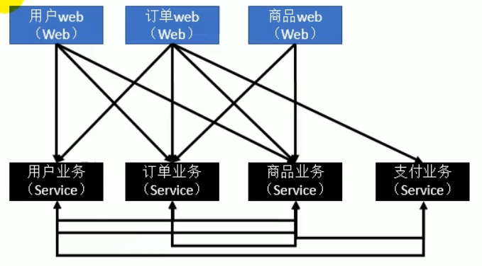
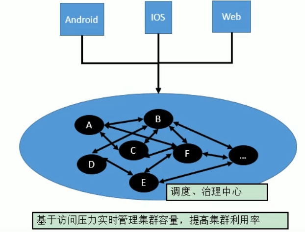
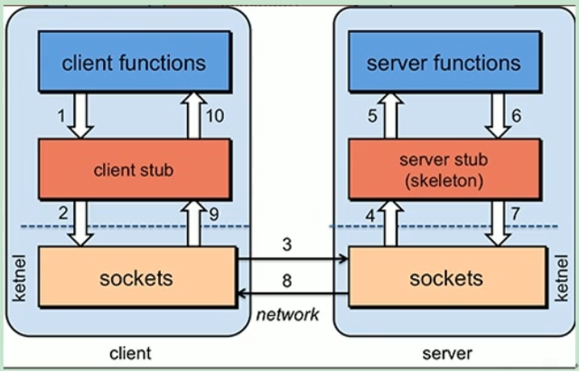
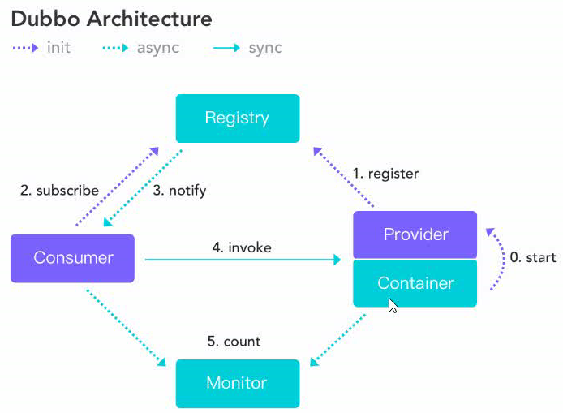
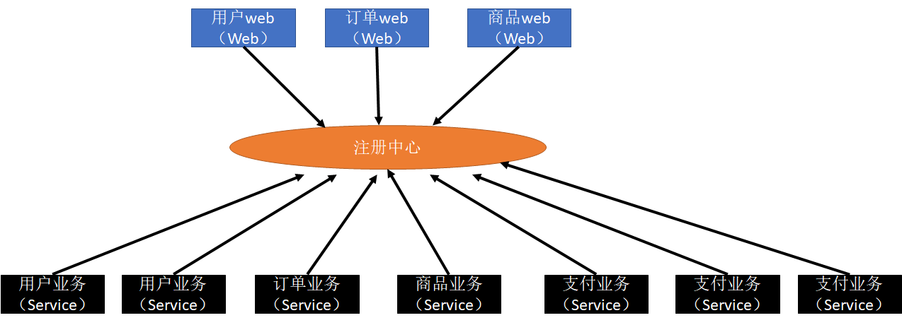
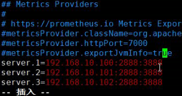

# Dubbo

治理分布式系统

## 1. 互联网框架演变趋势：

### 1.1 单一应用架构

+ 以一个jar包或者war包单独运行
+ 优点：简单
+ 缺点：测试困难、迭代困难、可靠性差、可伸缩性差、跨语言程度0差、团队协作难、并发量低
+ 优化：MVC模式

### 1.2 MVC模式（垂直）

+ 分层思想
+ 优点：承受更多的并发，易扩展（扩展应用）
+ 缺点：
  + 没有做到界面+业务逻辑的实现分离（界面常改动）
  + 应用不可能完全独立，大量的应用之间需要交互
+ 优化：RPC架构



### 1.3 RPC架构（分布式）

+ 远程过程调用
+ 特点：服务之间隔离，将核心业务分离
+ 缺点：服务过多时，管理成本高；客户端任务量大；资源浪费严重
+ 优化：SOA框架



### 1.4 SOA框架（流动计算架构）

+ 面向服务框架
+ 特点：比RPC多一个ESB（企业服务总线）
+ 解决：RPC资源浪费问题，对其进行实时资源调度，提高资源利用率
+ 问题：ESB处理问题太多变太重（服务网格化）
+ 优化：微服务架构



### 1.5 微服务架构

+ 轻量化
+ 特点：注册中心
+ 特性：单一职责
+ 优点：易测试、可靠性强等
+ 缺点：成本高、分布式系统的复杂性（管理困难）、接口要兼容多版本、分布式事务（seata tx-lcn）（事务会牵扯到锁，会降低性能）

## 2. RPC基于RMI的简单实现

> RPC（remote procedure call）一种进程间通信方式，一种技术思想而不是规范。




影响RPC框架性能有两点：

+ 通讯效率，能否快速的在各个服务器之间建立联系
+ 序列化和反序列化速度快慢

例子：dubbo，gRPC，Thrift，HSF

## 3. Dubbo入门

奥义：高性能、轻量级的开源Java服务框架（高性能的RPC框架）

三大核心：

+ 面向接口的远程方法调用
+ 智能容错和负载均衡（有调用时，调用对较闲（任务量小）的资源）
+ 服务自动注册和发现

### 3.1 流程



节点角色说明：

+ [^Registry]: 注册中心

+ [^Provider]: 服务提供者【对应下图的web】
  [^Container]: dubbo框架容器
  [^Monitor]: 监控中心
  [^Consumer]: 服务消费者【对应下图的业务】

过程：

+ dubbo框架容器启动（0.start）初始化服务提供者，将自己提供的服务注册（1.register）到注册中心，注册中心就知道有哪些服务上线了。
+ 服务消费者启动从注册中心订阅需要服务（2.subscribe），若服务有变更，注册中心通过长链接的方式（3.notify）将更新推送给消费者。
+ 消费者拿到所有订阅的服务，可以调用（4.incoke）服务提供者提供的服务。
+ 所有调用信息会定时发送给（5.count）监控中心

  

**注册中心（5种）：**相当于管理了一个服务在哪里的清单

+ Multicast（默认）
+ Nacos
+ Zookeeper
+ Redis
+ Simple


### 3.2 基本搭建

#### 3.2.1 引入Dubbo依赖

父工程：主要做`pom`依赖管理

`<dependencyManagement>`意思是，用的时候加载（多方在父工程pom中）。

+ 父工程统一指定版本，否则子工程中版本不一定一致，后期维护复杂。

+ ```xml
  <properties>
      <java.version>1.8</java.version>
      <!--父工程统一指定版本，后期升级只修改这里就行-->
      <dubbo.version>2.7.3</dubbo.version>
  </properties>
  
  <dependencyManagement>
      <dependencies>
          <dependency>
              <groupId>org.apache.dubbo</groupId>
              <artifactId>dubbo-spring-boot-starter</artifactId>
              <!--引入properties中版本-->
              <version>${dubbo.version}</version>
          </dependency>
      </dependencies>
  </dependencyManagement>
  ```

`<dependencies>`用在子工程中。

+ ```xml
  <dependency>
      <groupId>org.apache.dubbo</groupId>
      <artifactId>dubbo-spring-boot-starter</artifactId>
  </dependency>
  ```

#### 3.2.2 项目


1、广播模式，同一台电脑可以访问

2、网段问题


灰度发布：根据version控制可用范围，一步步发展新的版本、一步步将旧版本更新成新版本


Zookeeper注册中心

安装（Linux中）：

+ 注意配置文件，复制一个`zoo_simple.cfg`命名为`zoo.cfg`

+ 启动完成后查看状态 status

项目中：

+ 添加依赖：注册中心客户端引入`curator`客户端
+ 配置文件地址：address改成zookeeper 


conf中




了解（一致性问题）

+ poxos raft zab算法
+ 拜占庭将军问题


打包

管理控制台安装

dubbo-admin

Linux中

+ 先安装git，再拉取github上dubbo-admin的包

+ 安装maven，setting.xml中中央仓库改成国内的


面试技巧

+ 主动带节奏，带动面试官聊自己会的
+ sgg面试大保健
+ Java以前学过可以拾起来，不如问问大数据的组件
+ 学信网可查吗？可查啊。


思维能力，勿人云亦云

眼光，选择

幸存者偏差


