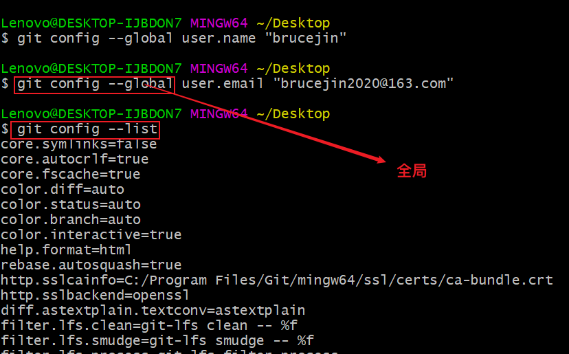
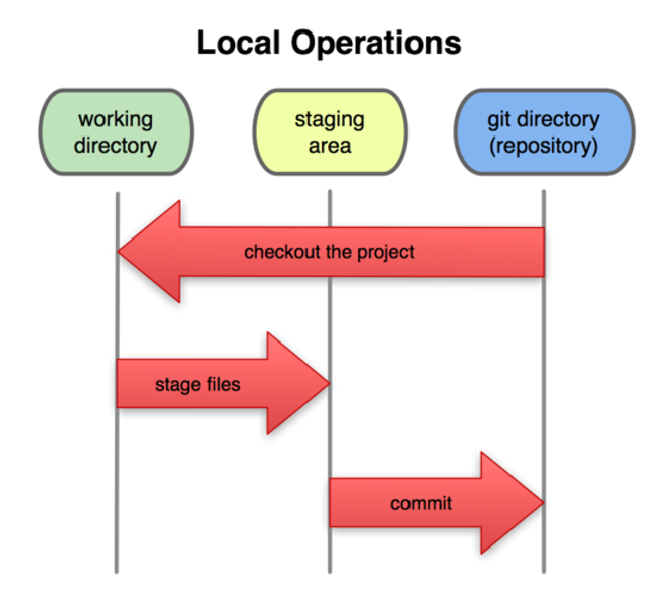

# Git

## .1 学习思路

1.这个技术是什么

2.优点，为什么学

3.缺点，如何避免

思否，掘金

## .2 版本控制

1、本地

+ 自嗨，无法协同操作

2、集中化（CVCS）

+ 单点故障
+ 多个仓库，资源浪费

3、分布式（DVCS）

+ 每个电脑自己带了一个本地仓库

## .3 Git设置个人

用户名和邮箱

```linux
git config --global user.name ""
git config --global user.email ""
```



## .4 Git三种状态和工作模式

4.1 工作模式及工作区域



工作区、暂存区、git仓库

4.2 三种状态

已提交`committed`、已修改`modified`、已暂存``

## .5 常用命令

```linux
//常用
git init
git status
git add 目录/文件名
git commit -m "注释"
git commit -am "注释" = add+commit //第一次提交本文件不可以

//查看日志
git log
git log --pretty=oneline //一行显示
git reflog //查看唯一标识
git diff HEAD -- 文件名 //看不同，在未提交之前（modified）

//回退
git reset --hard HEAD^^^^ //回退几次有几个^
git reset --hard 唯一标识 //唯一标识通过reflog查看
git reset --hard HEAD~'数字' //回退版本
git reset HEAD file //撤消操作
git restore --staged file //从暂存区撤回，注意版本有的没--help查看
git restore file //撤销文件中内容

//删除
git checkout file //从版本库，误删拉取
git rm -f
删除文件，提交操作

//快捷键
Tab自动补全
ctrl+ins复制粘贴
```

## .6 拉取和推送

```linux
git clone 网址(https)

(新建一个仓库，可看到，不选readme等)
create a new repository on the command line//创建新的存储库
echo "# test" >> README.md
git init
git add README.md
git commit -m "first commit"
git branch -M main //分支重命名
git remote add origin https://github.com/VideJin/test.git//远程添加
git push -u origin main//推送

//推送已有的存储库到远程
git remote add origin https://github.com/VideJin/test.git
git branch -M main
git push -u origin main
```

## .7  SSH

ssh比https更安全和快速

+ 需要公钥SSH Keys

+ 本地git客户端 `ssh-keygen -t rsa -C "GitHub账户邮箱"`

+ settings中配置ssh

+ 检测`ssh -T git@github.com`

+ 使用ssh推送

 ```git
git remote add origin git@github.com:VideJin/test.git
git branch -M main
git push -u origin main
 ```

## .8 分支

### 8.1 本地操作

```git
git checkout branch //切换分支
git checkout -b new_branch //新建并切换到新分支

git branch //查看所有分支
git branch -m oldbranch newbranch //重命名

git merge branch //合并分支 注：先切换到主分支再合并

git branch -d branch //删除指定分支
```

### 8.2 远程操作

```git
git branch -a //查看本地和远程分支
//push
git push origin file/branch_name //推送
//pull
git checkout -b local_branch origin/remote_branch //拉取远程指定分支并在本地创建分支
//删除
git push origin : file/remote_branch //只删除远程的

git fach // 查看状态
```

## .9 冲突

### 9.1 本地


