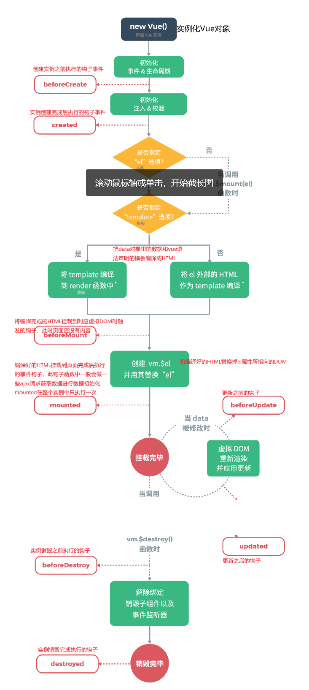
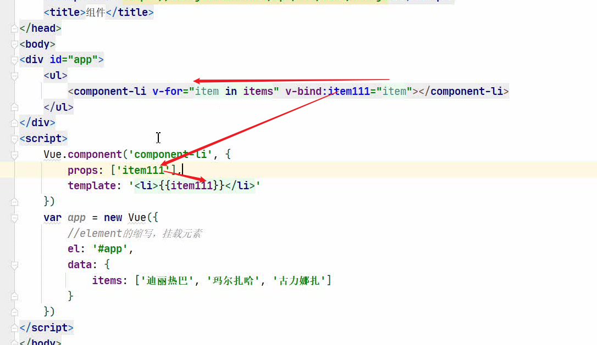
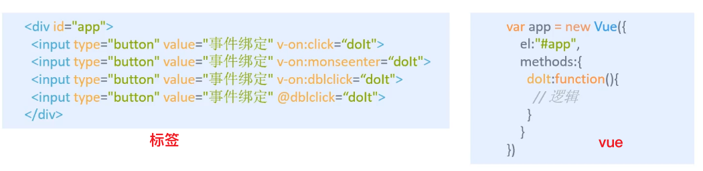
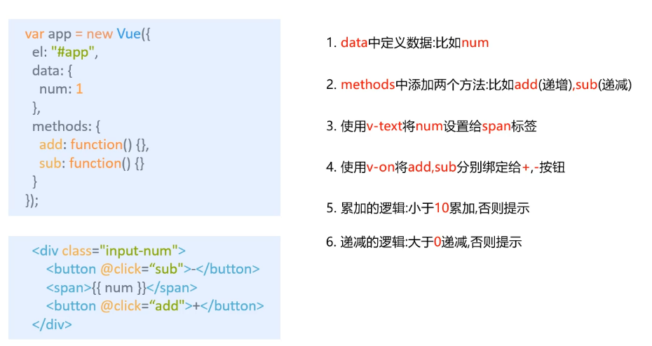
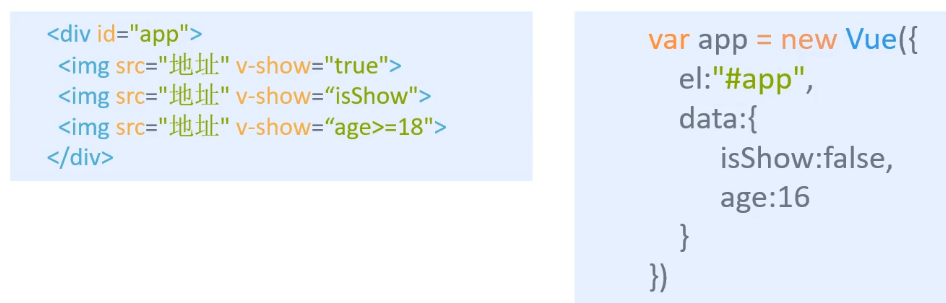
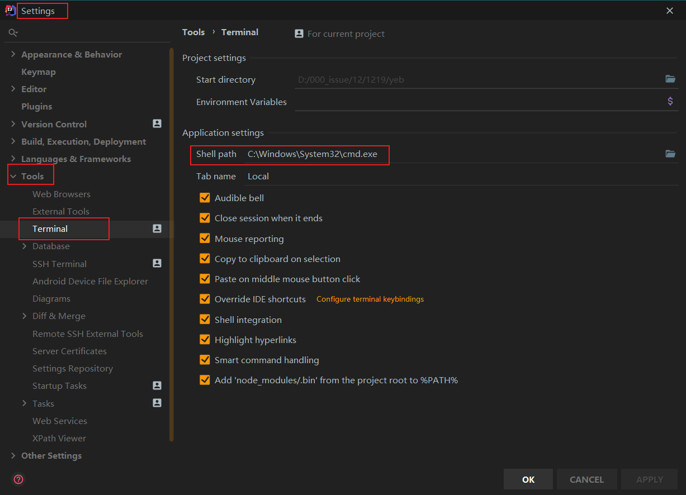

# VUE

## .1 前端知识体系

### 1.1 why

防止前端忽悠你

### 1.2 what

Axios框架（vue作者推荐）

vue-cli脚手架

vue-router页面跳转

vuex状态管理

WabPack打包

### 1.3 三要素

#### 1.3.1 html（结构层）

#### 1.3.2 css（表现层）

+ 预处理器
  + 给css添加了变量
  + 分类：
    + SASS
    + LESS

#### 1.3.3 js（行为层）

1、原生js，按照【ECMAScrpt】标准开发

ES5全浏览器支持

ES6常用，当前主流版本

2、TS【微软】es上增添新特性（类似工具类）

3、JS框架

+ jQuery 
  + 优
  + 缺
  + 目的
+ Angular
  + 特点
  + 缺
+ React
  + 特点
  + 缺点
+ Vue
  + 特点，计算属性，关注度分离原则（只负责页面交互）
+ Axios
  + 和后端交互，通信

4、UI框架

+ Ant-Design(圣诞节彩蛋事件)：
+ ElementUI“
+ Bootstrap：
+ AmazeUI：

5、js构建工具

+ Babel
+ WabPack

### 1.4 前后端分离发展历程

#### 1.4.1 后端为主的MVC时代

+ 优点
+ 缺点
+ 优化

#### 1.4.2 AJAX的SPA（单页面应用）时代

+ 优点
  + 调用后端的能力
+ 缺点
  + 前后端接口的约定
  + 前端开发的复杂度控制

#### 1.4.3 前端为主的额MV*时代

+ MVC
+ MVP
+ MVVM
+ 优点
+ 缺点
  + 代码不能复用。后端必须数据校验
  + 全异步，对SEO（搜索引擎）不利
  + 性能


#### 1.4.4 NodeJs全栈时代

+ 

### 1.5 前端MVVM模式

#### 1.5.1 what

+ 软件架构设计模式

+ 事件驱动编程方式

+ 核心

  + ViewModel层

+ 目前流行的MVVM框架

  + Vue.js
  + AngularJs

+ 观察者模式

+ 双向数据绑定

  

#### 1.5.2 why

+ 前后端真正分离
+ 低耦合
+ 可复用
+ 独立开发
+ 可单独测试

#### 1.5.3 组成


+ View

+ ViewModel
  + 状态和行为（Model只有状态）
  + 解耦View和Model层

+ Model

## .2  VUE概述

### 2.1 奥义

#### 2.1.1 what

+ 渐进式（逐步给特性）自底向上逐层应用
+ 只关注视图层
+ MVVM的实现者
  + DOM监听
  + Data绑定

#### 2.1.2 why

+ 轻量级
+ 移动优先，更适合移动端
+ 易上手
+ 吸收了长处
+ 开源，社区活跃度高

特点：

+ Javascript框架
+ 简化Dom操作
+ 响应式数据驱动

#### 2.1.3 两大核心要素

+ 数据驱动
+ 组件化

### 2.2 第一个Vue小项目

+ 新建简单js项目

+ 引入开发环境

+ 插件：浏览器：vue devtools 

+ `el:'#app'`绑定元素的ID

  > css选择器中 # 是id选择器

+ `data:{message:'Hello Vue!'}` ：数据对象中有一个名为 `message` 的属性，并设置了初始值`Hello Vue!`

```html
<!--导入Vue核心库-->
开发版本的Vue.js
<!--编写Vue组件-->
创建Vue实例对象，设置el和data属性
<!--准备DOM结构-->
使用简洁的模板语法把数据渲染到页面上
```

### 2.3 Vue生命周期

从Vue实例的创建到销毁的额过程



如果使用构造生成文件（例如构造单文件组件），模板编译将提前执行

### 2.4 渲染

条件渲染

+ v-if
  + v-else
  + v-else-if

列表渲染

+ v-for
+ id挂在元素

事件处理

+ v-on（对应onclick）
+ API中查看缩写@click=v-on:click
+ 方法必须定义在methods中

### 2.5 异步通信（Axios）

what

+ 实现AJAX异步通信

特点

+ 

why

+ 关注度分离原则

应用

```json

```

v-bind：省略后是:


2.6 表单数据绑定

+ v-model


## 3. 组件

what

+ 可重复使用的vue实例
+ 


## 4. 计算属性

what

计算动词，属性名词

将一个动词转化为一个名词。

将动态的行为转化为静态属性，与缓存类似

computed


5. 插槽与自定义

+ 通过插槽确定子组件摆放	的位置

## 5. 模板，工具

### 5.1 Vue-cli

what

脚手架

功能

+ 统一的目录结构
+ 本地调试
+ 热部署
+ 单元测试
+ 集成打包上线

环境

+ Node.js（6.x以上，首选8.x）
  + 安装版本不用配环境
  + zip版需要配置环境变量
+ git

注意

Npm相当于软件包，仓库在国外

首选npm，网络不好用yarn，可选cnpm（有些包会有Bug）

```bash
//cmd中,查看安装的node
node -v
npm -v //若版本落后，提示更新语句
npm install -g npm@7.1.2

//网络不好解决方案
npm install cnpm -g
npm install --registry=http://registry.npm.taobao.org

//安装cli
npm install vue-cli -g
//查看cli列表
vue list
```


创建一个项目

```bash
//到你准备新建的目录下
vue init webpack firstvue

//初始化并运行
cd firstvue 
npm install
npm run dev


```


```vu
<template>
里面只有一个div，方便布局
</template>

<script>
其中有个export暴露，才能让index接收到

</script>

<style>
样式
scoped加上后，仅当前组件生效
</style>
```

### 5.2 Webpack

#### 5.2.1 what

现代javascript应用程序静态模块打包器（module bundler）

打包工具

万物皆模块

#### 5.2.2 why

模块化演进（了解）

+ js

+ commonsJS
  + 优点
  + 缺点
  + 实现

+ AMD
  + 优点：异步
  + 缺点：提高开发成本
  + 实现

+ CMD

+ ES5
+ ES6

#### 5.2.3 安装WebPack

```bash
npm install webpack -g
npm install 

```

### 5.3 vue-router

#### what

+ 路由管理器

+ 页面跳转

#### 安装

```bash
npm install vue-router --save-dev//安装到工程中
```

router - > index.js 配置，路由安装，导出

main.js 导入，导路由,入口

使用：

+ 展示页面routerview

+ 跳转  router-link                                                                                                                                                                                                                                      

#### 整合ElementUI


跨域问题，一般用后端处理。js的代理转发


session stage 只能存字符串

### vuex

状态管理模式


## . 问题

### .1 el挂载点

> 作用：设置Vue实例挂在（管理）的元素

#### .1.1 Vue实例的作用范围？

Vue会管理 el选项 命中的元素及其内部的后代元素

#### .1.2 是否可以用其他的选择器？

可以，但一般使用id，因为唯一性

#### .1.3 是否可以设置其他的dom元素？

可以，但不能挂在在html和body上

### .2 data:数据对象

+ vue中用到的数据定义在data中
+ data中可以写复杂类型的数据
+ 渲染复杂类型数据时，遵守js的语法即可

```vue
对象
{{ 对象.属性 }}
数组
{{ 数组[下标] }}
```

### .3 Vue本地应用（Vue指令）

#### .3.1 内容绑定，事件绑定

> v-text,v-html,v-on基础

1、v-text

+ 设置标签的文本值（textContent）

  ```html
  <body>
      <div id="app">
          <!-- 会替换掉后面的值 -->
          <h2 v-text="message+'!'">上海</h2>
          <h2 v-text="info+'!'">上海</h2>
          <!-- 这种方式不会 -->
          <h2 >上海{{ information+"!"}}</h2>
      </div>
      <!-- 开发环境版本，包含了有帮助的命令行警告 -->
      <script src="https://cdn.jsdelivr.net/npm/vue/dist/vue.js"></script>
      <script>
          var app = new Vue({
              el:'#app',
              data:{
                  message:'你好',
                  info:"大家好",
                  information:"堡垒"
              }
          })
      </script>
  </body>
  ```

  

2、v-html

+ 设置标签的innerHTML

+ 可以识别 html 语法结构

+ 与v-text不同

  + v-html解析为标签
  + v-text解析为文本

  ```html
  <body>
      <!--2.html结构-->
      <div id="app">
          <p v-html="content"></p>
          <p v-text="content"></p>
      </div>
      <script>
          //3.创建vue实例
          var app = new Vue({
              el:'#app',
              data:{
                  // content:"上海堡垒"
                  content:"<a href='http://www.baidu.com'>百度</a>"
              }
          })
      </script>
  </body>
  ```

3、v-on基础

+ 作用：为元素绑定事件

+ 改变页面元素，不用操作DOM元素，而是更改数据（VUE数据驱动），更改时，注意`this`关键字拿到数据。

+ 

  ```html
  <body>
      <!--2.html结构-->
      <div id="app">
          <input type="button" value="v-on指令" v-on:click="doIT">
          <input type="button" value="v-on简写" @click="doIT">
          <input type="button" value="双击事件" @dblclick="doIT">
          <h2 @click="changeFood">{{ food }}</h2>
  
      </div>
      <script>
          //3.创建vue实例
          var app = new Vue({
              el:"#app",
              data:{
                  food:"韭菜香干"
              },
              methods:{
                  doIT:function(){
                      alert("做IT");
                  },
                  changeFood:function(){
                      //console.log(this.food);
                      this.food += "好吃😋！"
                  }
              }
          });
      </script>
  </body>
  ```

4、应用：计数器

+ 分析

  

+ 代码

  ```html
  <body>
  <!--
      思路：
      1.DOM结构，三个
          按钮 - @click sub
          显示数
          按钮 + @click add
      2.vue实例
          按钮 - 最小值
          数的最大最小值
          按钮 + 最大值
  -->
      <!--2.html结构-->
      <div id="app">
          <div class="input-num">
              <button @click="sub">
                  -
              </button>
              <span>{{ num }}</span>
              <button @click="add">
                  +
              </button>
          </div>
      </div>
      <script>
          //3.创建vue实例
          var app = new Vue({
              el:"#app",
              data:{
                  num:1
              },
              methods:{
                  //num = this.num,不行
                  sub:function(){
                      if(this.num>1){
                          this.num--;
                      }else{
                          alert("别点啦，到底了！");
                      } 
                  },
                  add:function(){
                      console.log("add");
                      if(this.num<10){
                          this.num++;
                      }else{
                          alert("别点啦，到头了！！！");
                      }
                  },
              },
          });
      </script>
  </body>
  ```

  

#### .3.2 显示切换，属性绑定

> v-show,v-if,v-bind

1、v-show

+ 作用：根据表达值的真假，切换元素的显示和隐藏

  

+ 本质是display

+ 指令后的内容，最终被解析为布尔值

+ 代码

  ```html
  <body>
      <!--2.html结构-->
      <div id="app">
          <input type="button" value="切换显示状态" @click="changeIsShow">
          <input type="button" value="加载" @click="checkAge">
          <!--双向数据绑定-->
          <input type="text" v-model="age">
          <span v-show="isShow">哈哈哈</span>
          <span v-show="result">啦啦啦</span>
      </div>
      <script>
          //3.创建vue实例
          var app = new Vue({
              el:"#app",
              data:{
                  isShow:false,
                  age:" ",
                  result:false
              },
              //监视输入的文本框的值
              watch:{
                  age(nval,oval){
                      //判断输入文本框的值是否为数字
                      if(isNaN(nval)){
                          alert("请输入数字");
                      };
                      console.log(isNaN(nval));
                  }
              },
              methods:{
                  changeIsShow:function(){
                      this.isShow = !this.isShow;
                  },
                  checkAge:function(){
                      if(this.age >= 18){
                          console.log("sdf");
                          this.result = true;
                      }else{
                          this.result = false;
                      };
                  }
              },
          })
      </script>
  </body>
  ```

2、v-if

+ 根据表达式的真假，切换元素的显示和隐藏（操纵dom元素）
+ 


#### .3.3 列表循环，表单元素绑定

> v-for,v-on补充,v-model


### .4 idea中npm不是命令

