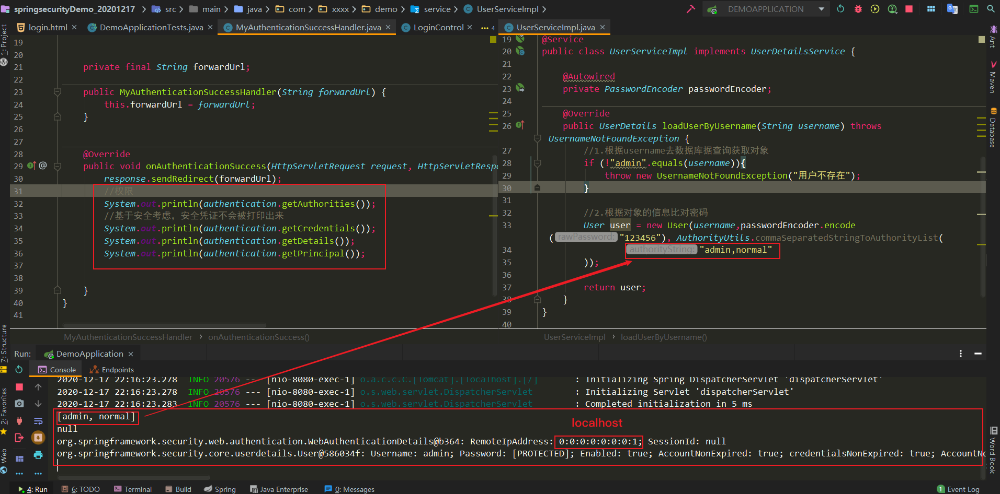
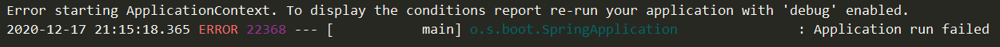
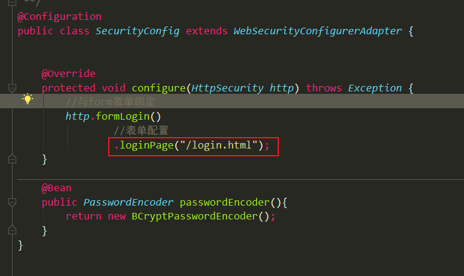
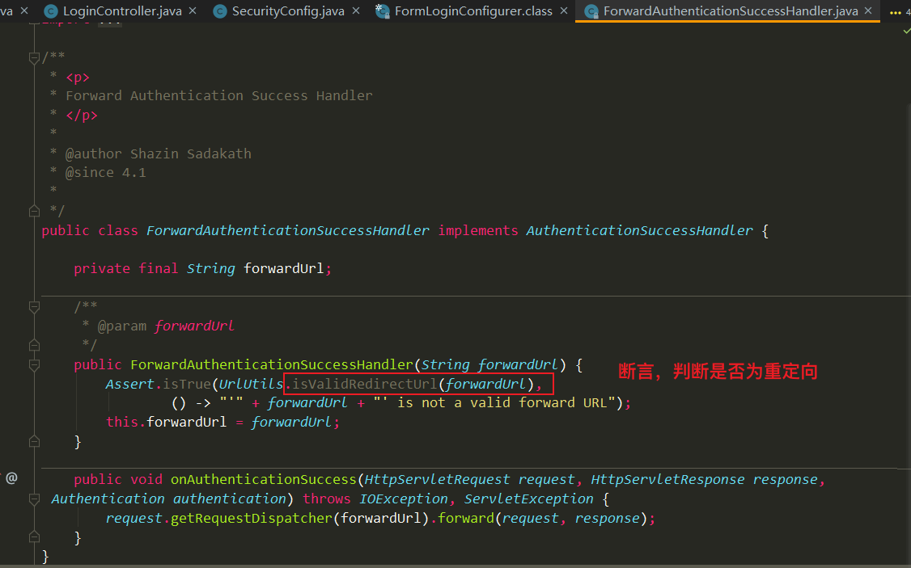
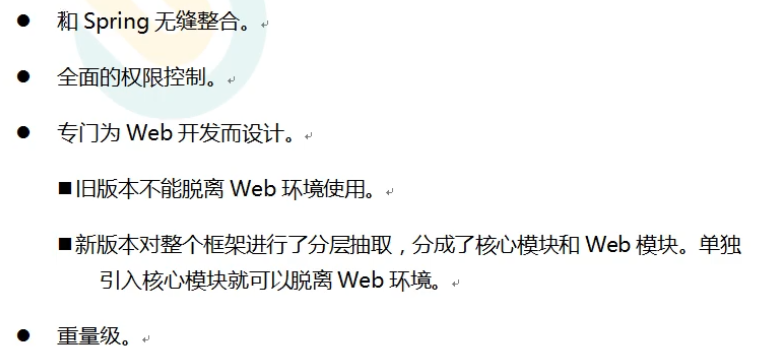
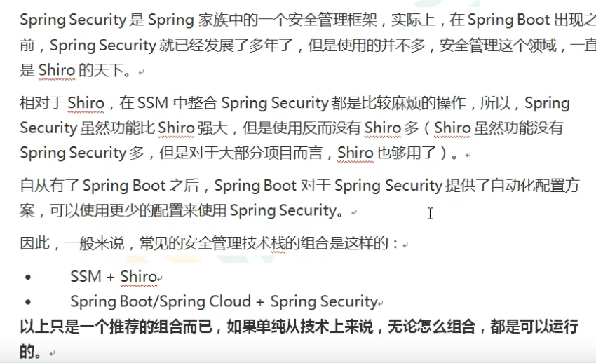
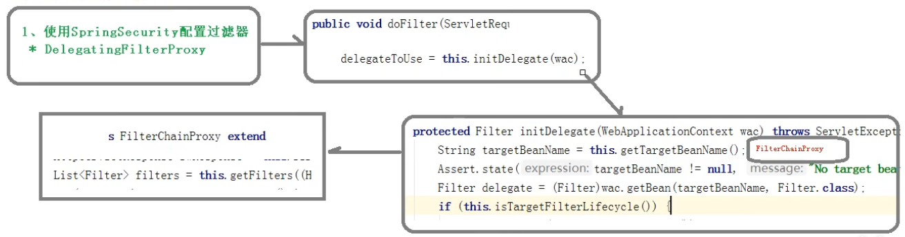
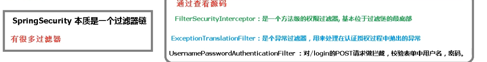

# SpringSecurity

Oauth2第三方登录

JWT令牌：相当于门票

SSO令牌：单点登录，默认登录

web应用安全解决方案

用户认证（Authentication）

用户授权（Authorization）

## 1、what

+ 安全框架（解决系统安全问题的框架）
  + spring Security：spring套餐中，代码的侵入量小，虽代码多但安全性和功能更强
  + Apache Shiro：轻便，配置代码少
+ 用的spring的三大特性（IOC/DI/AOP）
+ 本质是一个过滤器链
+ 功能
  + 认证：建立其声明的主体的过程（用户能否登录）
  + 授权：确定主体是否允许在应用程序中执行一个动作的过程（用户是否有权限完成一些操作）

## 2、入门

### 2.1 实现登录功能

#### 2.1.1 思路

1、建立项目时引入 spring security

2、准备页面login

3、准备接口

4、默认用户和生成密码

访问哪个界面路径要打全，如login.html

### 2.2 自定义登录逻辑

#### 2.2.1 准备

写类继承`UsernamePasswordAuthenticationFilter`类，重写`attempAuthentication`方法，验证成功调用`successfulAuthentication`方法，失败调用`unsuccessfulAuthentication`方法。

中间的验证与数据库比对信息需要实现`UserDetailsService`接口，编写查询数据库过程，返回`User`对象（安全框架提供的对象）。

##### 2.2.1.1 UserDetailsService

+ 接口，返回UserDetails（接口）（
  + 返回的用户对象，包含多个方法
  + 实体类，user）
+ loadUserByUsername方法
  + 从数据库中根据用户名查找用户信息
  + 返回UserDetails
+ 找到这些对象信息后比对密码

##### 2.2.1.2 PasswordEncoder

+ 加密解密接口
  + encode 对原始密码加密
  + matches （比对原始密码和加密密码）
  + upgradeEncoding（了解，可再次加密）
+ 实现类 --> BCryptPasswordEncoder（单向加密：仅加密不解密）
  + bcrypt强散列方法的具体实现
  + 盐随机，所以即使密码一样每次加密也不同
  + 基于hash算法的单向加密
  + 根据长度控制加密强度，默认10 

#### 2.2.2 实现

##### 2.2.2.1 自定义登录逻辑

+ 需要准备配置类把密码加密配置好
+ 实现自定义登录逻辑
  + 实现UserDetailsService接口
  + 重写loadUserByUsername方法
    + 根据username去数据库查询获取用户对象
    + 根据用户对象的密码和传入的密码比较，确认是否登录
      + User类中的权限信息用工具类`AuthorityUtils`创建权限

##### 2.2.2.2 自定义登录页面

+ 配置类继承WebSecurityConfigurerAdapter

  + 重写configure（HttpSecurity）

    + http.formLogin表单提交与form表单绑定

    + 登录成功跳转页面设置（建html，controller跳转）

    + 会发生不需要登录就可以访问页面，用授权解决

      ```java
      //与form表单绑定
      http.formLogin()
          //自定义表单配置
          .loginPage("/login.html")
          //login与form的action相关,与controller的无关
          .loginProcessingUrl("/login")
          //登录成功后跳转的页面。必须post请求
          .successForwardUrl("/main");
      ```

      

  + 授权,解决所有页面都可登录

    ```java
    //授权
    http.authorizeRequests()
        //允许login.html不登陆既可以访问，否则出现访问过多错误，死循环
        .antMatchers("login.html").permitAll()
        //所有请求必须登陆后访问
        .anyRequest().authenticated();
    ```

    + 无法跳转页面，解决：关闭csrf

  + 关闭csrf防护（默认开启）

##### 2.2.2.3 认证过程其他配置

1、失败跳转

+ 添加失败页面及contrller中重定向（满足post请求）

  ```java
  .successForwardUrl("/toMain")
  .failureForwardUrl("/toError");
  ```

+ 授权中放行失败页面

2、设置自定义用户名和密码

+ 密码和用户名固定

+ 在UsernamePasswordAuthenticationFiltr（拦截器）中

+ 改：usernameParameter("自定义")方法

  ```java
  http.formLogin()
      //自定义表单配置
      .loginPage("/login.html")
      //login与form的action相关,与controller的无关
      .loginProcessingUrl("/login")
      //登录成功后跳转的页面。必须post请求
      .successForwardUrl("/toMain")
      .failureForwardUrl("/toError")
      //自定义用户名和密码
      .usernameParameter("username123")
      .passwordParameter("password123");
  ```

  ```html
   <form action="/login" method="post">
       <!--name 对应-->
       用户名：<input type="text" name="username123"/><br/>
       密码：<input type="password" name="password123"/><br/>
       <input type="submit" value="登录">
  </form>
  ```

  

3、自定义登录成功处理器

+ ```java
  package com.xxxx.demo.handler;
  
  import org.springframework.security.core.Authentication;
import org.springframework.security.web.authentication.AuthenticationSuccessHandler;
  
  import javax.servlet.ServletException;
  import javax.servlet.http.HttpServletRequest;
  import javax.servlet.http.HttpServletResponse;
  import java.io.IOException;
  
  /**
   * @program: springsecurityDemo_20201217
   * @description: 自定义登录成功页面
   * @author: CoreDao
   * @create: 2020-12-17 22:04
   **/
  
  public class MyAuthenticationSuccessHandler implements AuthenticationSuccessHandler {
  
      private final String forwardUrl;
  
      public MyAuthenticationSuccessHandler(String forwardUrl) {
          this.forwardUrl = forwardUrl;
      }
  
      @Override
      public void onAuthenticationSuccess(HttpServletRequest request, HttpServletResponse response, Authentication authentication) throws IOException, ServletException {
          response.sendRedirect(forwardUrl);
  
      }
  }
  ```
  + 属性Authentication
  
    + 可获取四种信息
    + localhost会显示0.0.0.0.1,本地是127.0.0.1
  
    
  
  ```java
  http.formLogin()        
      //登录成功后跳转的页面。必须post请求
      //.successForwardUrl("/toMain")
      //登录成功跳转逻辑
      .successHandler(new MyAuthenticationSuccessHandler("http://www.baidu.com"))
  ```
  
  

4、自定义登录失败处理器

+ 


授权：

+ url匹配规则
  + 自上而下运行，先具体后笼统
  + ant表达式（多）：可设置请求方式 + ？（一个字符）、*（字符串）、**（目录）
  + 正则表达式：可设置请求方式 + 表达式
  + mvc表达式：可加servletPath。在配置中是spring.mvc.servlet.path,其他的匹配方式需要加上path

+ 控制url

  【1】内置六种控制访问。

  + permitAll
  + authenticated

  【2】其他的

  + 权限控制hasAuthority（严格区分大小写）| hasAnyAuthority多个

  + 用户角色控制 hasRole()，不用写ROLE_自动添加（严格区分大小写）|  hasAnyRole()多个

    + | 权限  | 角色       |
      | ----- | ---------- |
      | admin | ROLE_admin |

  + ip地址的控制hasIpAddress[

    + 作用：控制公司内网访问]

自定义403

AccessDemiedHandler


access表达式

自定义权限方法

接口：判断对象


基于注解的访问控制

+ 默认关闭，启动类加`@EnableGlobalMethodSecurity(注解 = true)`

+ @Sevured控制角色


添加依赖

配置

令牌完成记住我功能


退出登录

加一个a标签


CSRF

+ 跨站请求伪造
+ 提高安全性


## 3、Oauth2简介

what

+ 第三方认证的通用标准
+ 解决第三方认证技术统一的标准
+ 流程
+ 客户端、资源
+ 常用术语
+ 令牌类型

优点

+ 更安全
+ 广泛传播
+ 短寿命和封装的token
+ 资源和授权服务器解耦
+ 

缺点

+ 协议框架太宽泛
+ 不是一个认证协议，本身不能告诉你任何用户信息

授权模式

+ 授权码模式（
  + 用的最多）
+ 简化授权模式（
  + 没有授权码）
+ 密码模式（
  + 例子：微信和微信读书）
+ 客户端模式（
  + 例子：maven下东西）
+ 刷新令牌（
  + 例子：电影票时效性
  + 简化重新获取令牌的过程）


自定义登录逻辑


## 4、Spring Security Oauth2

### 4.1 概念

授权服务器

+  每个端口的作用

| 端点                     | 名称     | 作用                    |
| ------------------------ | -------- | ----------------------- |
| `Authorize Endpoint`     | 授权端点 | 进行授权                |
| `Token Endpoint`         | 令牌端点 | 经过授权拿到对应的Token |
| `Introspection Endpoint` | 校验端点 | 检验Token的合法性       |
| `Revocation Endpoint`    | 撤销端点 | 撤销授权                |


SSO架构

### 4.2 SSO2授权码模式

创建项目

+ 用cloud中的security和oauth2，封装了这两个，里面有授权服务器。
+ 新版security整合oauth2没有授权服务器。

添加依赖

自定义用户类

自定义登录逻辑

配置授权操作，注意类上加`@EnableWebSecurity`（因cloud）

授权服务器配置，开启（`EnableAuthoric=zationgSercvice`）

资源服务器配置->资源路径

controller中获取资源


检测

+ 获取授权码
+ 根据授权码获取令牌
+ 根据token去资源服务器拿资源


### 4.3 SSO2密码模式


问题：密码存在内存中，需持久化  - > 存到redis中

准备redis依赖

配置redis

配置中定义TokenStore


## 5、JWT

###  5.1 常见的认证机制

http

+ 无状态
+ 每次请求API需要提供username和password
+ 缺点：容易把密码暴露给第三方，不安全

cookie

+ session对象
+ 缺点：
  + 不太安全，存储在客户端
  + 不能跨域

OAuth

+ 第三方登录
+ 特点：令牌
+ 缺点：过于冗余，比较重

Token Auth（JWT）

+ 在服务端不会存储用户登录记录，其他与cookie一致
+ 优点：
  + 比http安全
  + cookie更节约服务器资源
  + 比Oauth更轻量
+ 与cookie对比
  + ==支持跨域访问（放请求头中）==
  + ==无状态==
  + 更适合CDN
  + 去耦
  + 更适合于移动应用
  + CSRF
  + 性能
  + 不需要为登录页面做特殊处理
  + 基于标准化

### 5.2 JWT奥义

what

+ 基于JSON格式的令牌的一种标准
+ https://jwt.io
+ 优点：
  + 基于JSON，人机都方便阅读，方便解析
  + 可自定义信息，易扩展（一般放不是机密的）
  + 安全性高
  + 不用单独配置资源服务器
+ 缺点
  + 令牌较长，占存储空间较大

组成（一个字符串，`.`分隔）

+ 头部（Header）
  + 声明类型base64编码
+ 载荷（Payload）
  + 存放有效信息（三种）
    + 标准的声明（建议但不强制使用）
    + 公共
    + 私有
+ 签名（signature）
  + header
  + payload
  + secret（盐，一定要保密【私钥】）

### 5.3 JJWT

+ 签发token
+ 解析token


时间控制

+ 当前时间
+ 签发时间
+ 失效时间


令牌增强

tokenEnhancer

刷新令牌


认证系统做了两件事


单点登录


自定义登录逻辑和常用配置，授权码模式，配置了解，JWT了解，整合JWT了解


403 权限不足

404 没找到

405 请求方法不允许

## . 问题

### 1、路径写“/”

问题：



解决：



### 2、为什么页面跳转必须使用post请求



### 3、SpringSecurity和Apache Shiro比较

springsecurity：重量级是缺点






### 4、过滤器是如何进行加载的？



### 5、springsecurity基本原理



6、