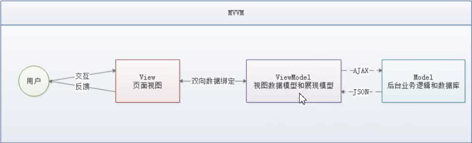
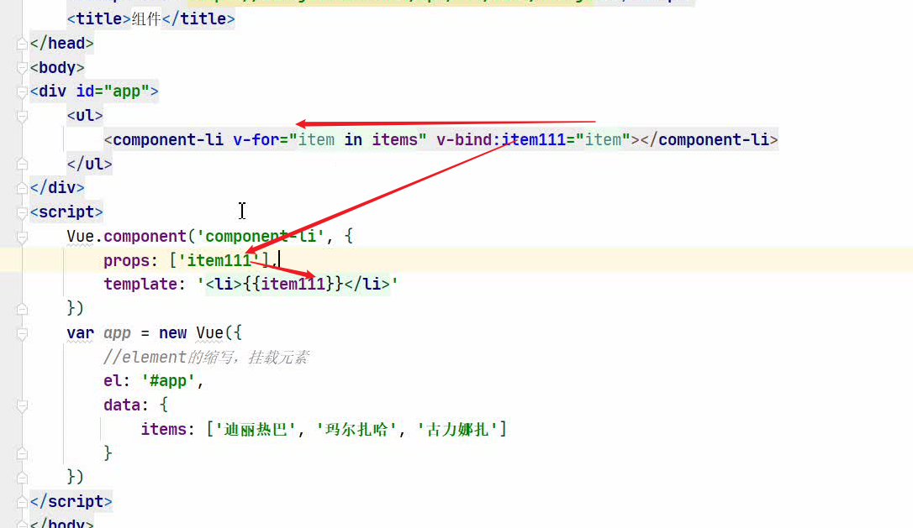

# VUE

## .1 前端知识体系

### 1.1 why

防止前端忽悠你

### 1.2 what

Axios框架（vue作者推荐）

vue-cli脚手架

vue-router页面跳转

vuex状态管理

WabPack打包

### 1.3 三要素

#### 1.3.1 html（结构层）

#### 1.3.2 css（表现层）

+ 预处理器
  + 给css添加了变量
  + 分类：
    + SASS
    + LESS

#### 1.3.3 js（行为层）

1、原生js，按照【ECMAScrpt】标准开发

ES5全浏览器支持

ES6常用，当前主流版本

2、TS【微软】es上增添新特性（类似工具类）

3、JS框架

+ jQuery 
  + 优
  + 缺
  + 目的
+ Angular
  + 特点
  + 缺
+ React
  + 特点
  + 缺点
+ Vue
  + 特点，计算属性，关注度分离原则（只负责页面交互）
+ Axios
  + 和后端交互，通信

4、UI框架

+ Ant-Design(圣诞节彩蛋事件)：
+ ElementUI“
+ Bootstrap：
+ AmazeUI：

5、js构建工具

+ Babel
+ WabPack

### 1.4 前后端分离发展历程

#### 1.4.1 后端为主的MVC时代

+ 优点
+ 缺点
+ 优化

#### 1.4.2 AJAX的SPA（单页面应用）时代

+ 优点
  + 调用后端的能力
+ 缺点
  + 前后端接口的约定
  + 前端开发的复杂度控制

#### 1.4.3 前端为主的额MV*时代

+ MVC
+ MVP
+ MVVM
+ 优点
+ 缺点
  + 代码不能复用。后端必须数据校验
  + 全异步，对SEO（搜索引擎）不利
  + 性能


#### 1.4.4 NodeJs全栈时代

+ 

### 1.5 前端MVVM模式

#### 1.5.1 what

+ 软件架构设计模式

+ 事件驱动编程方式

+ 核心

  + ViewModel层

+ 目前流行的MVVM框架

  + Vue.js
  + AngularJs

+ 观察者模式

+ 双向数据绑定

  

#### 1.5.2 why

+ 前后端真正分离
+ 低耦合
+ 可复用
+ 独立开发
+ 可单独测试

#### 1.5.3 组成



+ View

+ ViewModel
  + 状态和行为（Model只有状态）
  + 解耦View和Model层

+ Model

## .2  VUE概述

### 2.1 奥义

#### 2.1.1 what

+ 渐进式（逐步给特性）自底向上逐层应用
+ 只关注视图层
+ MVVM的实现者
  + DOM监听
  + Data绑定

#### 2.1.2 why

+ 轻量级
+ 移动优先，更适合移动端
+ 易上手
+ 吸收了长处
+ 开源，社区活跃度高

#### 2.1.3 两大核心要素

+ 数据驱动
+ 组件化

### 2.2 第一个Vue小项目

+ 新建简单js项目
+ 引入开发环境
+ 插件：浏览器：vue devtools 

### 2.3 Vue生命周期

### 2.4 渲染

条件渲染

+ v-if
  + v-else
  + v-else-if

列表渲染

+ v-for
+ id挂在元素

事件处理

+ v-on（对应onclick）
+ API中查看缩写@click=v-on:click
+ 方法必须定义在methods中

### 2.5 异步通信（Axios）

what

+ 实现AJAX异步通信

特点

+ 

why

+ 关注度分离原则

应用

```json

```

v-bind：省略后是:


2.6 表单数据绑定

+ v-model


## 3. 组件

what

+ 可重复使用的vue实例
+ 


## 4. 计算属性

what

计算动词，属性名词

将一个动词转化为一个名词。

将动态的行为转化为静态属性，与缓存类似

computed


5. 插槽与自定义

+ 通过插槽确定子组件摆放	的位置