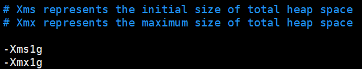

# Elasticsearch

基于Lucene的搜索服务器

## 1. 为什么用搜索引擎

分词，搜索效率高，高亮

### 1.1 vs solr

solr会产生io阻塞，前期不支持集群


es容易搭建集群

### 1.2 vs 关系型数据库


>  文档是json格式的

:bangbang: 核心：**倒排索引**

根据 value -> key


相关性得分高低筛选最优结果

## 2. 使用

### 2.1 Linux中安装

#### 2.1.1 压缩包->解压->启动

```bash
tar zxvf elasticsearch-7.6.2-linux-x86_64.tar.gz -C /usr/local/
cd /usr/local/elasticsearch-7.6.2/
bin/elasticsearch

./elasticsearch
#会报错，不允许用root用户启动
1.#报错信息：java.lang.RuntimeException: can not run elasticsearch as root
2.#es.7版本以上需要jdk11以上，其自带jdk

#解决
1.#创建用户组
groupadd es
#修改权限
chown -Rf es:es /usr/local/elasticsearch-7.6.2/
useradd es -g es
2.#在bin中的配置文件中添加自带的jdk11
vim bin/elasticsearch-env
JAVA_HOME="/usr/local/elasticsearch-7.6.2/jdk/"

#切用户
su es
#再次启动
bin/elasticsearch

#复制会话查看进程是否启动和相关信息
ps -ef|grep elastic
#查看信息
curl http://127.0.0.1:9200
#Elasticsearch的对外服务端口默认是9200，客户端访问是9300
#后台启动（暂时不设置）
bin/elasticsearch -d
```

#### 2.1.2 三个警告：

+ 最大文件描述扩容 65535

  + ```shell
    #注意在root用户下
    vi etc/security/limits.conf
    #最下面添加
    es soft nofile 65535
    es hard nofile 65535
    es soft nproc 4096
    es hard nproc 4096
    ```

+ 最大虚拟扩容 262144

  + ```bash
    vi etc/sysctl.conf
    vm.max_map_count = 262144
    
    #刷新
    sysctl -p
    ```

+ 配置

  + ```bash
    #集群发现配置，提供集群中符合主机要求的节点的列表
    discovery.seed_hosts: ["192.168.10.100"]
    #指定可以成为 master 的所有节点的 name 或者 ip，这些配置将会在第一次选举中进行计算
    cluster.initial_master_nodes: ["192.168.10.100"]
    ```

+ 修改权限

  + ```shell
    #因用root用户修改文件，故重新设置es用户
    chown -Rf es:es /usr/local/elasticsearch-7.6.2/
    ```

#### 2.1.3 实现远程启动

+ `elasticsearch.yml`中设置不仅本地可访问`network.host:0.0.0.0`
  ```shell
  vi config/elasticsearch.yml
  network.host: 0.0.0.0
  
  #再次启动，进行网页远程访问
  bin/elasticsearch
  ```


#### 2.1.4 处理版本警告：

`OpenJDK 64-Bit Server VM warning: Option UseConcMarkSweepGC was deprecated in version 9.0 and will likely be removed in a future release.`

+ ```shell
  #jvm9已经被标记落后
  cd config/
  vim jvm.options
  
  #将： -XX:+UseConcMarkSweepGC 改为： -XX:+UseG1GC
  ```

### 2.2 集群

> 集群时，需要重新安装es，因为之前的可能有些配置文件，所以需重装

**config中**

+ ```bash
  vi config/elasticsearch.yml
  
  #集群名字
  cluster.name: es # 集群名称，同一集群要一致
  
  #节点名字
  node.name: node-1 # 集群下各节点名称
  http.port: 9200 # 端口
  
  #开放跨域请求
  # 跨域请求配置(为了让类似head的第三方插件可以请求es)
  http.cors.enabled: true
  http.cors.allow-origin: "*"
  # 集群发现配置
  discovery.seed_hosts: ["192.168.10.100", "192.168.10.101", "192.168.10.102"]
  cluster.initial_master_nodes: ["node-1", "node-2", "node-3"]
  discovery.zen.ping_timeout: 60s
  ```

**安装总结**

+ ```shell
  #传包
  scp elasticsearch-7.6.2-linux-x86_64.tar.gz root@node01:/root/
  1. #tar解压到指定位置，-C是指定目录
  tar zxvf elasticsearch-7.6.2-linux-x86_64.tar.gz -C /usr/local/
  cd /usr/local/elasticsearch-7.6.2/
  
  2.#在bin中的配置文件中添加自带的jdk11
  vim bin/elasticsearch-env
  JAVA_HOME="/usr/local/elasticsearch-7.6.2/jdk/"
  
  3. #修改 三个警告+Jvm
  vi /etc/security/limits.conf
  es soft nofile 65535
  es hard nofile 65535
  es soft nproc 4096
  es hard nproc 4096
  
  vi /etc/sysctl.conf
  vm.max_map_count = 262144
  
  sysctl -p
  
  4. #修改config 
  vim config/elasticsearch.yml
  # 集群名称
  cluster.name: my-application
  # 1,2,3
  node.name: node-1
  network.host: 0.0.0.0
  http.port: 9200
  # 跨域请求配置(为了让类似head的第三方插件可以请求es)
  http.cors.enabled: true
  http.cors.allow-origin: "*"
  # 集群发现配置
  discovery.seed_hosts: ["192.168.10.100", "192.168.10.101", "192.168.10.102"]
  cluster.initial_master_nodes: ["node-1", "node-2", "node-3"]
  discovery.zen.ping_timeout: 60s
  
  5.#创建用户组
  groupadd es
  useradd es -g es
  #修改权限
  chown -Rf es:es /usr/local/elasticsearch-7.6.2/
  ```

查看集群是否成功

+ 访问: `http://192.168.10.100:9200/_cluster/health?pretty`
+ “status”: “red” 表示集群环境不ok， “status”: “green” 表示集群环境ok
+ 

### 2.3 插件

#### 2.3.1 head插件

```shell
#安装git
yum -y install git

#安装node
tar xvf node-v14.15.1-linux-x64.tar.xz -C /usr/local/
```


新建索引

+ 分片数：
+ 副本数：

> 分片

操作： 

+ 


#### 2.3.2 kibana(自带)

+ 安装

+ 修改配置文件`kibana.yml`

  ```shell
  #中文修改
  
  #服务端口
  
  ```

+ 索引模式：关联索引模式的话，索引中必须有数据，在head中创建的索引kibana是只读，不会操作。

+ Elasticsearch索引管理：可以管理操作索引

> ELK


#### 2.3.3 IK 中文分词插件

es是外国人写的，只对26个字母分词，那么国人写了分词插件。

添加映射，是否分词

> 分词（粗粒度、）决定了你是否能够搜索到结果
>
> + 比如你搜中，而分词分的中国，那么搜索不到结果


### 2.4 安装MySQL

数据源：

+ 自己插入
+ logstash 从任何数据库导入
  + 安装logstash0


服务器安装mysql：

+ 离线安装：自己配环境变量
+ 在线安装：不用自己配环境变量
  + `yum -y install `
  + `yum -y install mysql-community-server`


### 2.5 JavaAPI

#### 2.5.1 javaAPI

新建一个maven项目，简单快速项目

添加依赖

+ 

Java连接

两种连接方式

+ transort
  + 缺点：
    + 不支持restful风格
    + 二进制
    + 只支持Java
+ rest
  + 缺点：
    + s

high level REST Client 目前主流和稳定的，缺点是更新太频繁


#### 2.5.2 springBoot整合

建立项目

+ NoSQL中

配置依赖

+ `application.yml`中配置es

测试

+ 先准备一个实体类

+ 测试启动类中

+ 索引操作

  + 默认创建（实体类中`@Document`中的`createIndex=true`）

  + ```java
    
    ```

  + 

+ 通过repository操作数据

  + 自定义接口继承`ElasticsearchRepository`

  + ```java
    
    ```

  + 

+ 通过模板操作

  + ```java
    
    ```

  + :bangbang: 匹配查询

    ```java
    //匹配查询，默认查询到的结果>10条，只显示10条
    ```

  + 匹配删除

    ```java
    
    ```

  + 高级搜索

    ```java
    //分页，排序（根据定义好的属性，自定义），高亮（默认，自定义）
    //如果排序相同，那么用什么比较？
    
    
    ```

    


## 3. 问题

### 3.1 es启动内存问题

默认1G，虚拟机内存小可以调为最低的512M

`config`的`jvm.options`中

