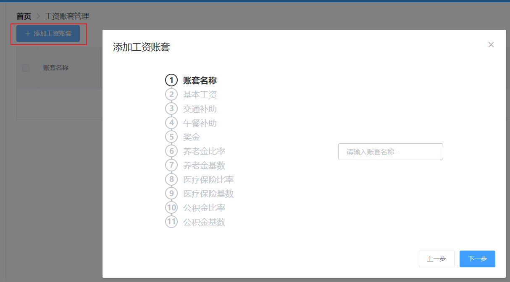
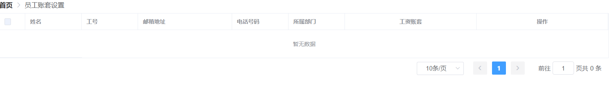
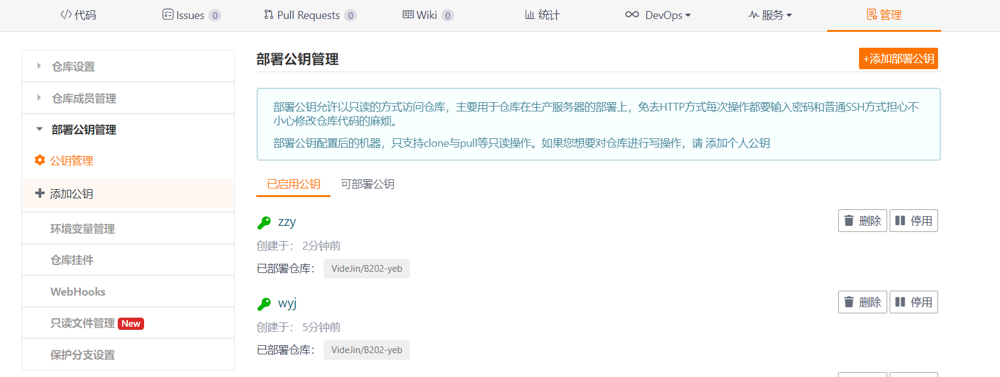
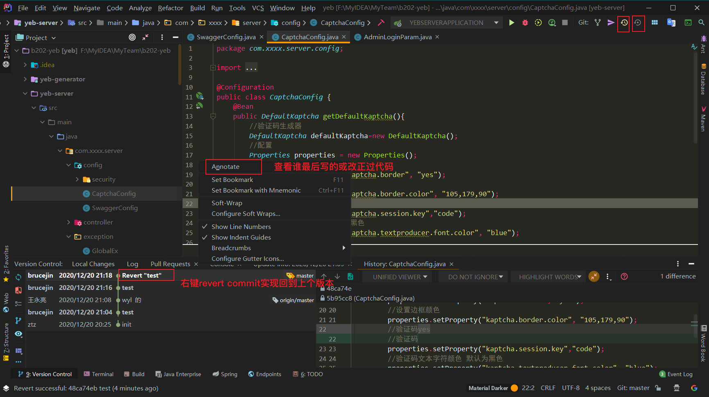

# YED项目

## 1、项目技术

mybatisplus

autogenerator,逆向工程（全套）

swagger2，接口文档，测试

kaptcha验证码

easyPOI,java操作office（easyexcel阿里，hutool）

## 2、环境搭建

node:14.15.1

nom:6.14.8

vue: 4.5.9

webpack:

`npm install -g @vue/cli`

## 3、模块

登录：菜单，权限

职位管理

职称管理

部门管理

操作员管理

员工管理

工资账套管理

个人中心

在线聊天

## 、问题

### 1.node和sass-loder需要更新

node-sass:https://github.com/sass/node-sass/tags

sass-loder:https://github.com/webpack-contrib/sass-loader/tags

### .2 json转化的时候忽略某些属性字段值

` @JsonIgnore  //可以直接放在field上面表示要忽略的filed`

`@JsonIgnoreProperties主键或者在字段上使用@JsonIgnore`

``

​	node rebuild

密码123

F12，network,xhr查看请求和返回参数

| 张泽宇 | 统计管理           |      |
| ------ | ------------------ | ---- |
| 赵同洲 | 系统管理           |      |
| 靳睿晨 | 薪资管理           |      |
| 王永亮 | 人事管理和员工资料 |      |

薪资管理

### .3 gitee添加认证

在git bash here 中

生成密钥：

`ssh-keygen -t rsa -C "xxxxx@xxxxx.com"`

查看公钥

`cat /c/Users/Lenovo/.ssh/id_rsa.pub`

添加到gitee

### .4 远程与本地不一致

:question: 原因：idea提交项目到码云出现被拒绝

`git pull origin master --allow-unrelated-histories`

### .5 Idea找不到或无法加载主类

路径问题

+ 包移动过。解决：重新导入idea
+ 导入中导入了其他人的.idea和.iml文件

### .6 idea中的git基本操作

### .7 验证码

aj-captche