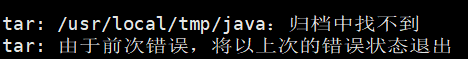
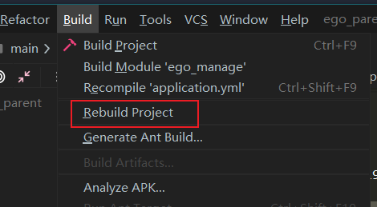
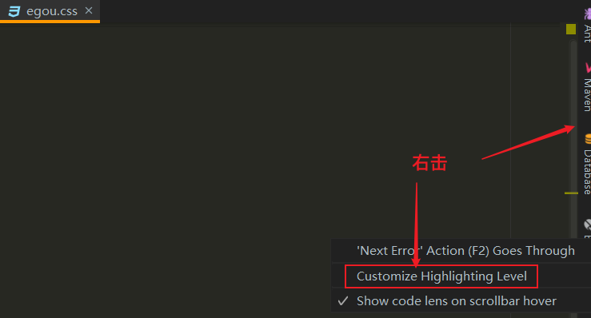
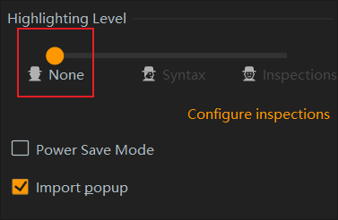
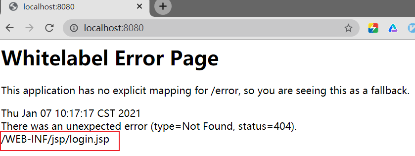
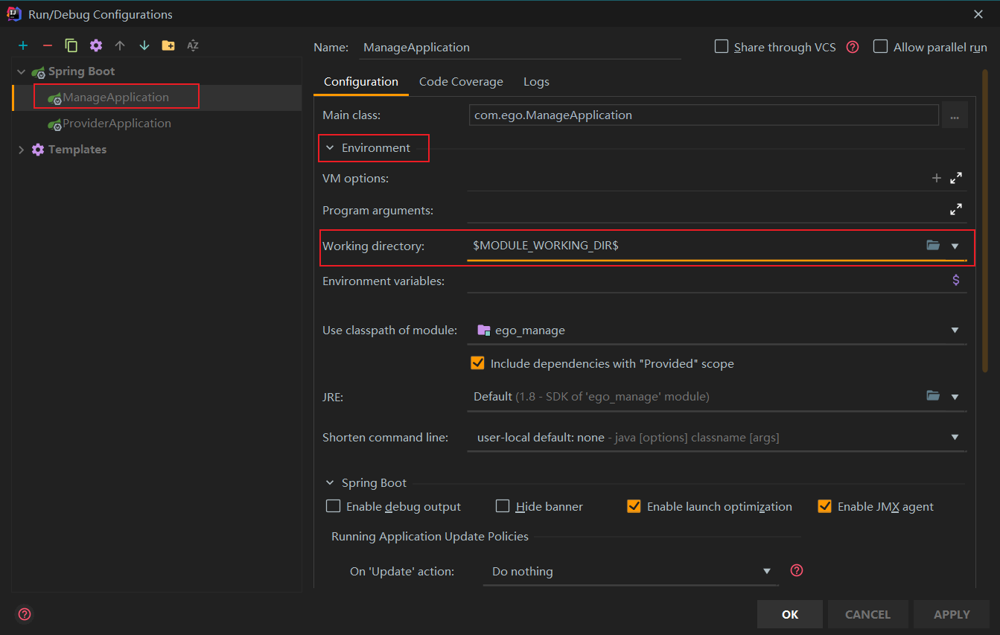

# shop

OAC破解技术

行为验证


## .问题

### 1.zookeeper未连接成功

**解决思路**

【1】虚拟机中

+ 是否启动 zookeeper 服务

  + ```bash
    1.#查看状态
    #zookeeper的bin中
    ./zkServer.sh status
    #正确结果：mode:standelone(单机)
    
    2.#查看进程
    pa aux|grep zookeeper
    #正确结果：有进程
    
    3.#启动
    ./zkServer.sh start
    #正确结果：STARTED
    ```

+ 必须copy `zoo-simple.cfg `为` zoo.cfg`，因为zookeeper默认启动`zoo.cfg`文件。

【2】代码中

+ 配置文件`application.yml`中 zookeeper 地址和端口是否写对

  + ```shell
    #查看ip
    ip addr
    ```

  + cmd中ping查看是否能访问

+ 启动类中是否写注解`@EnableDubbo`（apache的）

+ 关闭防火墙Linux和windows

【3】版本问题

+ ```xml
  <dubbo-version>2.7.5</dubbo-version>
  <!-- zookeeper版本是3.5.5,这里是客户端版本，不可过高，否则可能连接不上 -->
  <curator-version>4.2.0</curator-version>
  ```


### 2.idea启动类问题

一个项目中默认只能放6个启动类。

为了保证当项目多的时候，都能放得下，保存启动类，当启动类多了之后也不会覆盖之前得。

固定启动类：

edit中，save configuration对启动类进行保存。


### 3.配置数据源

**报错信息：**

`Failed to configure a DataSource: 'url' attribute is not specified and no em`

无法配置DataSource：未指定'url'属性，也无法配置嵌入数据源。

**解决：**

在启动类的注解`@SpringBootApplication`后加入

`(exclude= {DataSourceAutoConfiguration.class})`

### 4.配置文件加载问题

默认加载application.yml（必须有）

如果加载其他的需要写

```yml
spring:
	application:
		name:
	profiles:
		active: dev
```

### 5.tar归档中找不到

问题：

解决：

+ `tar -zxf jdk-8u221-linux-x64.tar.gz -C /usr/local/tmp/java/`

+ 加`-C`表示 参数 表示更换目录的意识 。

+ ```bash
  -C  --directory DIR
  	change to directory DIR
  ```

### 6.Linux配jdk

+ 解压jdk

+ 配环境变量

  + ```bash
    vim /etc/profile
    ------------------------------
    #找到export
    #注释掉
    #export PATH XXX
    export JAVA_HOME=/usr/local/jdk
    export PATH=$JAVA_HOME/bin:$PATH
    ------------------------------------
    #想让这个文件生效，必须source
    source /etc/profile
    #查看jdk版本
    java -version
    ```

### 7.Curator的版本兼容问题

Curator 存在版本兼容问题。

Curator 2.x.x-兼容两个zk 3.4.x 和zk 3.5.x，

Curator 3.x.x-兼容兼容zk 3.5。

### 8.项目重构

问题：有时候你觉得模块之间依赖在代码上写清楚了，但是还是会有某些原因导致找不到依赖

解决：build中rebuild project进行项目重构

+ 

### 9.前端css出现编译错误

+ 一般代码是没有问题的
+ 直接忽略
+ 方法：
  + 
  + 



### 10.模块下idea找不到jsp，jsp无法被编译

模块下的问题

+ 

解决

+ 在启动类中加入
  + 

### 11.单体项目开发与分布式项目开发

#### 11.1 单体

+ 添加jar包
+ 配置文件
+ 分层开发
  + pojo
  + mapper
  + service
  + controller

#### 11.2 基于dubbo的RPC分布式开发

+ jar和配置文件已经封装

+ 用逆向工程生成pojo和mapper

+ 写service

  + 第一步：api（注意包名冲突问题见12）

  + 第二步：provider

  + 第三步：manage（consumer）

    > 写前两步注意数据库访问，事务问题，不需要考虑页面
    >
    > 写第三步要考虑页面要什么

### 12.解决包名冲突

#### 12.1 api 中

+ 包起名时带有 dubbo，接口起名时带有 DubboService 防止和 Consumer 冲突

+ `src/main/java/com/ego/dubbo/service/ManagerDubboService.java`

#### 12.2 provider中

+ 对应`src/main/java/com/ego/dubbo/service/impl/ManagerDubboServiceImpl.java`

### 13.service的导入

+ 不同模块导入的不同

+ provider 中导入apache的
  + `import org.apache.dubbo.config.annotation.Service;`

+ manage（consumer）中导入spring 的
  + ``

### 14.mapper问题

统一注入

在mapper模块的每个mapper接口中没有写mapper注解的话，必须在provider方的启动类中写上扫描接口的注解

+ `@MapperScan("mapper接口包的位置")`