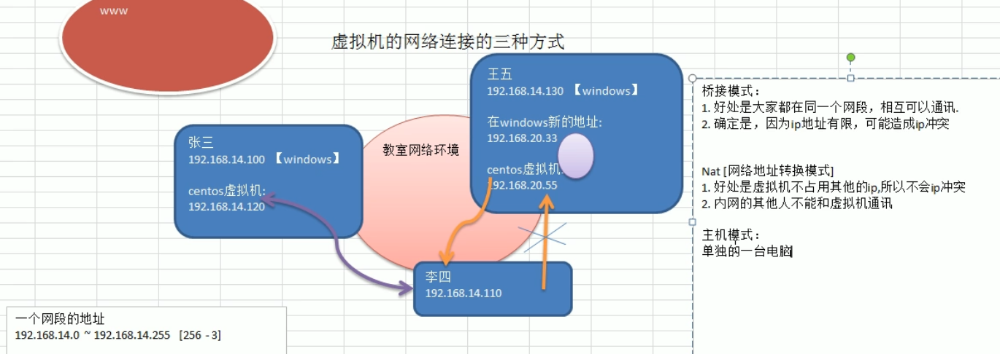
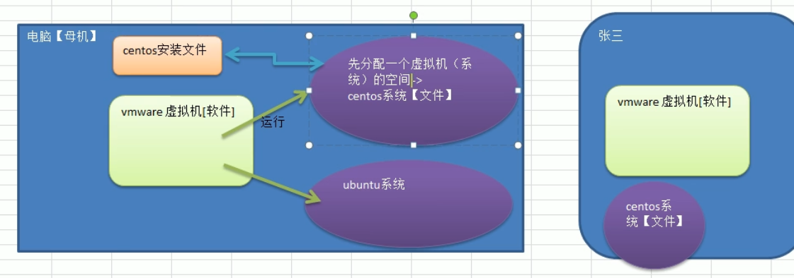

# 虚拟机相关

## 1.三种网络模式

### 1.1 桥接模式

**奥义：**

+ 与主机在同一网段。eg
  + 主机：192.168.10.100
  + 那么虚拟机：192.168.10.xxx 【xxx为0~255之间除0（被保留），1（网关地址），255（广播地址）和主机之外的随机值】

**优点：**

+ 大家都在同一网段，相互可以通讯

**缺点：**

+ 一个网段的地址是253个，如果同一网段都用桥接模式，会导致ip冲突。

### 1.2 NAT模式

奥义：

+ 网络地址转换模式
+ 主机先生成一个地址，然后虚拟机与这个地址同一网段。通过主机生成的这个地址与外网联系。eg
  + 主机：192.168.14.130
  + 新地址：192.168.20.33
  + 虚拟机：192.168.20.xxx
+ 虚拟机可通过主机地址访问其同网段内网中的其他地址，但是不能反过来访问它（反向代理，内网其他人不能访问虚拟机）。
+ 其上网也是通过主机的地址访问外网。

优点：

+ 虚拟机不占用其他的ip，所以不会ip冲突

缺点：

+ 内网的其他人不能和虚拟机通讯，外面找不到里面

### 1.3 仅主机模式

奥义：

+ 单独的一台电脑

## 2.虚拟机与主机

