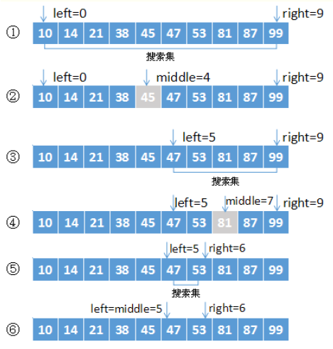

## 01 Java 基础 |  004 数组

#### 1. what

+ 奥义： 相同数据类型的有序结合。
+ 引用类型
+ 一个数组中，数组元素的类型是唯一的，只能存储一种数据类型的数据。
+ 连续且有序

#### 2. why

+ 数组可以有序的存储数据，并且并通过下标的方式访问数据，对数据的处理方便快捷多态。

#### 3. how

##### 3.1 声明构建

###### 3.1.1 声明

> 一维数组的声明方式有两种

```java
type[] arr_name;//推荐使用这种方式
type arr_name;
```

> 注意：
>
> + `int a[5];`非法（声明数组不能指定其长度（数组中元素个数））
> + 原因是声明数组时并没有实例化对象，只有实例化数组对象时，jvm才分配空间，这时才与长度有关。
> + 声明数组并没有数组被真正的创建。

###### 3.1.2 构建

```java
//方式一
type[] 变量名 = new type[数组中元素个数];
int[] a = new int[10];
//方式二
type 变量名[] = new type[]{元素列表};
int[] a = new int[]{1,2,3};
//可简写为（[]中不能再指定长度）
int[] a = {1,2,3};
```

###### 3.1.3 内存结构

+ 基本数据类型数组

+ ```java
  public class DemoArray01 {
      public static void main(String[] args) {
         /* int[] s = null;
          s = new int[10];*/
          int[] s = new int[10];
          for (int i = 0; i < 10; i++){
              s[i] = 2 * i + 1;
              System.out.println(s[i]);
          }
      }
  }
  ```

+ 引用数据类型数组

+ ```java
  public class DemoArray02 {
      public static void main(String[] args) {
          /*Man[] mans;
          mans = new Man[10];*/
          Man[] mans = new Man[10];
  
          Man m1 = new Man(1,11);
          Man m2 = new Man(2,22);
  
          mans[0] = m1;
          mans[1] = m2;
  
          System.out.println(mans[0]);
          System.out.println(mans[1]);
      }
  }
  
  class Man{
      private int age;
      private int id;
      public Man(int id, int age){
          super();
          this.age = age;
          this.id = id;
  
      }
  
      @Override
      public String toString() {
          return "Man{" +
                  "age=" + age +
                  ", id=" + id +
                  '}';
      }
  }
  ```

  

##### 3.2 初始化

###### 3.2.1 静态初始化

直接分配空间和赋值

```java
//基础数据类型
int[] a = {1,2,3};
//引用数据类型
Man[] mans = {
  new Man(1,1),new Man(2,2)  
};
```


###### 3.2.2 动态初始化

分配空间再分开赋值

```java 
int [] a = new int[2];
a[0] = 1;
a[1] = 2;
```

###### 3.3.3 数组的默认初始化

数组是引用类型，元素---->类的实例变量。（分配空间，元素隐式初始化）

```java
int a[] = new int[2];//0,0
boolean [] b = new boolean[2];//false,false
//每个数据类型的隐式初始化值就是数组的默认初始化
```


##### 3.3 长度和界限

###### 3.3.1 长度length

+ 数组长度一旦确定，不能改变

+ length属性是Public final int，常量，只读。

###### 3.3.2 界限

+ [0, length-1]为合法区间

##### 3.4 数据处理和基本操作

###### 3.4.1 初始化

+ 取值`类型 变量名 = 数组名[下标];`
+ 存值|取值`数组名[下标] = 数据;`

###### 3.4.2 遍历（for）

```java
//数组连续有序
for (int 索引=0; 索引 < 长度; 索引++){
    数组名[索引]; //操作
}

int[] arr = {1,2,3,4,5};
for(int i = 0; i < arr.length; i++){
    System.out.println(arr[i]);
}
```

+ 索引空间在数组合法空间0~length-1
+ 每次索引后移一位

###### 3.4.3 增强 for

+ 可对数组和集合进行遍历

  ``` java
  for (元素类型 局部变量 : 数组对象){
      局部变量
  }
  //例子
  int[] arr = {1,2,3,4,5};
  for(int a : arr){
      System.out.println(a);
  }
  ```

###### 3.4.4 比较

+ 重写equals()方法，否则调用的是object中的方法（比较值）

+ 工具类：`java.util.Arrays`类，其中`equals([][])`方法来比较两个数组内容是否相同

  ```java
  public static void main(String[] args){
      int[] a = {1,2,3};
      int[] b = {1,2,3};
      System.out.println(Arrays.equals(a,b));
  }
  ```

###### 3.4.5 打印

+ 直接打印调用的是object的方法，打印出来是数组的地址

+ 调用`Arrays`工具类中的`toString()`方法

  ```java
  int[] a = {1,2};
  System.out.println(a); //[I@35ce36
  System.out.println(Array.toString(a));//[1,2]
  ```

###### 3.4.6 拷贝

1. `Arrays`工具类：

   1. `public static Object[] copyOf(Object[] original, int newLength)`---->拷贝原数组中指定长度的元素到一个新的数组并返回。
   2. `public static Object[] copyOfRange(Object[] original, int from, int to)`可指定起始位置和截至位置。

2. `System`类：`static void arraycopy(object src, int srcpos, object dest, int destpos. int length)`
1. 将 src 数组e里的元素值赋给 dest 数组的元素
   
2. srcopos：从 src 数组的第几个元素开始赋值
   
3. length：指定多少元素

  ```java
String[] s = {"Mircosoft","IBM","Sun","Oracle","Apple"};
Sting[] sBak = new Stings[6];
Sting.arryacope (s, 0, sbak, 0, s.length)
  ```


###### 3.4.7 查找

1、顺序查找

```java
public class ArrayDemo01 {
    public static void main(String[] args) {
        int[] arr = {23, 6, 3, 10, 85};
        int aim = 10;
        int i = -1;
        for (i = 0; i < arr.length; i++){
            if (aim == arr[i]){
                break;
            }
        }
        System.out.println(i); //3,数组下标从0开始，第三个是10
    }
}
```


2、二分查找

+ 奥义：对半查找（Binary Search）

+ 特点：效率高

+ 要求

  + 线性表顺序存储结构
  + 元素按关键字有序排列

+ 实质：

  + 不断将有序数据集对半分割，并检查每个分区的中间元素

  

```java
public class BinarySearchDemo {
    public static void main(String[] args) {
        BinarySearchDemo array = new BinarySearchDemo();//创建类的对象，以便于调用这个类的方法
        int[] arr = {2,3,4,5,6,13,14,16,21,28}; //创建要进行查找的数组，必须有序
        int binarySearch = array.binarySearch(arr, 21);//创建一个对象接收通过binarySearch方法查找到的数据在数组中的下标
        System.out.println(binarySearch);//输出下标
        //System.out.println(array.binarySearch(arr, 21)); //简化
    }

    public static int binarySearch(int[] array, int targetElement){
        int leftIndex = 0; //左边位置
        int rightIndex = array.length - 1; //右边位置
        int middleIndex = (leftIndex + rightIndex) / 2; //中间位置

        //如果左边的位置还是小于右边的位置，则还没找完
        while (leftIndex <= rightIndex){
            //获取中间位置的元素值
            int middleElement = array[middleIndex];
            //判断元素应该在左边还是右边还是刚好找到
            if(targetElement < middleElement){
                //如果目标在左边，则移动右边的标记
                rightIndex = middleIndex - 1;
            }else if(targetElement > middleElement){
                //如果目标在右边，则移动左边的标记
                leftIndex = middleIndex + 1;
            }else{
                return middleIndex;
            }

            //一个新的中间位置
            middleIndex = (leftIndex + rightIndex) / 2;//Q:有什么意义？
        }

        return -1;//Q：为什么返回0，1，-1结果都一样？
    }
}
```

###### 3.4.8 排序

1、冒泡排序

+ 从下标（位置）0开始，当前位置数据和后面数据进行比较

+ 若前大，则数据交换，标记位置向后移动一位，重复直到最后一个

+ 重复前面步骤

  ```java 
  public class BobbleSortDemo01 {
      public static void main(String[] args) {
          int[] arr1 = {1,5,7,9,16,2,4};
          System.out.println(Arrays.toString(arr1));//查看数组arr1中数据
          /*
          * 冒泡排序
          *   1、每一趟找到最大的
          *   2、总共比较次数为 arr.length-1 次
          *   3、第一次的比较次数为 arr.length - 1 次，依次递减
          * */
          //定义标记
          int temp;
          for (int i = 0; i < arr1.length-1; i++){
              for (int j = 0; j < arr1.length-1; j++){
                  if (arr1[j] > arr1[j + 1]) {
                      //交换位置
                      temp = arr1[j];
                      arr1[j] = arr1[j + 1];
                      arr1[j + 1] = temp;
                  }
              }
          }
     System.out.println(Arrays.toString(arr1));//输出排序后的数组arr1
      }
  }
  ```

2、选择排序

+ 随便假定一个数为最小（大）元素，存放在数组排序序列起始位置。

+ 从剩余未排序元素中找最小（大）元素，放到已排序序列末尾

+ 重复执行，直到所有元素排序结束

  ```java
  public class SelectionSortDemo01 {
      public static void main(String[] args) {
          int[] arr = {1,23,5,8,11,78,45};
          System.out.println(Arrays.toString(arr));
          int temp;
          for(int i = 0; i < arr.length; i++){
              for(int j = i + 1; j < arr.length; j++){
                  if (arr[i] > arr[j]){
                      temp = arr[i];
                      arr[i] = arr[j];
                      arr[j] = temp;
                  }
              }
          }
          System.out.println(Arrays.toString(arr));
      }
  }
  ```

  

##### 3.5 多维数组

```java
int[][] arr = new int[3][]; //必须给定高维
int[][] arr1 = new int [2][3];
int[][] arr2 = {{},{},{}};
//多为数组加[],一般使用一维数组。
```


