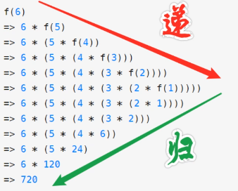
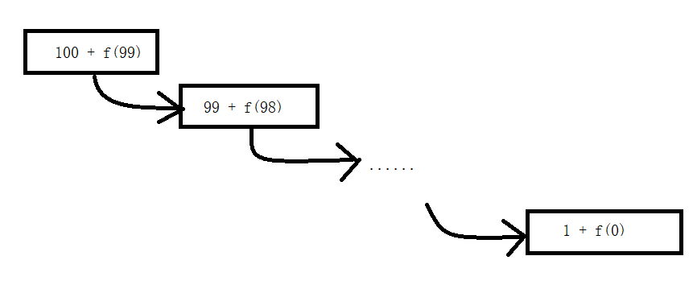

##  01 Java 基础 |  005 方法

### 1. 方法

##### 1.1 what

> 引言
>
> 代码块：块（复合语句），{}包含的java语句。决定局部变量的作用域

+ 带名字，能解决特定问题的代码块

##### 1.2 why

+ 可重复使用
+ main方法过于臃肿
+ 方便自上而下分解问题
+ 方便维护

##### 1.3 how

###### 1.3.1 定义

+ 在类中定义，不能嵌套定义（类可以）

+ 格式

  + ```java
    [修饰符] 返回值类型 方法名([形参列表]){
    	方法体;//解决特定问题的步骤
    }
    
    static 返回值类型 方法名(){
        方法体;
    }
    ```

###### 1.3.2 调用

```java
方法名([实参列表]);
```

+ void无返回值则不能使用变量接收
+ 有返回值则可以`[接收变量=]方法名([实参列表])`

###### 1.3.3 分类

+ 无参无返回值
+ 无参带返回值
+ 带参无返回值
+ 带参带返回值

> Q：四种分类的意义？

###### 1.3.4 思考

编写方法时思考：

+ 方法功能
+ 方法名称
+ 是否可独立运行，不能需要外界数据参与运算则确定形参
+ 运行完成是否影响调用处的后续操作，影响则确定返回类型，不影响则void

### 2. 参数

##### 2.1 what

+ 形参

  + 定义方法时，用来占位，无具体数据

+ 实参

  + 方法调用时，给定数据给对应的形参，这个数据

  > 实参和形参的类型必须兼容

### 3. 返回值

##### 3.1 what

+ 根据需求，存在返回值则规定好具体类型，不存在则用void关键字指定
+ 有具体的返回值类型，方法体有带值的return语句
+ 无返回值，可无return，需要return，其后不能带任何数据

##### 3.2 return

+ 作用：

  + 有返回值，结束方法和送出结果
  + 无返回值，结束方法

+ 一个方法最多只能执行一条return语句

  > 注:
  >
  > + 一个作用域return后不能有代码
  > + 不可达语句：
  >   + 在一定被执行的return语句后
  >   + 循环中无条件的break后写的语句
  >   + 死循环后的语句

##### 3.3 方法结束

+ 结束方法的`}`
+ `return`

### 4. 方法签名

##### 4.1 what

+ 方法的签名，确保在一个**类**中**唯一性**。（同一个作用域中变量名唯一）
+ 方法名、形参（类型、个数、顺序）
+ 与修饰符，返回类型，形参名无关

##### 4.2 why

+ 在类中，方法的调用就是通过方法签名确定方法

### 5. 重载

##### 5.1 what

在一个类中当方法完成的功能类似时，使用相同的名称，并保证方法的参有不同，参数个数、类型、顺序有一个不同即可。保证方法签名唯一性。

##### 5.2 why

方便使用者调用，省去想方法名称的时间。

##### 5.3 how

+ 需满足：
  + 同一个类
  + 方法名必须相同
  + 参数列表(个数、类型、顺序)不同
+ 注意
  + 方法重载与返回值无关

### 6. 递归（一般不用）

##### 6.1 what

+ 自己调用自己



##### 6.2 why

+ 把问题逐渐简单化

##### 6.3 how

+ 结构：
  + 定义递归头（临界值）
  + 递归体

##### 6.4 与循环关系

+ 所有递归都能写成循环
+ 循环效率高
+ 只有在循环写出来能把人看晕的时候用递归，让代码易懂

##### 6.5 与死循环区别

+ 死循环导致CPU占用率100%
+ 递归引起内存泄漏（占着凳子不坐）最终导致内存溢出（凳子不够用）

> 注意：
>
> + 只递不归会导致程序崩溃（栈溢出）
> + 在适当的时候终止（条件语句）

```java
public class MethodDemo01 {
    public static void main(String[] args) {
        MethodDemo01 m = new MethodDemo01(); //创建类的对象以运行类中方法
        System.out.println(m.f(100));//计算从1加到100的结果
    }
    public int f(int x){//递归函数
        if(x > 0){
            return x + f(x - 1);//调用自己
        }else{
            return 0;
        }
    }
}
```

