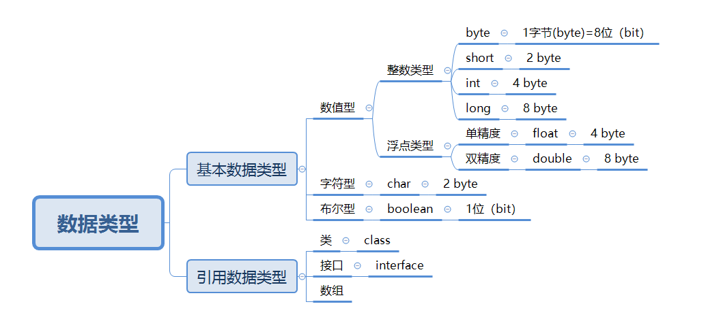

## 01 Java基础 | 002 Java 语法

#### 1. 变量

##### 1.1 What

+ 基本存储单元。
+ 就像停车场的停车位，停车场是内存空间，而变量就是停车位，数据就是车，车是不固定的。

##### 1.2 Why

+ Java是强类型语言（Strongly Typed），有两个含义：
  + 所有的变量在使用之前必须先声明，后使用。
  + 指定类型的变量只能接受类型与匹配的值。

+ 这意味着限制和约束，每个变量和表达式在编译时都有确定的类型。
  + 变量---->被赋的值
  + 表达式---->产生的值
  + 确定了在这些值上的一系列操作及含义。

##### 1.3 How

###### 1.3.1 声明

+ 声明语法

  + 数据类型 变量名 [ = 初始值 ];

+ 例子:

  ```java
  int a, b, c; //声明了三个int类型的变量：a,b,c
  byte d; //声明了一个byte型的变量
  ```

+ 注意

  + 数据类型和变量名之间用 Space（空格）隔开
  + 每一条Java语句都要以“;”（英文分号）结尾
  + 一个语句中连续声明多个变量时，变量名之间“,”（英文逗号）隔开
  + 同一作用域下变量名不允许重复（身份证号不能重复）
  + 命名规范

> 作用域---->
>
> + 由类和方法（代码块）定义，伴随生命周期
> + 变量的可见性和声明周期
> + 规则为封装
> + 方法作用域：
>   + 从方法开花括号“{”开始
>   + 可嵌套
>   + 变量生命周期被限制在作用域之内：数据（车）进入作用域创建变量（停车场），离开其作用域时销毁变量。

###### 1.3.2 初始化

+ 初始化即赋初值

+ ```java 
  public class DemoVariate01 {
      /*
      main方法，程序执行的入口，固定格式
      */
      public static void main(String[] args){
          int a = 10; //声明并初始化int类型变量a
          int b = 8;
          int sum = a + b;//声明sum,并把a+b的值赋给sum
          System.out.println(a + "+" + b + "=" + sum); //打印输出 a+b=sum 结果是10+8=18
      }
  }
  ```


######  1.3.3 使用

+ 使用前必须

  + 声明（定义变量类型）
  + 初始化（赋初值）

+ ```java
  public class DemoVariate01 {
      /*
      main方法，程序执行的入口，固定格式
      */
      public static void main(String[] args){
          int a = 10; //声明并初始化int类型变量a
          int b;
          int sum = a + b; //声明sum,并把a+b的值赋给sum
          System.out.println(a + "+" + b + "=" + sum); //打印输出 a+b=sum 结果出错,因为b没有初始化
      }
  }
  ```

#### 2. 标识符&关键字

##### 2.1 分隔符

  + 分号";"
      + 分隔语句
  + 花括号"{}"
      + 定义一个代码块
  + 方括号"[]"
      + 访问数组元素
  + 圆括号"()"
      + 定义方法时---->形参声明
      + 调用方法时---->传入实参
      + 表达式中---->优先计算
      + 类型转换中---->强制类型转换运算符
+ 空格（space）
  + 分割一条语句的不同部分
+ 圆点（英文句号）
  + 类/对象及其成员（成员变量、方法、内部类）之间的分隔符，表明**调用**某个类或某个实例的指定成员。

##### 2.2 命名规范

> 给变量、类、方法以及包进行命名

+ 开头: 

  + 字母 
  + 下划线\_ 
  + 美元符号$

+ 其他不部分:

  +  字母 
  +  下划线\_ 
  +  美元符号$ 
  +  数字 （不能作为开头）的任意组合

+ Java标识符大小写敏感、长度无限制

+ 不可以是Java的关键字

+ > Java采用Unicode标准国际字符集(2个字节表示一个符号,2¹⁶=65536,中文一万多,英文26个字母,其他语言等等都可包含),而不是ASCII字符集(1个字节,1个字节2⁸=256)。故字母不仅仅包含英文,还包含汉字等等。但是不建议使用汉字。

##### 2.3 关键字

| abstract   | assert  | boolean   | break     | byte       | case         |
| :--------- | :------ | :-------- | :-------- | :--------- | :----------- |
| catch      | char    | class     | const     | continue   | default      |
| do         | double  | else      | extends   | final      | finally      |
| float      | for     | goto      | if        | implements | import       |
| imstanceof | int     | interface | long      | native     | new          |
| null       | package | private   | protected | public     | return       |
| short      | static  | strictfp  | super     | switch     | synchronized |
| this       | throw   | throws    | transient | try        | void         |
| volatile   | while   |           |           |            |              |

>关键词不需要背，实战中自然熟悉  

##### 2.4 使用规范

+ 驼峰规则
+ 类：每个单词首字母大写，如Man
+ 方法或变量：第一个单词小写，从第二个字母开始首字母大写，如eat()，eatFood()  

#### 3. 数据类型



##### 3.1 基本数据类型

###### 3.1.1 数值型之整型

| 类型  |    宽度（占用存储空间）     |                      范围                      | 默认值    |
| :---: | :-------------------------: | :--------------------------------------------: | --------- |
| byte  | 1 字节 = 8 bit = 8 位二进制 |                    -128~127                    | （byte）0 |
| short |       2 byte = 16 bit       |        -2^15 ~ 2^15-1 （-32768~32767）         | (short)0  |
|  int  |       4 byte = 32 bit       | -2^31 ~ 2^31-1 (-2147483648~2147483647) 约21亿 | 0         |
| long  |       8 byte = 64 bit       |                 -2^63 ~ 2^63-1                 | 0L        |

+ Java整型常数三种表示形式

  + 十进制：99，-99，0
  + 八进制（以0开头）：015
  + 十六进制（以0x或0X开头）：0x15

+ 整型常数默认int型，声明long常量时后加"l"或"L"，建议用大写L

  + ```java
    long a = 5555; //不出错，在int范围内
    long b = 55555555555; //出错，超出int范围
    long c = 55555555555L; //不出错
    ```

###### 3.1.2 数值型之浮点型

|  类型  | 占用存储空间 |         范围         | 默认值 |
| :----: | :----------: | :------------------: | ------ |
| float  |    4 byte    |  -3.403E38~3.403E38  | 0.0f   |
| double |    8 byte    | -1.798E308~1.798E308 | 0.0d   |

```java
public class DemoFloat {
    public static void main(String[] args) {
        double f1 = 314e2; //31400.0
        double f2 = 314e-2; //3.14
        float f = 0.1F; //0.1 浮点数默认是double型，给float赋值，需要在数后加“f”或“F”，一般是“f”
        double d = 1.0 / 10; //0.1
        System.out.println(f1 +"\n"+ f2 +"\n"+ f +"\n"+ d);
        float d1 = 423432423f;
        float d2 = d1 + 1;
        if (d1 == d2){ //判断d1 和d2 是否相等
            System.out.println("d1 == d2");
        }else{
            System.out.println("d1 != d2");
        }//输出是相等，所以浮点数1.不适合进行比较 2.不适合金融计算类精确的领域，存在舍入误差。大值计算用Java.math类下的BigInteger和BigDecimal，可处理任意长度的数值。
    }
}
```


###### 3.1.3 字符型（char，默认值'\u0000'(null)）

+ 单引号用来表示字符常量。

  + 'A'表示一个**字符**
  + "A"表示含有一个字符的**字符串**

+ char类型用来表示Unicode编码表中的字符（Unicode占2 byte，65536字符；ASCII占1 byte，128字符）。

+ ```java
  char c1 = 97; //输出为a，因为其被赋值为整数97，该数值对应ASCII中的字母'a'
  char c2 = 'a';
  ```

  >在Java中，char被当作整数类型，但因其主要用途是**表示Unicode字符**，故一般单独阐述。

###### 3.1.4 布尔型（boolean，默认值false）

+ 表示逻辑值（true 或 false）

+ 所有关系运算（如a > b）返回boolean类型的值

+ if 和 for 这类控制语句的条件表达式需要boolean类型。

+ ```java
  public class DemoBoolean {
      public static void main(String[] args) {
          boolean b = false; //声明和初始化boolean类型变量b
          System.out.println(b); //输出b的值 false
          b = true; //把true赋值给b
          System.out.println(b); //输出此时变量b的值 true
          if(b) System.out.println("是true"); //如果b是true则输出"是true"
          b = false; //把false赋值给b
          if(b) System.out.println("是true"); //如果b是true则输出"是true"
          System.out.println(10 > 9); //否则输出10>9的结果true
      }
  }
  ```

##### 3.2 引用数据类型

+ 引用类型指向一个对象，不是原始值，指向对象的变量是引用变量。
+ 引用类型常见的有：String、StringBuffer、ArrayList、HashSet、HashMap等。
+ 暂时了解

##### 3.3 基础数据类型和引用数据类型对比

|   对比   |                基本数据类型                |                         引用数据类型                         |
| :------: | :----------------------------------------: | :----------------------------------------------------------: |
| 分配地址 |               在栈中进行分配               |             在堆中进行分配，堆的读写速度远不及栈             |
|   指向   |            变量名指向具体的数值            |      变量名指向存数据对象的内存地址，即变量名指向hash值      |
| 分配空间 | 变量在声明之后Java就会立刻分配给它内存空间 | 它以特殊的方式（类似C语言的指针）指向对象实体（具体的值），这类变量声明时不会分配空间，只是存储了一个内存地址 |
|   赋值   |      基本类型之间的赋值是创建新的拷贝      |             对象之间的赋值只是传递引用（值传递）             |
|   比较   |            "=="和"!="是在比较值            | "=="和"!="是在比较两个引用是否相同，需要自己实现equals()方法 |
|   销毁   |         基本类型变量创建和销毁很快         |                     类对象需要JVM去销毁                      |


#### 4. 数据类型转换

##### 4.1 隐式类型转换

+ 奥义：从低级类型向高级类型转换，系统自动执行。

+ 按精度从低到高：byte < short < int  < long < float < double。

+ ```java
  int x = 10;
  float y = x; //输出结果为10.0
  ```

+ 转换层级规则

  |           操作数1数据类型           | 操作数2数据类型 | 转换后数据类型 |
  | :---------------------------------: | :-------------: | :------------: |
  |          byte、short、char          |       int       |      int       |
  |       byte、short、char、int        |      long       |      long      |
  |    byte、short、char、int、long     |      float      |     float      |
  | byte、short、char、int、long、float |     double      |     double     |

+ 例子

  ```java
  public class DemoChange {
      public static void main(String[] args) {
  
      byte myByte = 10;
      int myInt = 8;
      float myFloat = 8.4f;
      double myDouble = 10.101;
      char myChar = 97;
  
          System.out.println("byte类型与float类型运算：" + (myByte + myFloat)); //18.4
          System.out.println("byte类型与int类型运算：" + (myByte + myInt)); //18
          System.out.println("byte类型与char类型运算：" + (myByte + myChar)); //107
          System.out.println("char：" + myChar);//a，与字符串拼接会变成字符，运算会编程对应ASCII码
          System.out.println("int类型与char类型运算：" + (myInt + myChar));//105
          System.out.println("double类型与char类型运算：" + (myDouble + myChar));//107.101
  
      }
  
  ```

  

##### 4.2 显式类型转换

+ 语法

  + （类型名）要转换的值

+ 例子

  ```java
  int a = (int)45.23; //此时a的值为45
  long b = (long)456.6f; //此时b的值为456
  int c = (int)'a'; //此时c的值为97
  ```

#### 5. 注释

>注释不会被执行，Java中有三种类型注释

1. 单行注释
   + " // "开头，之后内容
2. 多行注释
   + 以" /\* " 开头，以" \*/ "结尾
   + 不可嵌套（无意义）
   + 可做行内注释
3. 文档注释
   + 以" /\*\* "开头，以" \*/ "结尾
   + 可生成项目的API  

案例：

```java
/**
	*这里是文档注释
	*/
	public class Welcome{
		public static void main/*这里是行内注释*/(String[] args){
		
			//下面是打印语句。输出双引号中的内容
			System.out.println("我是Brucejin！");
			System.out.println("你好！");
			/*
			前进！
			无所畏惧
			*/
			System.out.println("加油！");
		}
	}
```


