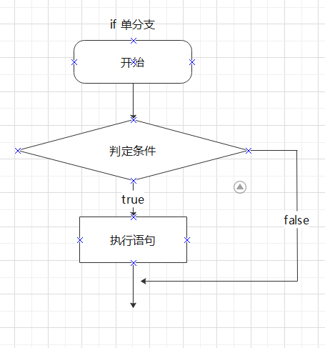
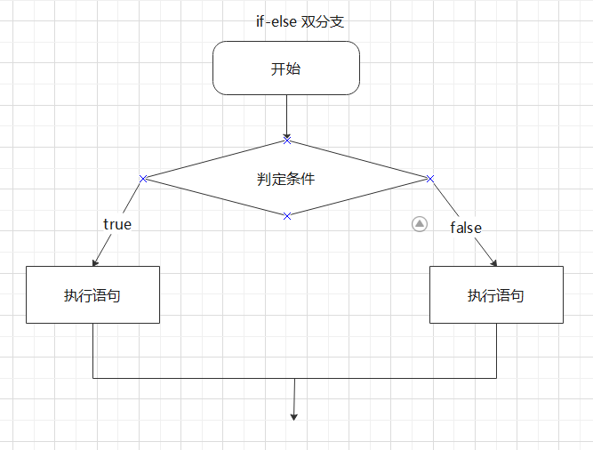
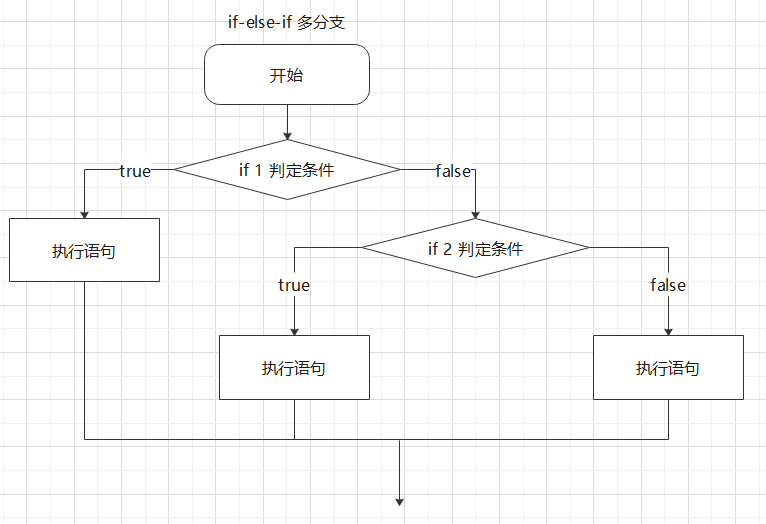
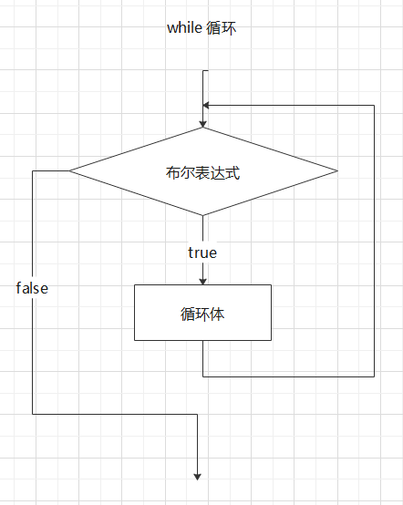
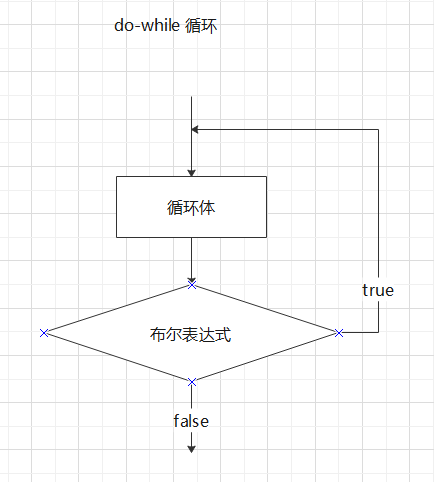
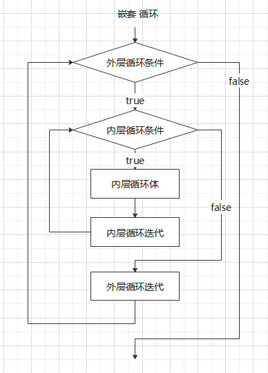
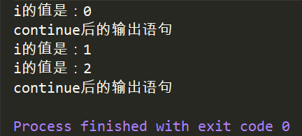
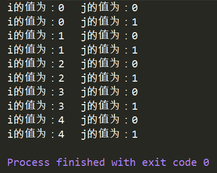
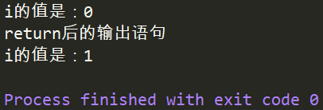

## 01 Java基础 | 003 Java 控制语句


#### 1. 顺序结构

+ 一句一句顺序执行
+ 

#### 2. 选择结构

##### 2.1 if 选择

###### 2.1.1 if 单分支

```java 
if(条件){
    true执行;
}    
```



```java
public class DemoIf {
    public static void main(String[] args) {
        int age = (int)(Math.random() * 100); //随机生成[0,100)的数字赋值给变量age
        if (age < 18){
            System.out.println("是个小屁孩");
        }
        if (age >=18){
            System.out.println("成年人啦");
        }
    }
}
```


###### 2.1.2 if-else-if 双分支

```java
if(条件){
    true
}else{
    false
}
```



```java
public class DemoIf {
    public static void main(String[] args) {
        int age = (int)(Math.random() * 100); //随机生成[0,100)的数字赋值给变量age
        if (age < 18){
            System.out.println("是个小屁孩");
        }else if(age >= 18){
            System.out.println("成年人啦");
        }
    }
}
```


###### 2.1.3 if-else-if 多分支

```java 
if(条件1){
    条件1 true
}else if(条件2){
    条件1 false 且 条件2 true
}...
    else{
        前边所有 false
    }
```



```java
public class DemoIf {
    public static void main(String[] args) {
        int age = (int)(Math.random() * 100); //随机生成[0,100)的数字赋值给变量age
        if (age < 15){
            System.out.println("小屁孩,好好玩");
        }else if(age < 25){
            System.out.println("青年人,好好学习");
        }else if(age < 45){
            System.out.println("中年人,好好工作");
        }else if(age < 65){
            System.out.println("中老年，补补钙");
        }else if(age < 85){
            System.out.println("老年人，多运动");
        }else{
            System.out.println("老寿星，古来稀！");
        }
    }
}
```

###### 2.1.4 嵌套 if-else 条件语句

```java
if(条件a){
    if(条件b){
        语句块
    }else{
        语句块
    }
}else{
    语句块
}
```


##### 2.2 switch-case选择

```java
switch(表达式){
    case 值1://注意是:不是;
        语句序列;
    	[break];
    case 值2:
        语句序列;
        [break];
    ...
    [default:
    	默认语句;]
}
```


#### 3. 循环结构

+ 循环语句包含4部分
  + 初始化语句
  + 循环条件
  + 循环体
  + 迭代语句

##### 3.1 while 循环

```java 
while(条件){
    循环体
    迭代因子
}
```



```java
public class WhileTest {
    public static void main(String[] args) {
        int i = 0;
        int sum = 0;
        while(i <= 100){ //计算从1加到100等于多少
            sum += i; //等同于sum = sum + 1;
            i++;
        }
        System.out.println("Sum= " + sum);
    }
}
```


##### 3.2 do-while 循环

```java
do{
    循环体；
}while(布尔表达式);
```



```java
public class WhileTest {
    public static void main(String[] args) {
       int i =0;
       int sum = 0;
       do {
           sum += i;
           i++;
       }while(i <= 100);
        System.out.println("Sum= " + sum);
    }
}
```


##### 3.3 for 循环

```java 
for(初始表达式（设置循环变量初值）;布尔表达式（条件判断）;步进（迭代因子，递增或递减）){
    循环体;
}
```

```java
public class ForTest {
    public static void main(String[] args) {

       int sum = 0;
       for (int i = 0; i <= 100; i++){
           sum += i;
       }
        System.out.println("Sum= " + sum);
    }
}
```


##### 3.4 循环嵌套（双重for）

```java
public class ForTest {
    public static void main(String[] args) {
        for(int i = 1; i <= 5; i++){
            for(int j = 1; j<= 5; j++){
                System.out.println(i + "  ");
            }
        }
    }
}
```



##### 3.5  break / continue  / return

###### 3.5.1 break

+ 结束循环（常用）

  ```java
  public class BreakTest {
      public static void main(String[] args) {
          for (int i = 0; i < 10; i++){
              System.out.println("i的值是" + i);
              if (i == 2){
                  break;
              }
          }
      }
  }
  ```

  

+ 直接结束外层循环

  ```java
  public class BreakTest {
      public static void main(String[] args) {
          outer: //标签,就像标记一样
          for (int i = 0; i < 5; i++){
              for (int j = 0; j < 3; j++){
                 System.out.println("i的值为：" + i + "\t" + "j的值为：" + j);
                 if (j == 1){
                     break outer;
                 }
             }
          }
      }
  }//结果 i = 0; j = 0; i = 0 ; j = 1;
  ```

+ switch- case选择语句中

###### 3.5.2 continue

+ |                 continue                 |      break       |
  | :--------------------------------------: | :--------------: |
  | 忽略本次循环剩下的语句，接着开始下次循环 | 完全终止循环本身 |

  ```java
  public class ContinueTest {
      public static void main(String[] args) {
        for (int i = 0; i < 3; i++){
              System.out.println("i的值是：" + i);
              if(i == 1){
                  continue;
              }
              System.out.println("continue后的输出语句");
          }
      }
  }//忽略了i=1的循环
  ```
  
  
  
+ 结束标签

  ```java 
  public class ContinueTest {
      public static void main(String[] args) {
          outer:
          for (int i = 0; i < 5; i++){
              for (int j = 0; j < 3; j++){
                 System.out.println("i的值为：" + i + "\t" + "j的值为：" + j);
                 if (j == 1){
                     continue outer;
                 }
             }
          }
      }
  }
  ```

  

###### 3.5.3 return

+ return功能：

  + 结束方法
  + 有返回值则返回返回值

  ```java
  public class ReturnTest {
      public static void main(String[] args) {
          for (int i = 0; i < 3; i++){
              System.out.println("i的值是：" + i);
              if(i == 1){
                  return;
              }
              System.out.println("return后的输出语句");
          }
      }
  }
  ```

  


> 寄语：遇到问题：
>
> 1. 上网查相关资料
>
> 2. 整合到自己的项目
>
> 3. 总结问题
> 4. 有哪些方式解决办法，各个方式有哪些优缺点，什么情况用什么解决方式
> 5. 整理到自己的知识体系中