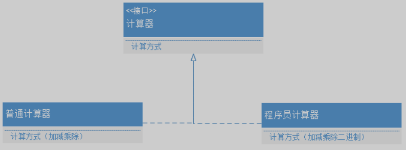
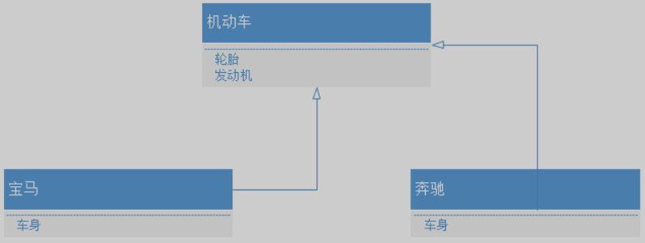
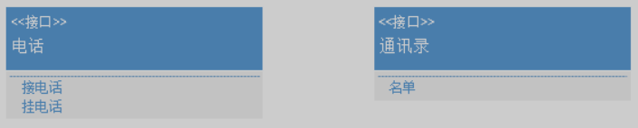
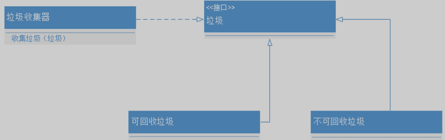

# JavaSE

## .知识点

### .1 面向对象设计

五大原则：

+ SOLID

+ 单一功能、开闭原则、里氏替换、接口隔离、依赖反转

---

遵循五大原则可以使程序解决紧耦合，更加健壮。

| 英文 | 原则         |
| ---- | ------------ |
| SRP  | 单一责任原则 |
| OCP  | 开放封闭原则 |
| LSP  | 里氏替换原则 |
| ISP  | 接口隔离原则 |
| DIP  | 依赖倒置原则 |

#### .1.1单一责任原则

一个类或者一个方法只做一件事。

+ 如果一个类承担的职责过多，就等于把这些职责耦合在一起，一个职责的变化就可能抑制或者削弱这个类完成其他职责的能力。
+ 例如餐厅服务员负责把订单给厨师去做，而不是服务员又要订单又要炒菜。
+ 

#### .1.2 开放封闭原则

对扩展开放，对修改关闭。

+ 一个类独立之后就不应该去修改它，而是以扩展的方式适应新需求。
+ 例如一开始做了普通计算器程序，突然添加新需求，要再做一个程序员计算器，这时不应该修改普通计算器内部，应该使用面向接口编程，组合实现扩展。
+ 

#### .1.3 里氏替换原则

派生类（子类）对象可以在程式中代替其基类（超类）对象。

+ 所有基类出现的地方都可以用派生类替换而不会程序产生错误。
+ 子类可以扩展父类的功能，但不能改变父类原有的功能。
+ 例如机动车必须有轮胎和发动机，子类宝马和奔驰不应该改写没轮胎或者没发动机。
+ 

#### .1.4 接口隔离原则

类不应该依赖不需要的接口，知道越少越好。

+ 例如电话接口只约束接电话和挂电话，不需要让依赖者知道还有通讯录。
+ 

#### .1.5 依赖倒置原则

高级模块不应该依赖低级模块，而是依赖抽象。

+ 抽象不能依赖细节，细节要依赖抽象。
+ 比如类A内有类B对象，称为类A依赖类B，但是不应该这样做，而是选择类A去依赖抽象。
+ 例如垃圾收集器不管垃圾是什么类型，要是垃圾就行。
+ 

> 没人写一款程序能完全遵守SOLID原则，甚至有些设计模式是违反SOLID原则。如何权衡就要看利是否大于弊。

## 文献

https://www.cnblogs.com/suli0827/p/9515842.html