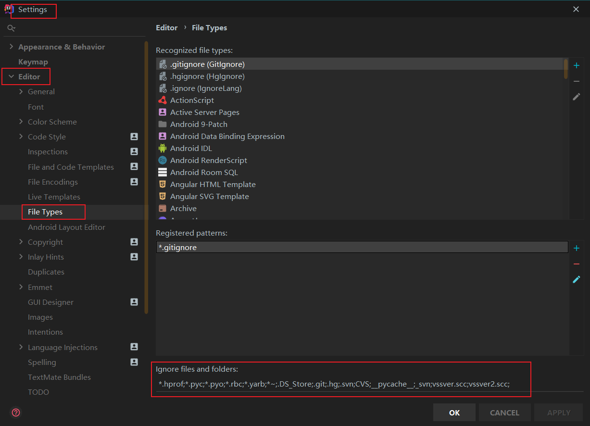
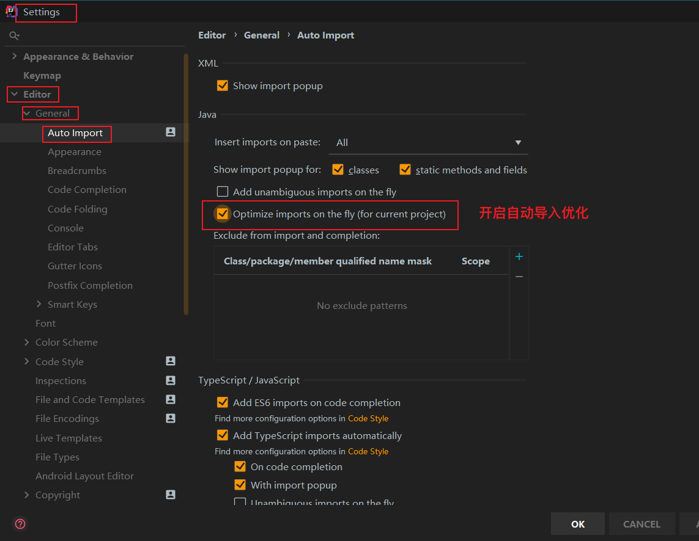
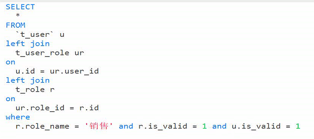
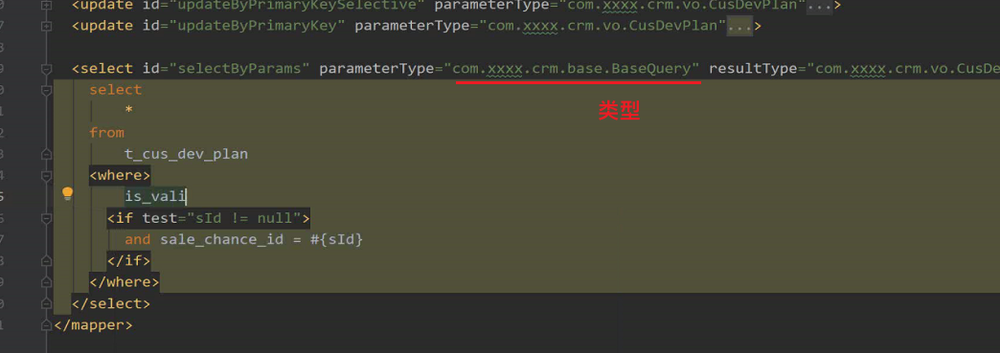
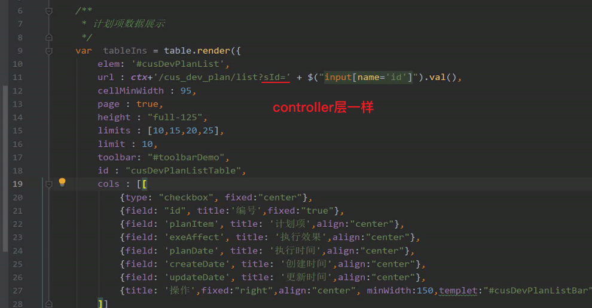
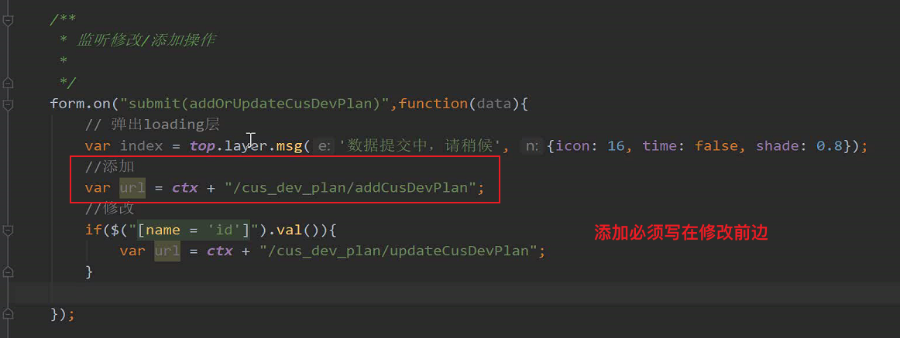

# CRM | 02 营销管理

## 1. 表结构分析


## 2. 功能实现

### 2.1 营销机会管理功能

#### 2.1.1 准备工作

#### 2.1.2 CURD

##### 2.1.2.1 查询

##### 2.1.2.2 添加

##### 2.1.2.3 更新

##### 2.1.2.4 删除

### 2.2 客户开发计划功能

#### 2.2.1 效果

#### 2.2.2 代码实现

##### 2.2.2.1 后端

##### 2.2.2.2 前端

## 3. 问题

### 3.1 idea中DataBase导入后写SQL不自动提示

1. File Types 中忽略的文件名中是否有

   

2. 开启idea的自动导入优化

   

3. :heart: (此方法有效)设置application.yml配置环境中导入的数据库

   

   

### 3.2 MySql模糊查询concat()函数

作用：连接字符串

用法：

```sql
select * from student where name like concat("%",#{name},"%");
```

:question: 原因：java开发中，查询条件一般是作为参数传递过来的，故需用concat()函数来拼接。

### 3.3 多表联查技巧

先把所有的表连起来（join on）

然后再给条件筛选（where）



### 3.4 获取对象写法

js：$()

ftl：${}

### 3.5 测试技巧

写一个前台测试一下

写一个后台测试一下

### 3.6 BaseController

提供了一个 ctx 路径

### 3.7 路径

ftl中的data_path对应controller层的requestMapper和方法上的路径

### 3.8 



### 3.9 



### 3.10 表单刷新

通过hidden隐藏域中的id的value进行获取。

id：唯一性

hidden：不让用户看到，要隐藏

### 3.11 

