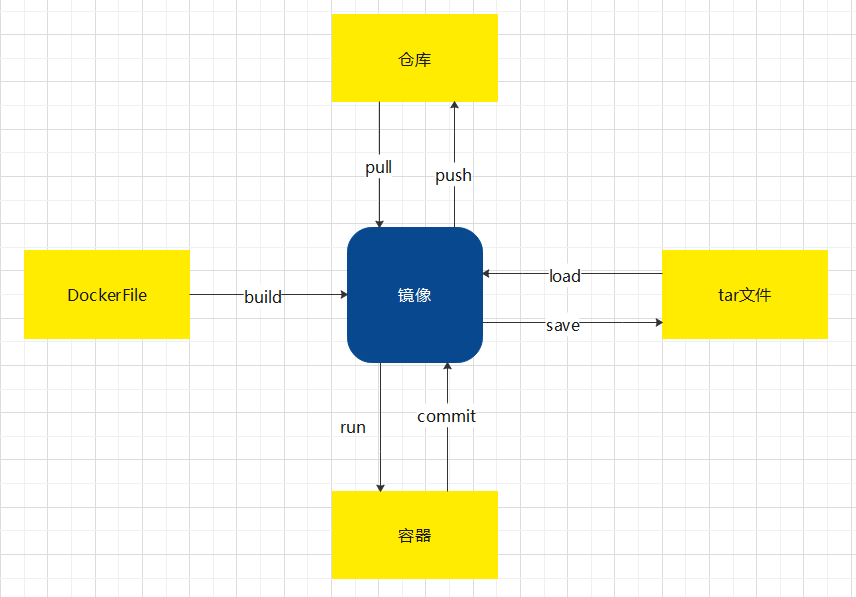

# Docker

## A1 总述图

+ 镜像：相当于用虚拟机或者创建时用的镜像文件
+ 容器：相当于正在运行中的虚拟机
+ tar文件：类似于vm中的vmdk文件，虚拟机副本，可以将镜像直接保存成tar文件，然后转移等操作，还可重新加载成镜像
+ DockerFile：配置文件（很短），通过写“如何构建”的步骤，来指定一个镜像是如何构建的；通过“docker build”指令，可将dockerfile构建成一个镜像
+ 仓库：远程仓库保存了很多镜像

解决问题：

+ 为什么在我机器上是正常的，到你机器上就不正常了。

+ 高可用集群搭建

## A2 使用

play with Docker网站

### 2.1 仓库和容器

下载镜像：`docker pull nginx[:latest]`

运行镜像：`docker run -d -p 80:80 nginx`

`-d`后台运行，`-p`指定端口,先写外部端口:内部端口

`--name`指定运行起来名字

`-v`映射文件，一般把mysql的data文件映射以免出错

查看本地镜像：`docker images`

查看正在运行的容器：`docker ps` 

进入容器操作：`docker  exec -it 可识别的最短id号 bash`

指定镜像名字：`docker commit 可识别的最短id号 name`

删除：`docker rm -f 镜像号`

### 2.2 DockerFile文件

新建DockerFile

`vim DockerFile`dockerfile语法

构建：`docker build -t m2 .`

`.`表示当前目录下的dockerfile

`m2`是起的名字

### 2.3 tar文件

保存为tar文件：`docker save m2 >1.tar`

加载tar文件：`docker load <1.tar`

